With the current state of mass telework and increased social distancing, finding new ways to connect with others over shared projects has become a necessary endeavor. This has lead me to upgrade my webcams, and use [OBS](https://obsproject.com/) to create a streaming setup to show-and-tell what I have been tinkering with.

<!--more-->

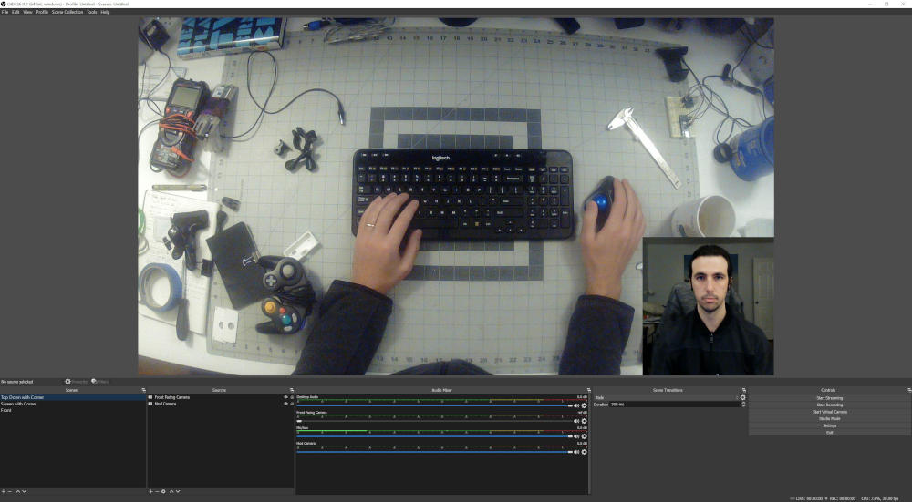

While I like the dual window setup, where I can address the camera and show on the desk whatever project is on my desk, the field of view (FOV) of the top-down camera is wider than necessary. If I wanted to highlight some physically small portion of the project, this camera cannot resolve this detail.

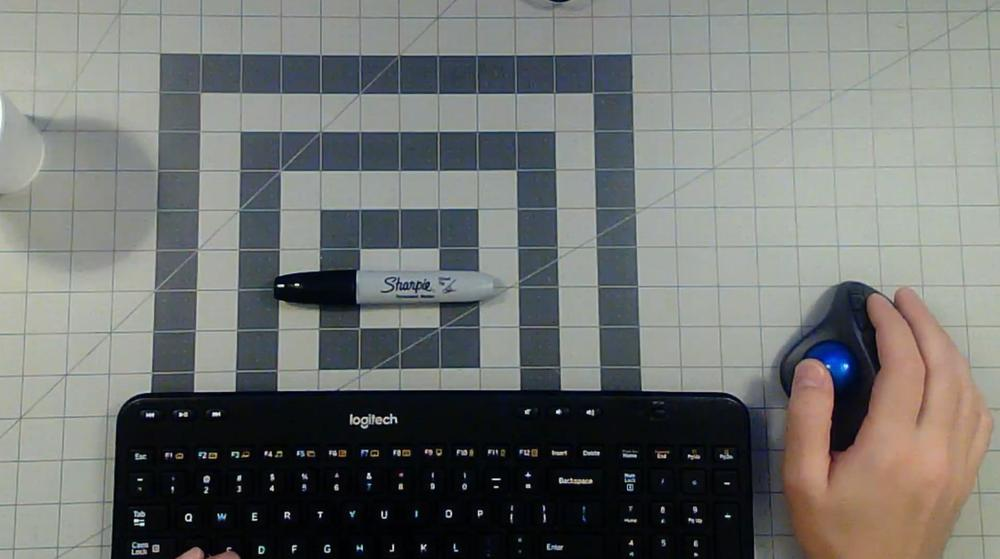

Using OBS to crop the image shows this limitation, where small text is not readable, and the system cannot resolve the 1/4" spaced dots of the cutting mat. This limitation motivated me to take a cheap webcam and see if I could add a more robust lens, with a narrow FOV, and manual focus capability.

## Choosing a Camera and Lens
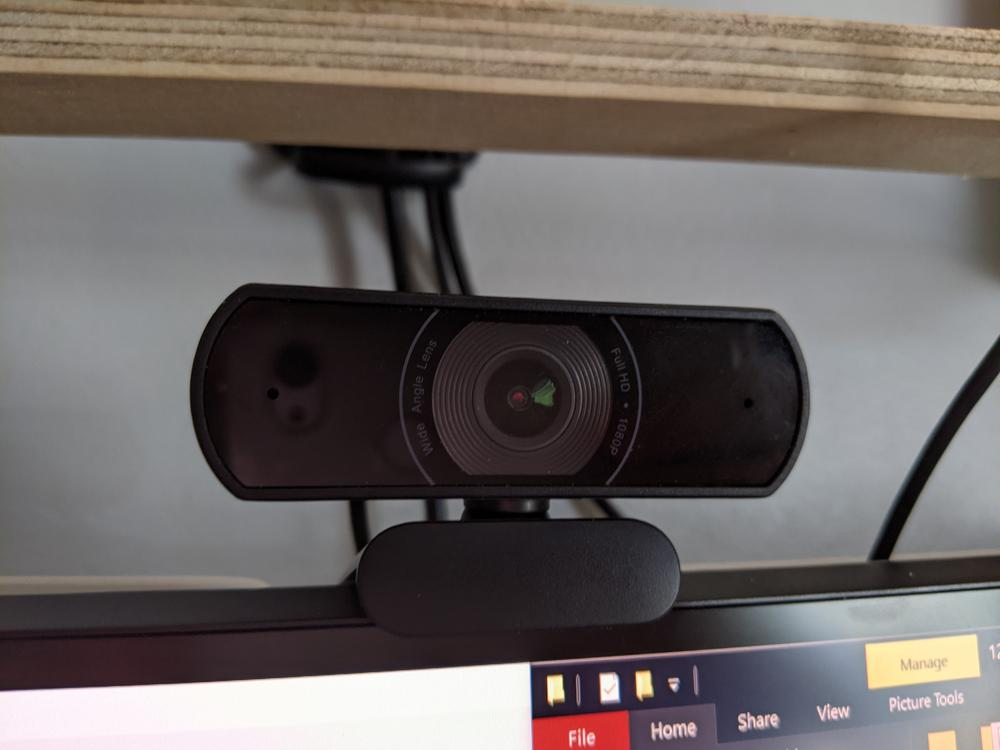

I picked up a well-reviewed 1080p camera for $20 from Amazon. This camera is of decent quality with a tendency to overexpose and oversaturate collected images when left to default values. Disabling auto-exposure compensation helped alleviate this.

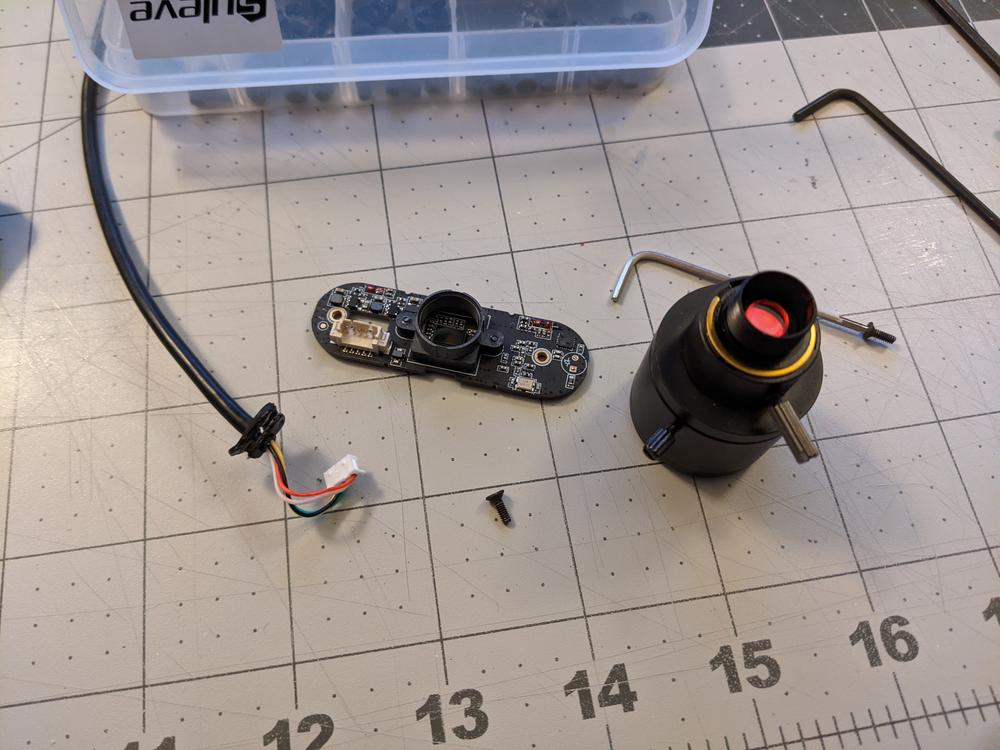

Having [disassembled a few webcams](/blog/3d-scanner-matlab/) before, I took a gamble on this camera having a standard M12 lens mount, and picked up a 2.8-12mm lens. Since this lens was designed for CCTV and the IR illumination that usually accompanies those systems, it did not include an IR filter.

## Designing a Case
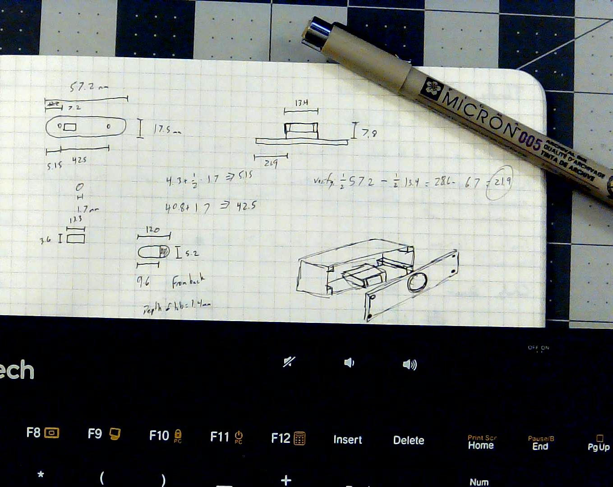
When designing a piece of hardware to match a device, such as the case to enclose this webcam, I try to start with a hand drawn sketch. I will block out the necessary mounting holes and protruding components, then use a micrometer to take and record all the dimensions.

Once I have all dimensions in front of me, I will sketch out a rough drawing of the yet-to-be made hardware. This helps me think through design constraints and how this will be manufactured. I had already decided on a 3d printed case, so I made sure to avoid overhangs and designed with the tolerances of the printer in mind.

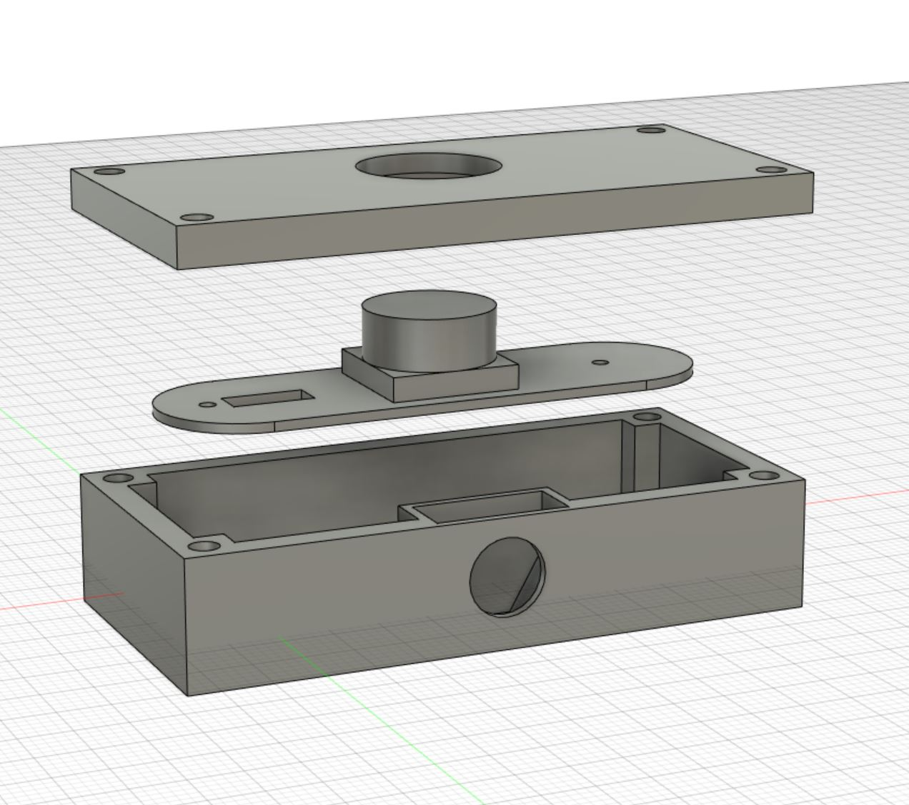

With a path forward, I created a model in Fusion360. The assembly had three parts, the camera board, it's case, and the lid to keep everything enclosed. I also created a small slot for a 1/4-20 nut to sit inside, making it compatible with standard tripods and other camera mounts.

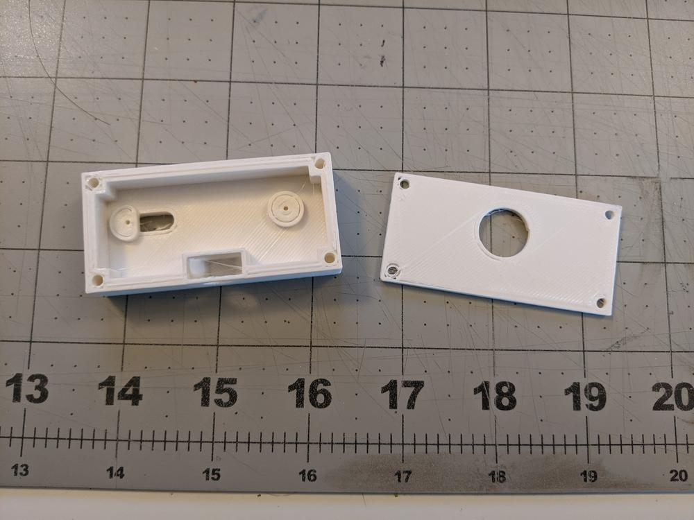

I sent the file over to my 3d printer, and an hour later had a usable housing for the camera. There is a bit of separation between the perimeter walls and infill of the print, but it still does the job I need it to.

## Assembly
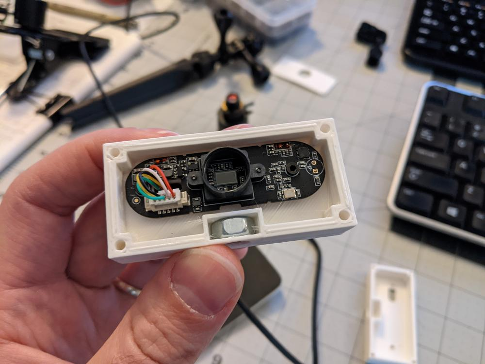

With the work I put in beforehand to make sure dimensions were correct, assembly was a straight-forward process. The camera fits well in the case, with ample room for the usb cable to pass through from the back.

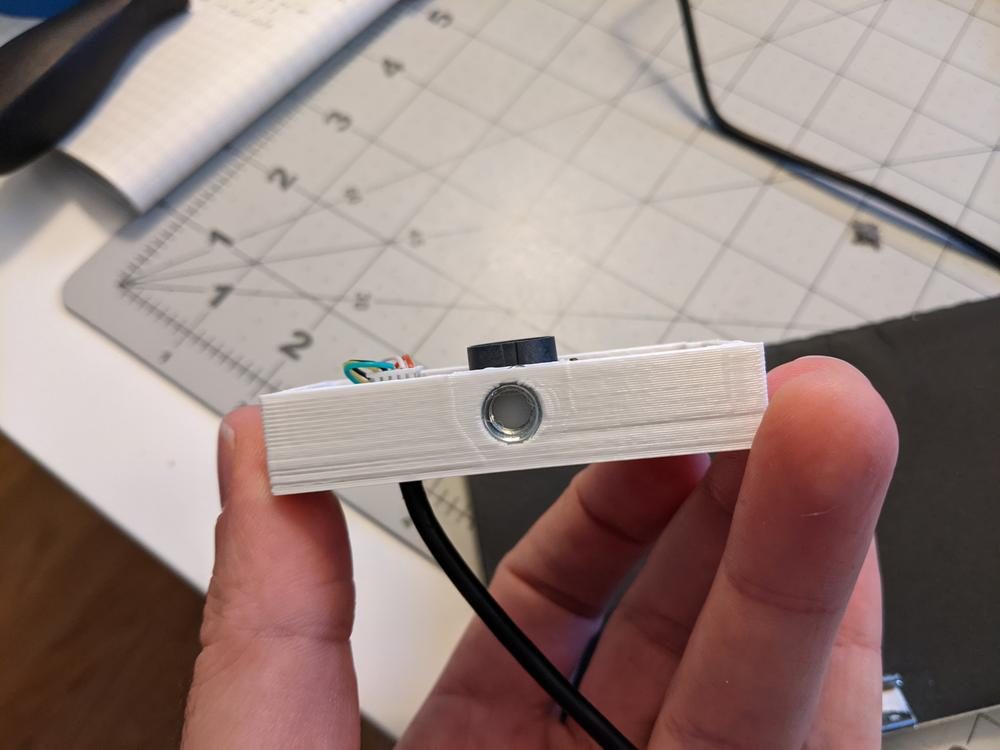

The only thing I failed to account for was the usb cable sticking up off the board. This forced the lid to sit off from the face of the housing. I did a quick redesign to add a lip to the lid, reprinted, and finished assembly.

## First Mounting Point
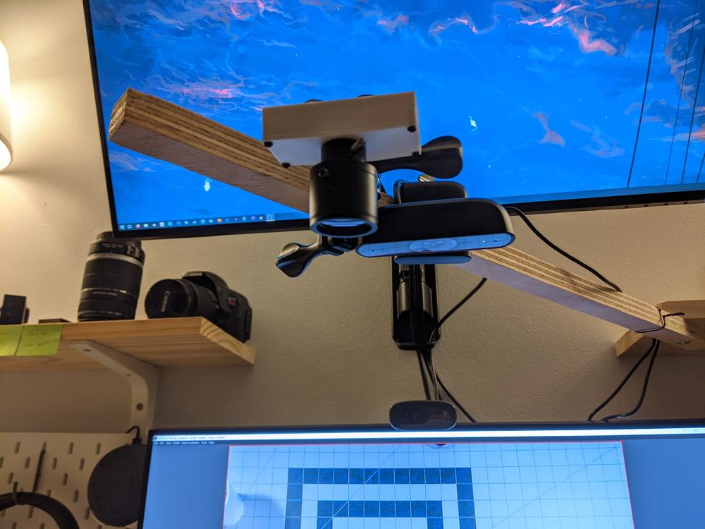

The first mounting point was a swinging arm I attached to a shelf between my main and upper monitor. This was a simple and stable system, that I could push out of the way when not in use.

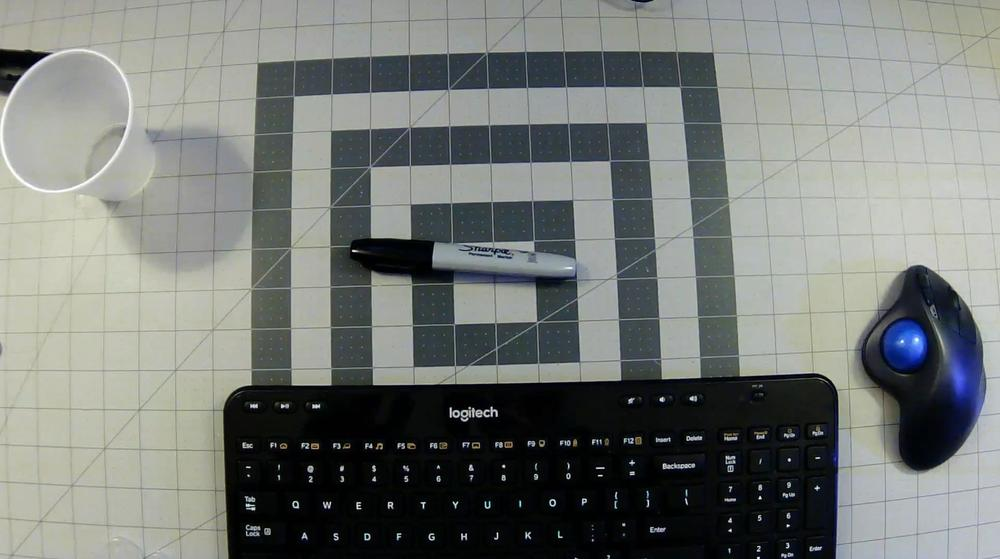

With the new lens, I got a much narrower FOV, and was able to resolve details such as the dots on the cutting mat. While the image did have some barrel distortion from the lens, it was not enough to detract from the video.

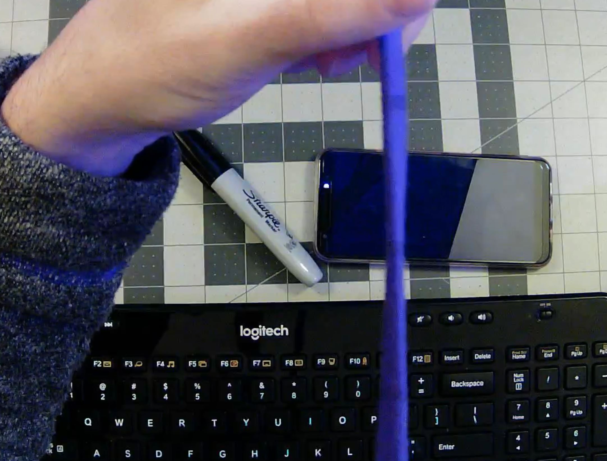

Without the IR filter, the camera is extremely sensitive to IR light, such as the emitter on my phone or the reflected light from my VR base station. To correct this, I picked up a small 6mm IR filter sized for these types of lenses.

At this point, I made a bad judgement call, and attempted to tack the IR filter on the back end of the lens with the closest adhesive I had on hand, cyanoacrylate (super glue). I knew superglue had a tendency to release fumes and degrade plastic, but I tried to reduce risk of damage by using the smallest amount necessary, and only on the edge of the filter.

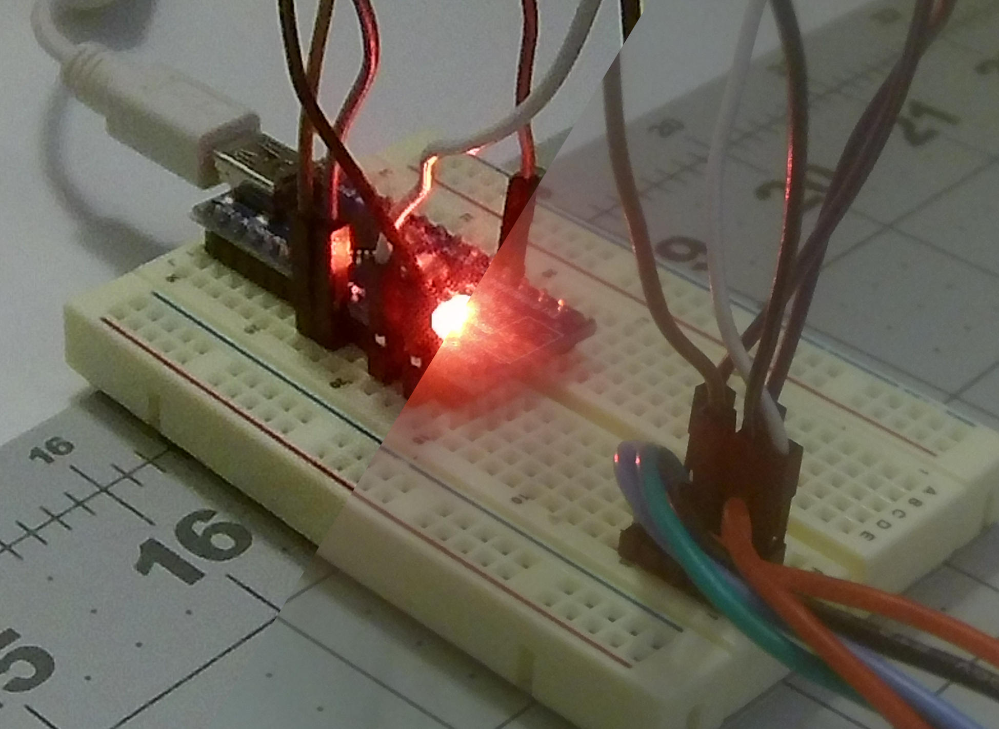

This demonstrates how the superglue came back to haunt me. On the left is a picture taken with the original lens, focused and cropped to the breadboard. Notice how there is high contrast between dark and light areas. Even though the resolution isn't the best, the edges of text and electronic components are clearly seen. On the right, the resolution is better, with the letters and numbers easily readable, but there is a haze over the entire image, which is emphasized by the red LED.

During the curing process, superglue will release fumes, and the fumes from this particular application fogged up my IR filter. Now, when looking at any bright source of light, such as a screen or glint off a shiny surface, that light will disperse and show up with a surrounding haze or glow on the image.

## Second Mounting Point
Even though the resulting image quality was less than ideal, I could have managed with this setup. However, the location of the mount arm blocked my view of the second monitor, and got in the way of my front-facing camera.

Seeking a better camera location, I ended up attaching it to the arm of an architect lamp that went behind and over my second monitor. This raised position required a longer focal length lens to narrow the field of view. I decided on a variable 6-22mm lens, of similar design to the first.

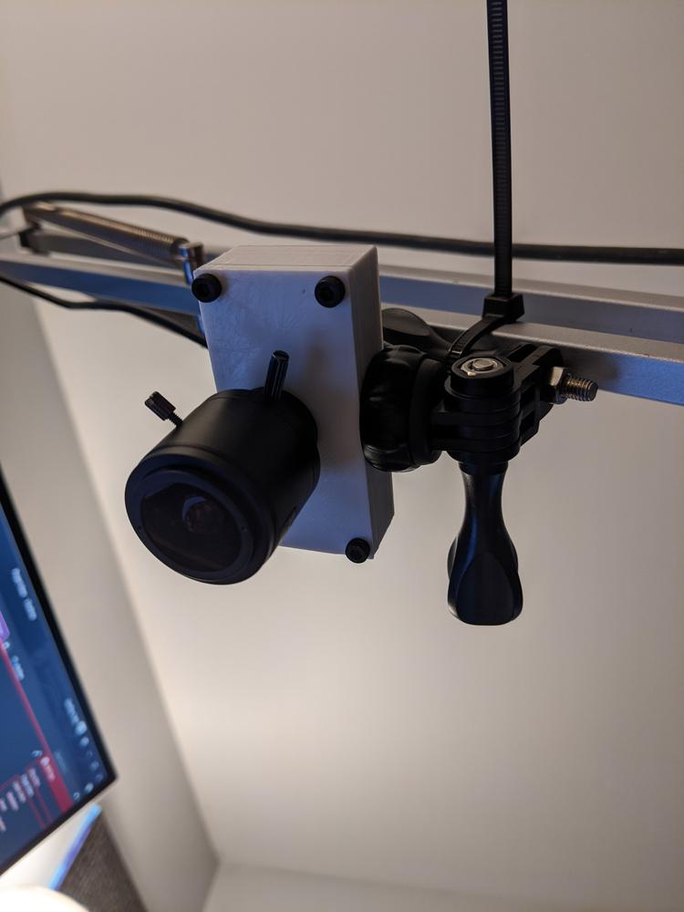

The camera was temporarily attached to the arm with zip ties, and cleaned up later. This position keeps it out of the way of the front facing camera and second monitor, while giving a good image of the desktop.

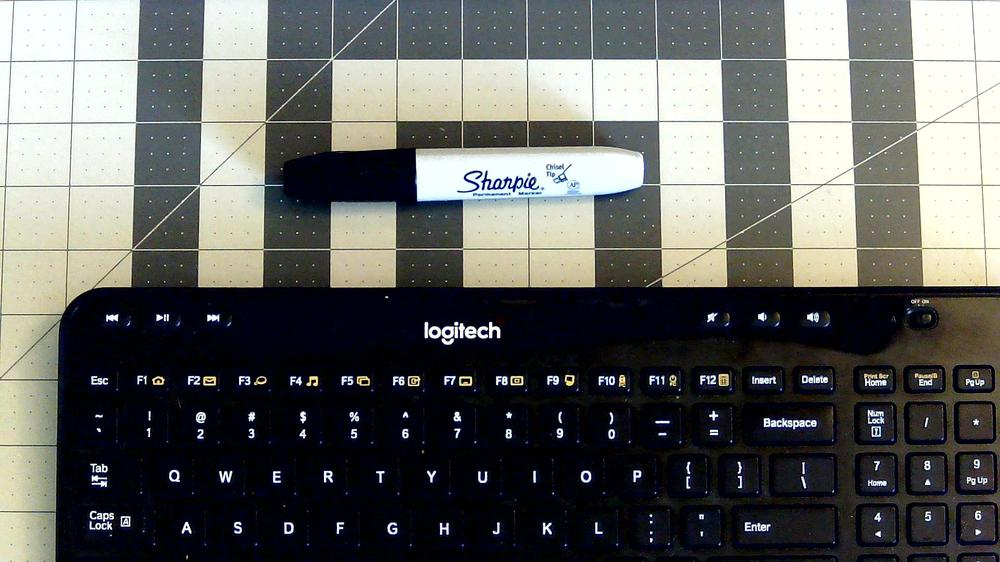

As seen from the above image, the picture quality is much better, clearly resolving the detail of the cutting mat, Sharpie, and keyboard text.