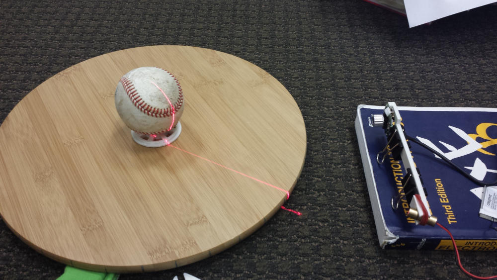
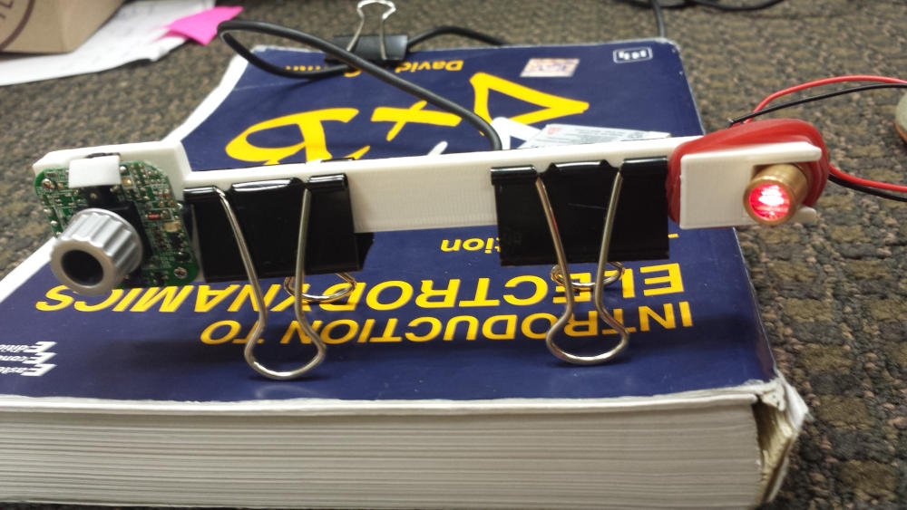
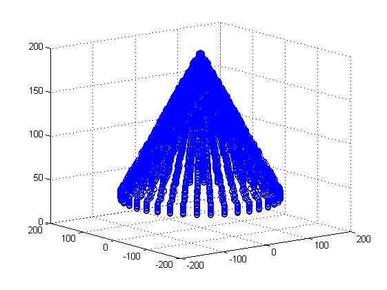
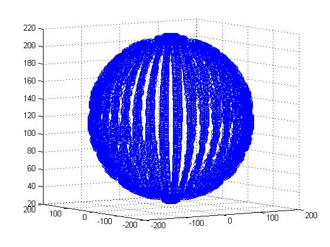
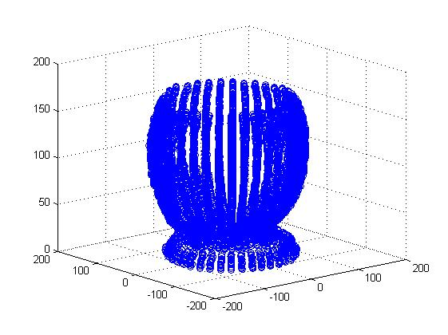

For a project in my computational physics class, I wanted to create something more than a program. With an old webcam, a pantry turntable, and a cheap laser, I figured I could use MATLAB's image processing abilities to create proof-of-concept 3d scanner.

By centering the object on the turntable, and projecting the laser line onto the object, I can use the camera to collect images while rotating the object at known intervals. The images are then fed into a MATLAB script that calculates the deviation of the laser from the center of the image. Using these deviations, I can plot the location in Cartesian coordinates, and have a rough estimation of the objects outer dimensions. 

Knowing the distance from the camera to the center of the turntable, the distance from the laser to the camera, and the angle of rotation, I can figure out how far to the left the profile of the object deviates from the center of the image, giving me an x and y coordinate. Height z is extracted from the pixel height on the image. Here are a few sample of plotted data from a simulated sphere and cone, as well as data collected from a baseball on the turntable 

The collected images suffered from some scaling issues in the x-y plane, and is probably due to the object not being centered on the turntable, or a shift during intervals of rotation. The simulated data came out better than expected, proving that, with a bit of work, this could be a robust little scanner. There is much future work that could be done with this project. The plotted data could be turned into a mesh, creating a fully enclosed 3d object, and the setup could be made much more rigid and automated with a stepper, allowing for smaller turntable rotation intervals and therefore better resolution.