I didn't think I would be revisiting this project so soon, but the foam was already cut, and I filled up the first terrain piece with my entire collection of painted 'Mechs. I also remembered to take more in-progress pictures, so there's a bit more detail to the process.

<!--more-->

As mentioned in [the last post](), Haunts' Wargaming has a slightly more involved method to make [double-sided rock hills](https://www.youtube.com/watch?v=qg3nzWJ1x0g) using 2 inch insulation foam and some simple cutting and painting techniques. This entire post is pretty much a written version of his video, which I highly recommend if you want to make some nice rock terrain for your gaming table.

## Cutting and Carving

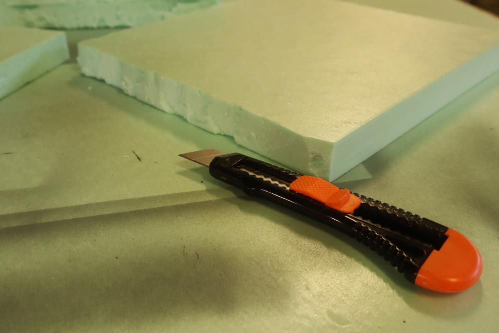

Following the video, I started by taking my clean cut square pieces, and carving the sides to be a bit more irregular. If these were to be terrain pieces, I would have tried to make the shapes more rock-ish, but I'm favoring form over function this round.

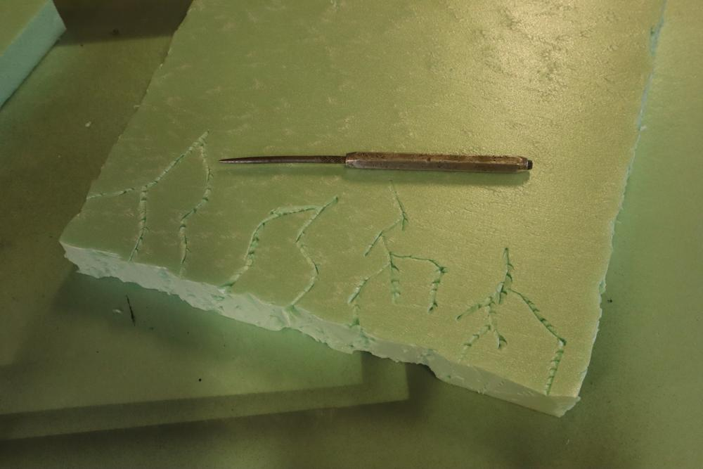

Using an awl/prison shiv, I carved some cracks in the top of the foam. Where a crack meets an edge, I used the blunt edge of the knife to extend the cracks down to the bottom of the piece.

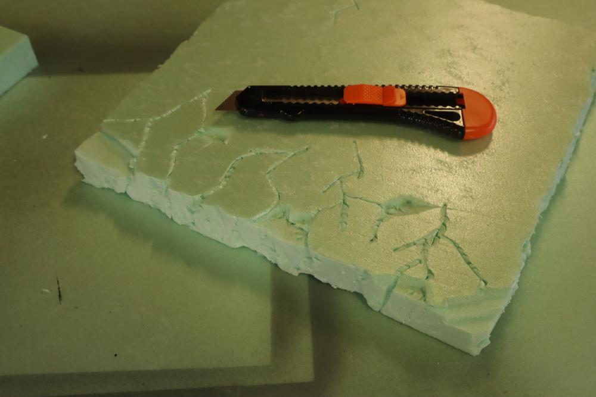

Going back to the utility knife, I made shallow cuts into the top and sides, then broke off chips to give the appearance of rock chunks that have fallen off

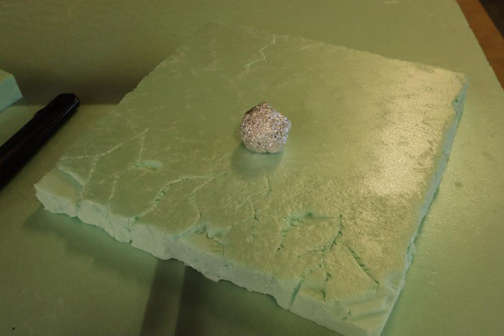

I rolled a ball of tinfoil over the entire surface, the sides, and a fair bit on the top edge to give some texture. This really helps to sell the look of the rock slab and gives some more tooth for the paint layer.

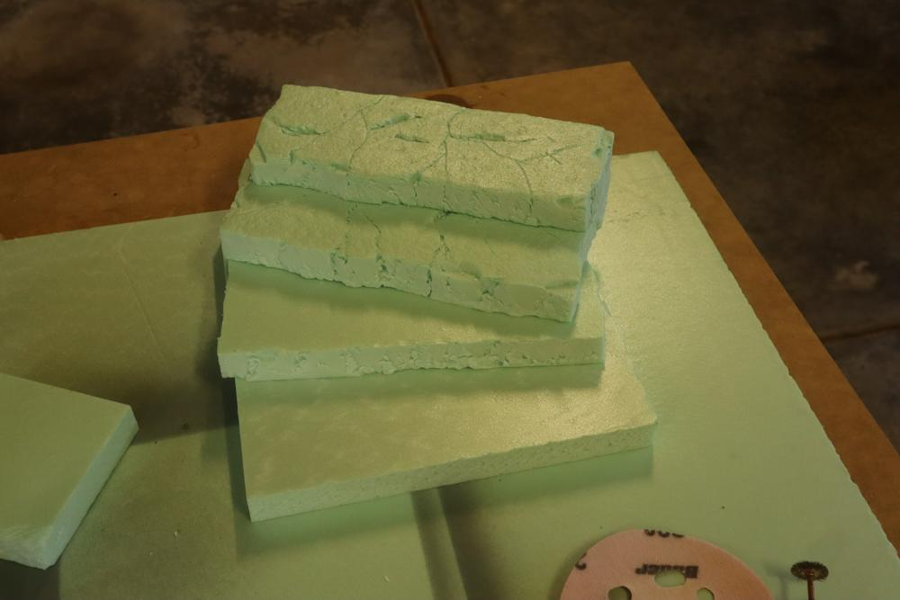

This technique was applied to each tiered piece of foam.

## Assembly

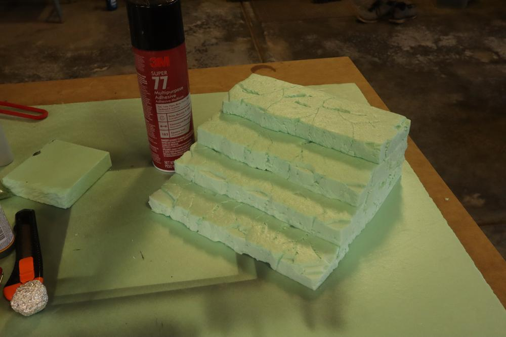

One side of each contact surface was sprayed down with Super 77 and firmly pressed together for about 30 seconds. In the past, I've tried wood glue (does not work), liquid nails (works but leaves a bit of a gap), and this spray (my favorite so far).

## Painting

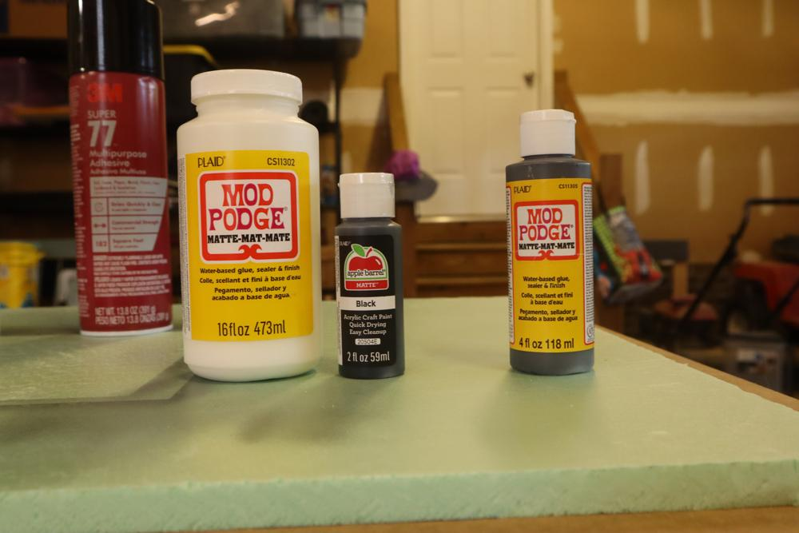

I mixed together a 3:1 ratio of Mod Podge and acrylic paint to make my basecoat and sealer. The foam showed through the first coat, but the second coat hid the underlying color and left the piece with a durable matte surface.

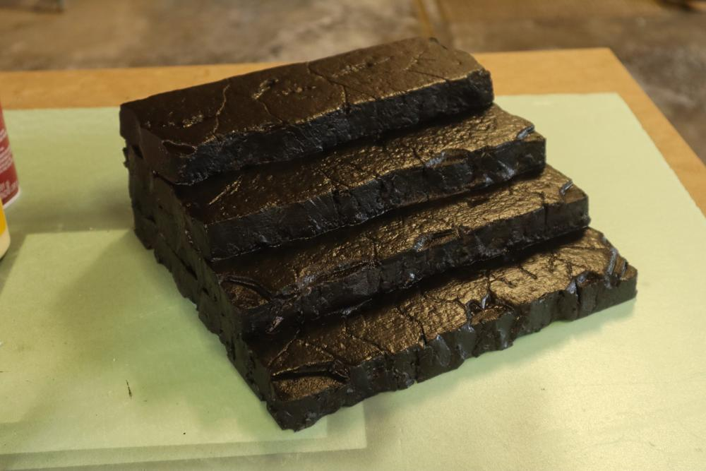

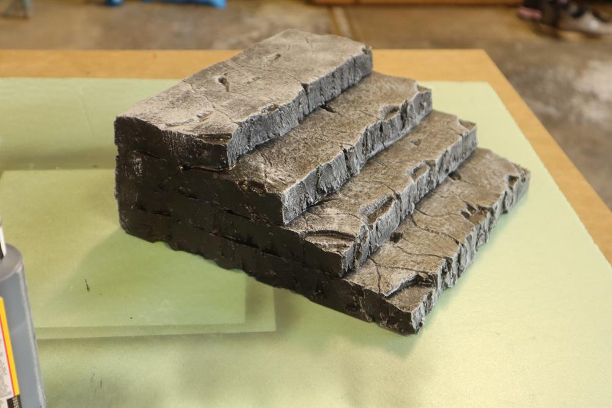

Next, I used granite grey and a makeup brush to do a heavy drybrush over the entire piece. At this point, the piece could be done, but I decided to take it a few steps further.

## Wrapping it up

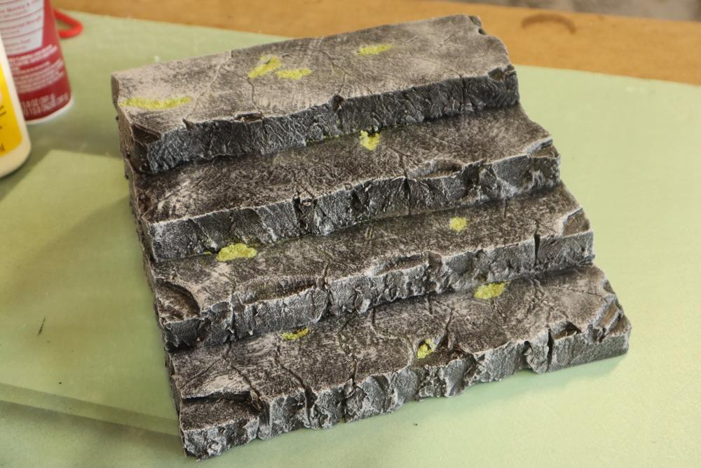

I dabbed some PVA glue into each of the recesses I had carved out before painting, and dropped some flock over each bit of glue. I wanted to add a bit of color to the stand, and assumed water and dirt would collect in the holes if this was a real rock surface. I'm quite pleased with how this looks.

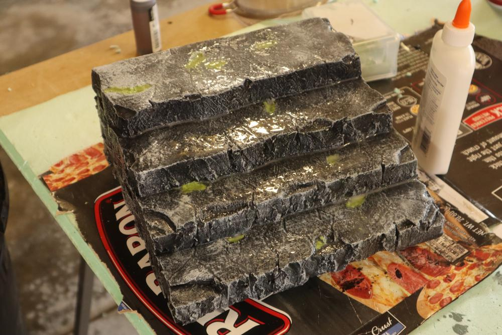

Once the glue was dry, I soaked this piece in watered down PVA to seal the flock and protect the drybrushing. Once dry, I took the piece from the garage to the office for the final touches.

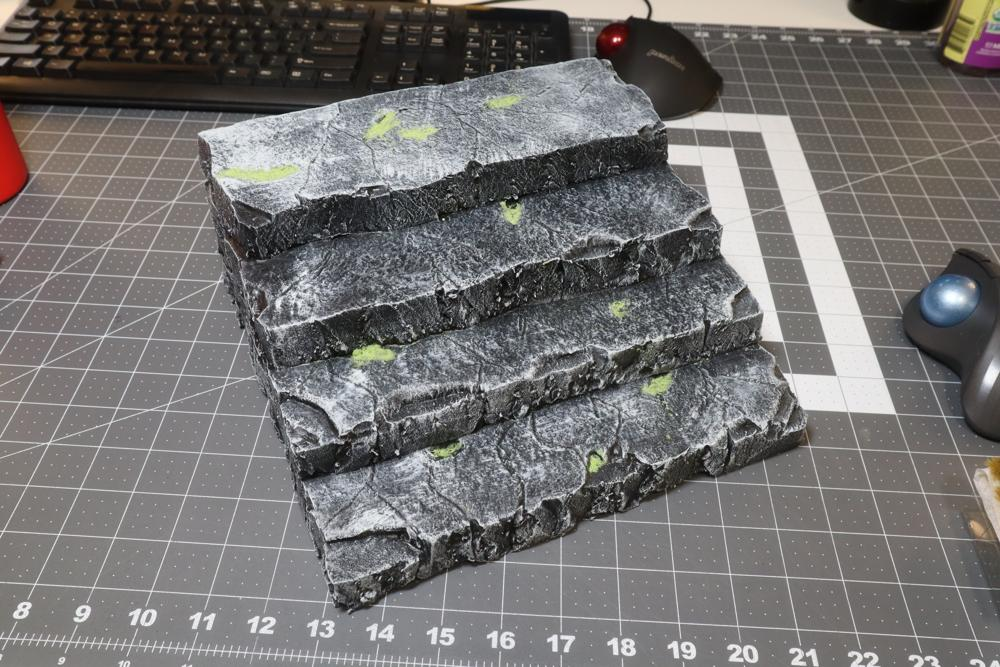

This is also when I realized I had the white-balance on my camera set to Cloudy, which shifted the color temperature towards the warm side. While the following pictures are more "correct" color-wise, I wish I had kept the WB setting for consistency across this post and the warmth in each photo. 

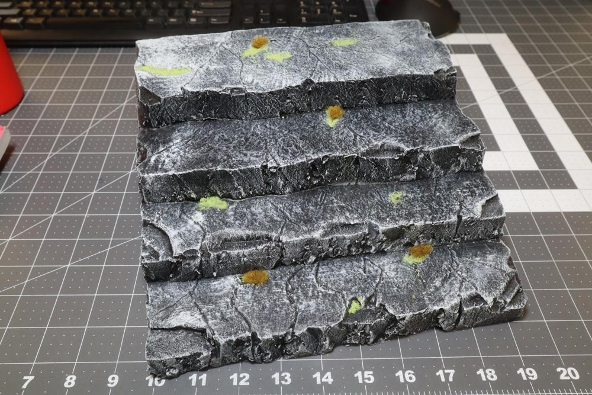

Using some peel-and-stick grass tufts I picked up from the local hobby store, I filled in a few areas the flock did not adhere to. I could have tried for a better color match, but the variety gives it some character.

## On the Shelf

With all the grass applied, I put it on the shelf and loaded it up with minis. These are my 3d printed Halo minis for Grimdark Future Firefight by OnePageRules. Overall, I am extremely happy with how this one turned out, even more so than the first iteration. Getting to practice this rock-making technique is motivating me to pick up some 2 inch foam for some dedicated tabletop terrain. Maybe in a future post...