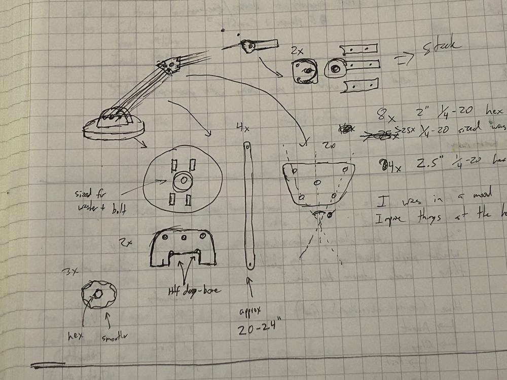
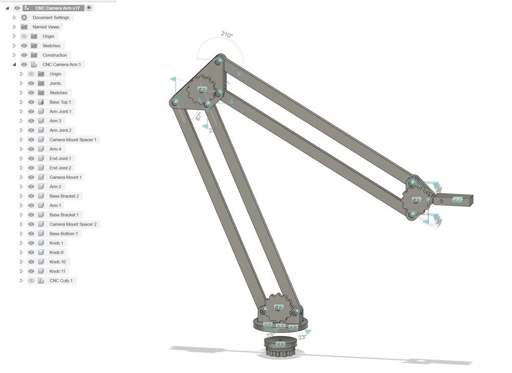
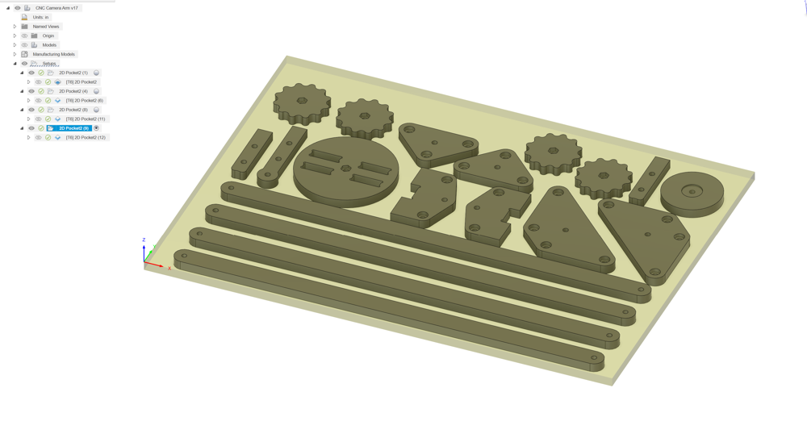
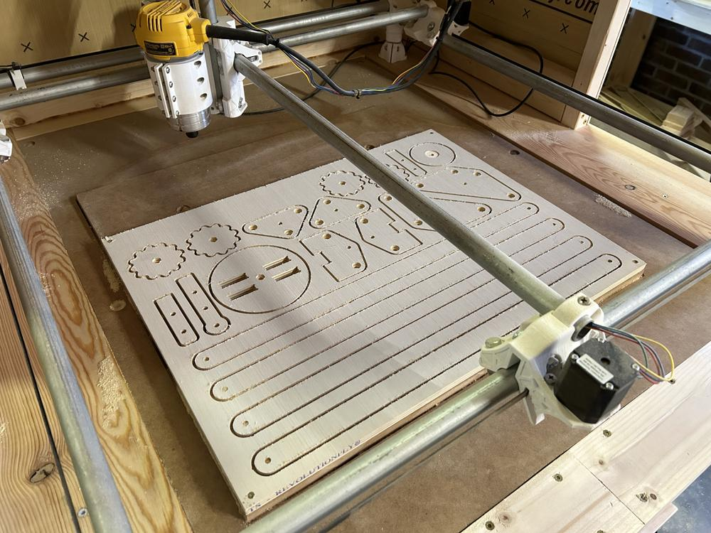
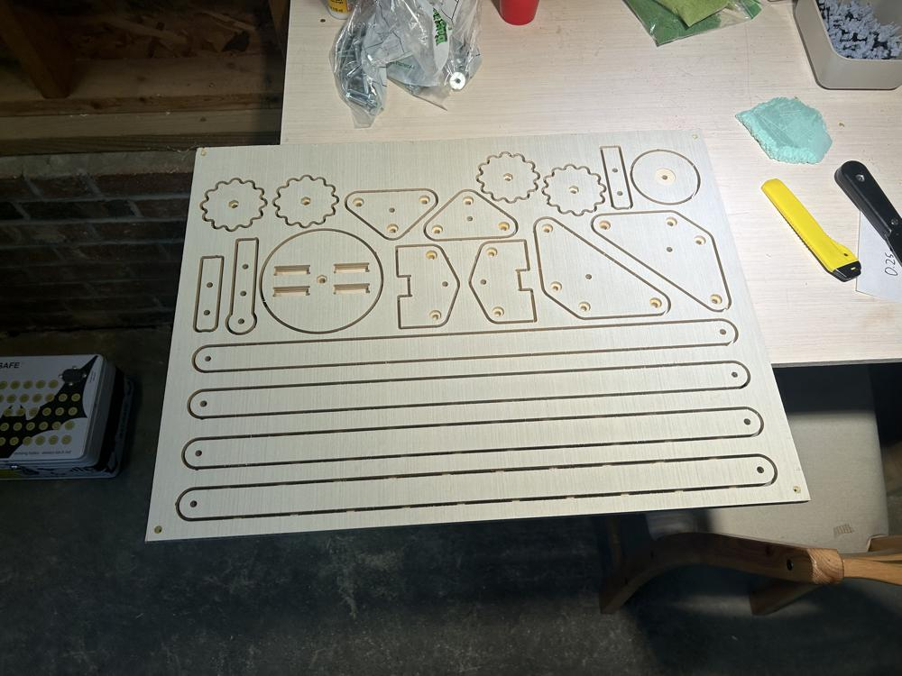
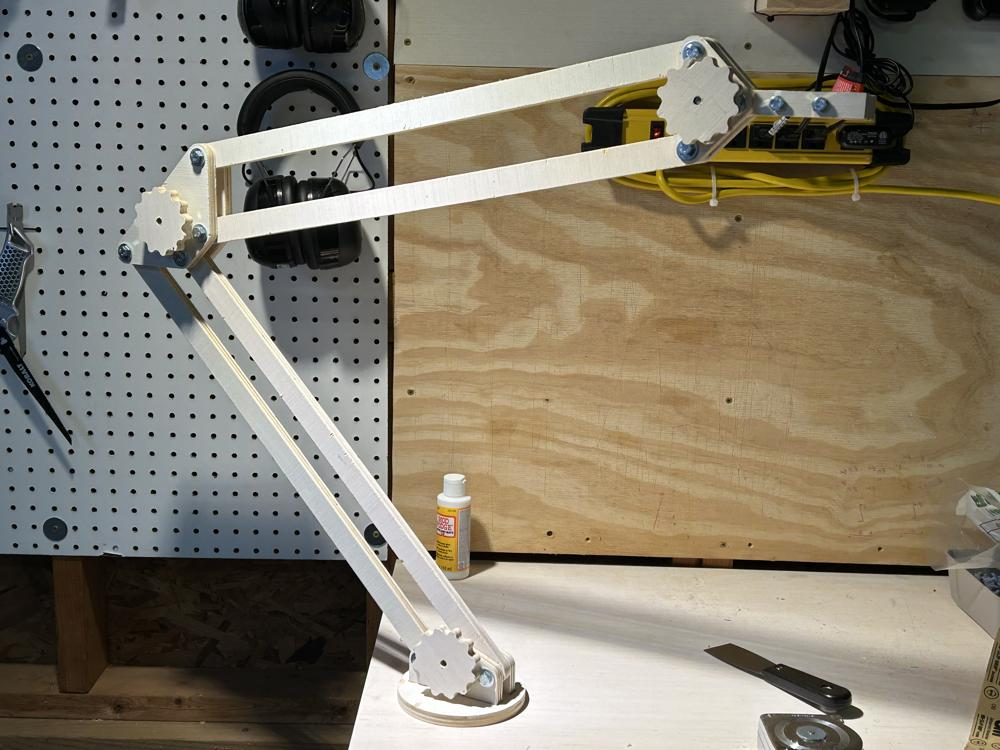

With a desire to film more projects, and an itch to test out the latest MPCNC reincarnation, I designed and machined a large camera arm based on an architect lamp.
<!--more-->

As with most of my garage projects, this started as a sketch in my notebook. A rough sketch on paper gets the idea out of my head, and gives me a place to record critical dimensions. 

Once the main idea was planned, I iterated the design in Fusion360. This took several hours over the course of a week. This design in particular gave me a chance to practice creating joints and constraining motion. The key was fixing the base in place, and ensuring all rotational joints were defined correctly.

With the design finalized, I copied each component to a sub-assembly, then redefined the joints to a flat plane of plywood. This flat plane will be the machining layout on the MPCNC. I discovered this trick through [this YouTube video](https://www.youtube.com/watch?v=jcZzs4l9QmU). This technique allows me to make edits to the original design, which then propagate down to the machine layout.

Limited by the endmills I had on hand (single flute 1/8" upcut), the machining took a total of 2.5 hours, split into four separate operations. Since the MPCNC build is still new, I wanted to make sure I could babysit it during the entire operation in case something went wrong.

Each piece was held in place by small tabs, each 1/8" wide and 1/16" tall. I removed and cleaned up each tab using a Sonicrafter oscillating tool. In hindsight, I used way too many tabs, but better that than too few.

I attempted to recess each bolt and nut into the wood, but did not take into account the space needed to get a wrench or ratchet in place to tighten these down. I ended up using longer bolts to compensate for this oversight, but will make edits to the CAD file if I make another arm.

All in all, I am very happy with the end result. I get nearly 4 feet of extension, and the arms are very sturdy once locked in place. This will make a solid addition to the shop, and gives me a wide range of camera positions to record from.