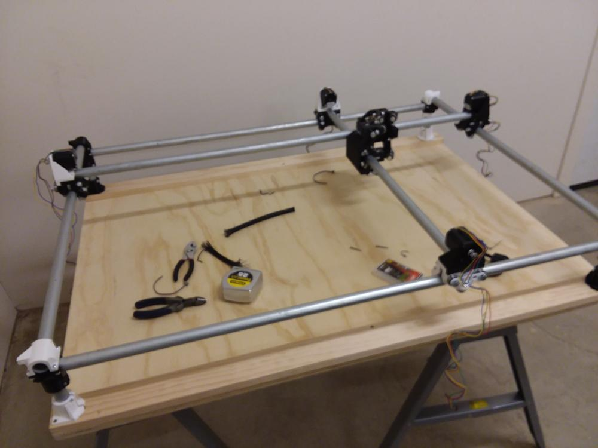
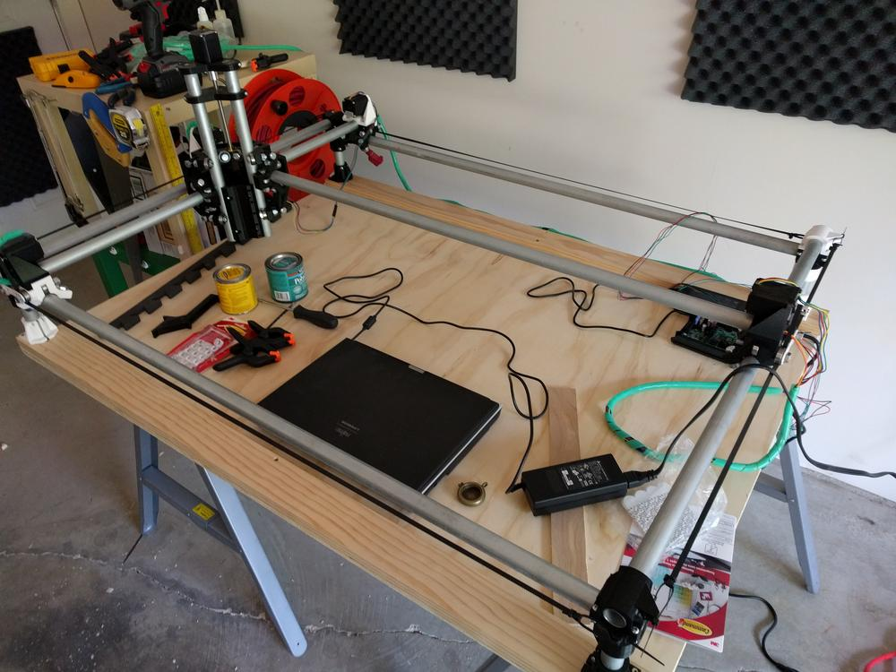
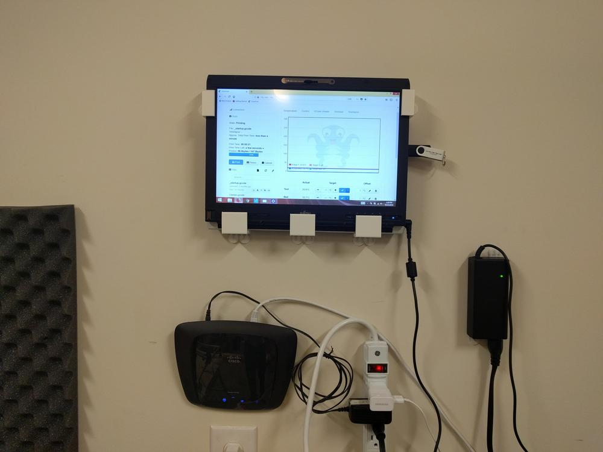
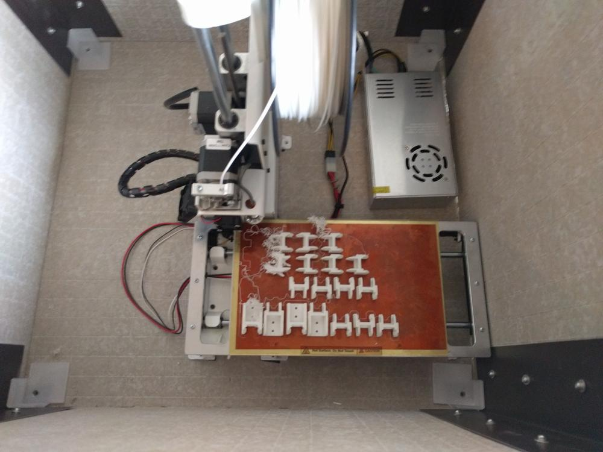
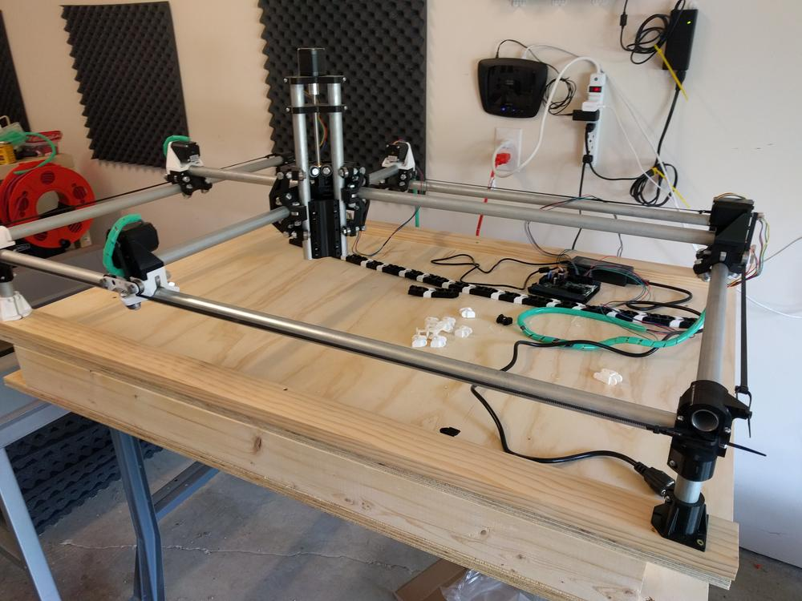
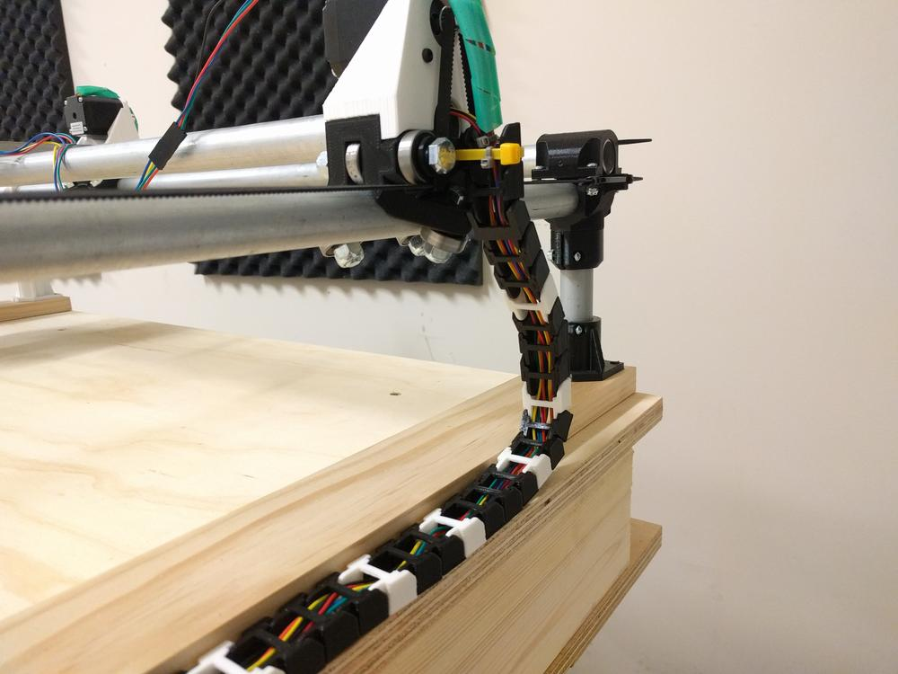
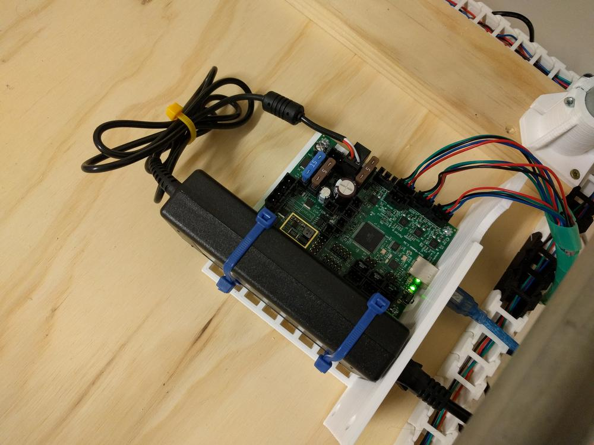
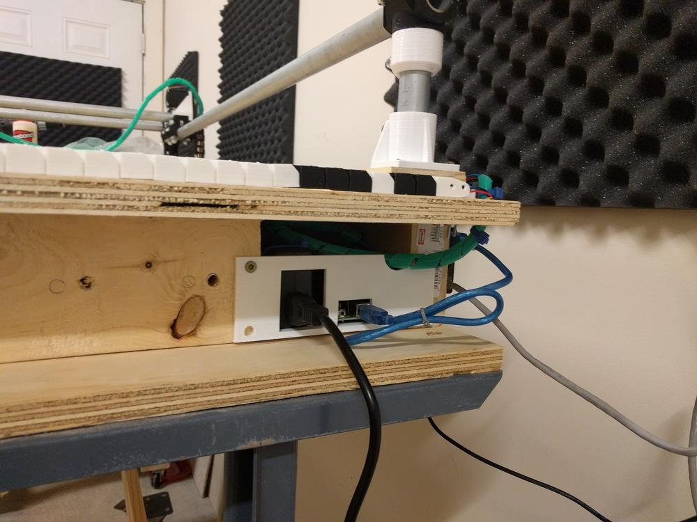

Soon after finishing the initial build, which was significantly scaled down from my original plans, a garage unit opened up in my apartment. I had been keeping an eye out for this, so I leased one, and moved some things down to set up a small shop.

I used this newly acquired space to scale the MPCNC up to it's intended size; a 2' x 3' working area.

Fortunately, the most inexpensive parts of the machine are the parts that determine it's size. I picked up some conduit and plywood from Lowe's, cut them to the proper size, and swapped out the short conduit from the initial build.

I added a few strips of 1x4 on either side to support the machine, and create a space for a swap-able spoilboard.

After getting all the hardware in place, I started the rewiring process. For the front and left, the stepper wiring is immediately run through the conduit toward the back and right of the machine.

I picked up some green plastic cable wrap to replace the braided cable sleeve from before. This stuff was easy to coil around a bundle of wires, but was a bit unwieldy and caught on edges as the axes moved.

To make both the MPCNC and 3d printer easier to manage and control, I set up a local network using a spare router and an old touchscreen laptop. Both the machines have their own dedicated Raspberry Pi running an Octoprint server. These are connected by Ethernet to the router, which connects by wifi to to the laptop.

To set up a print, I use my desk-side machine in the apartment to generate the gcode. This is moved to a flashdrive and carried by sneakernet down to the garage network.  

After too many cable snags, I sought out another solution for the green cable wrap. There are several printable cable chains on thingiverse, so I picked the one with the best user reviews and printed up a few sets.

To house the control board and add some underlying strength to the plywood base, I built a box underneath the MPCNC using 2x4 lumber and an additional piece of plywood for the bottom. The entire base is sitting on some steel workbench legs.

Running the wiring though the cable chains turned out to be a lot harder than I thought it would be. Each stepper motor has a y-connector between it and the control board, which is a little square of plastic that caught on every single link in the cable chain.

I ran cable chains along the back and right side of the machine, bringing them together at the back corner where the control board would sit.

To keep the control board and power safe and compact, I designed and printed a small insert with mounting holes of the MiniRambo board and a gridded surface for attaching the power brick with zip ties. There is also a front panel with holes for the power and usb to pass though.

When I built the box, I left a small opening for the electronics insert. The dimensions of this insert were based on the idea of a flatter base, hence the rather large gap in the picture above.

All in all, I am happy with how the MPCNC is coming together.