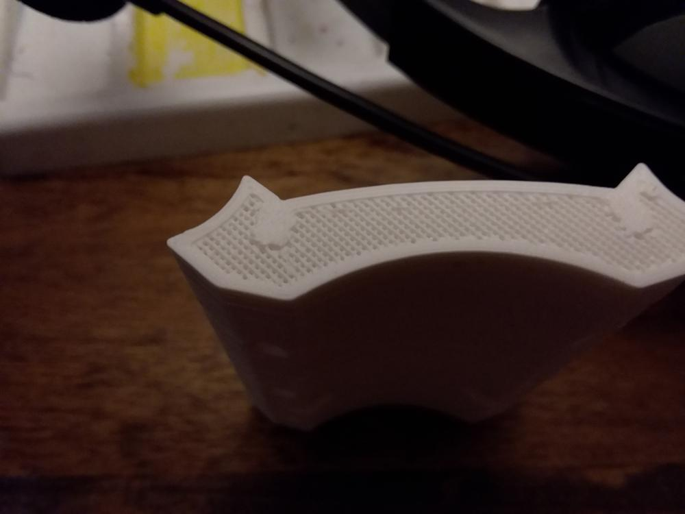
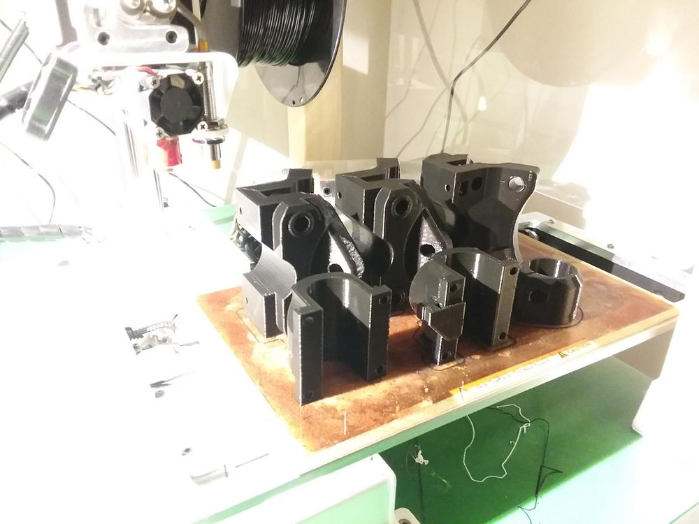
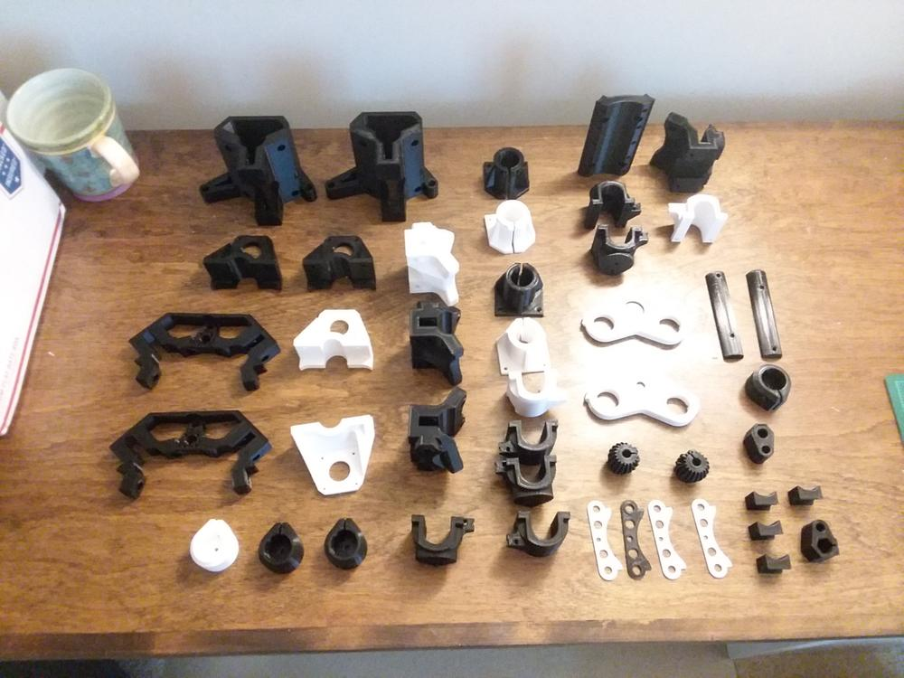
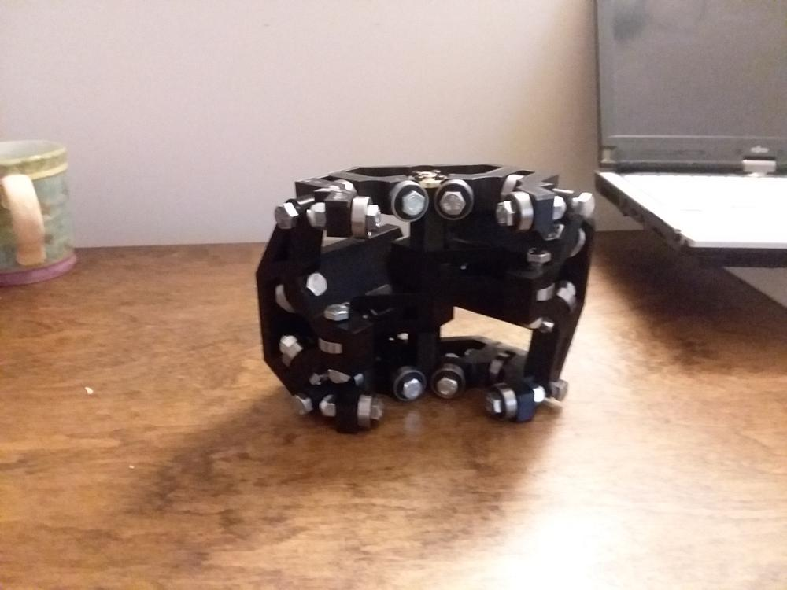
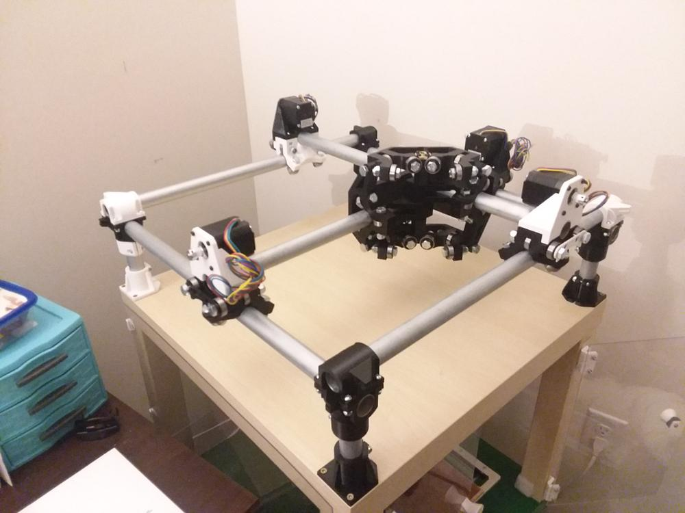
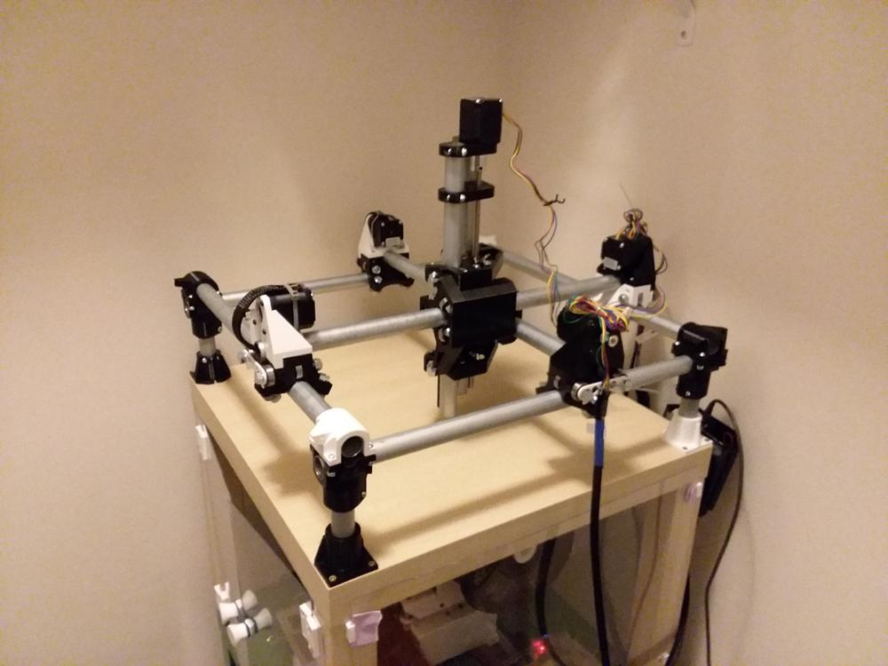

After a few months of going back and forth on this idea, I decided to pull the trigger and build the Mostly Printed CNC (MPCNC). It is a CNC platform that can be assembled out of inexpensive electronics and hardware, EMT conduit, and 3d printed components.

Ryan at V1 Engineering sells a kit with all the electronics and hardware, leaving me to source a table, conduit, and print the parts. While waiting for the kit to arrive, I started the long process of printing.

## Printing Components

Each part was printed at 55% infill, with 3 perimeters, and at 55mm/s. That was a little fast, and resulted in some ringing in the print features, but the parts didn’t need to be pretty, just accurate and functional.

Early on in the prints, I ran out of white PLA, and swapped to a roll of black PLA. An attempt at hot-swapping to the new roll during a print resulted in a weak part, which easily snapped at the filament change layer. I recommend pausing, moving the tool to a good location, then purging the hot end until the new material is flowing smoothly.

All this printing also taught me how inaccurate the print time estimates are. On average, each set of prints took about 20% longer than expected. This wasn’t too much of a problem, since most prints were taking place at night.

All in all, printing took nearly two rolls of filament and 120 hours of print time. Here is the final set of parts:

## Assembly
With all the parts printed, it was time to install all the bolts and bearings. Assembly was a painless process, and I was soon ready to install the conduit.

The original plan was to to have a 24 by 24 inch build area. This would have required a table measuring almost 3 by 3 feet. At the moment, I don’t have that kind of space to dedicate to this machine. I opted to scale down to 11 by 11 inches, which fits on top of an Ikea Lack side table. With 20 feet of conduit costing well under $20, I can easily rebuild the table at a larger scale when I have the space.

## X-Y Gantry
I was surprised at how much the center portion weighed and the amount of space it takes up, but it still moves smoothly with the plethora of bearings on the conduit rails.

## All Wired Up
Finally, I installed the z axis and wired up the control board. Most of the cables were wrapped in braided cable sleeve. Excess wire was coiled up and zip-tied out of the way. This excess will come in handy when I scale up the machine to a larger working area.

