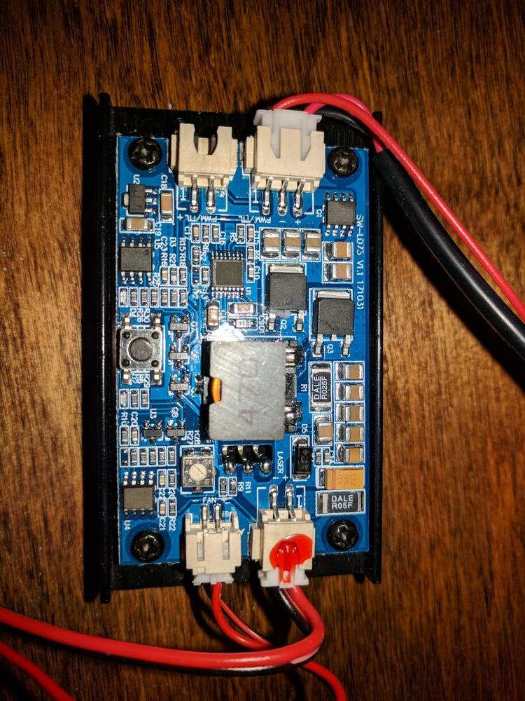
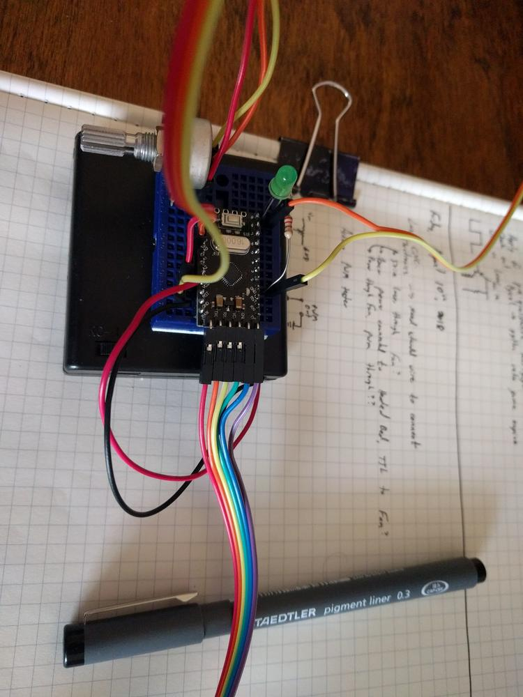
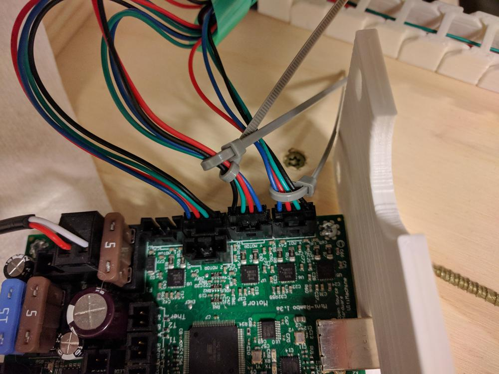
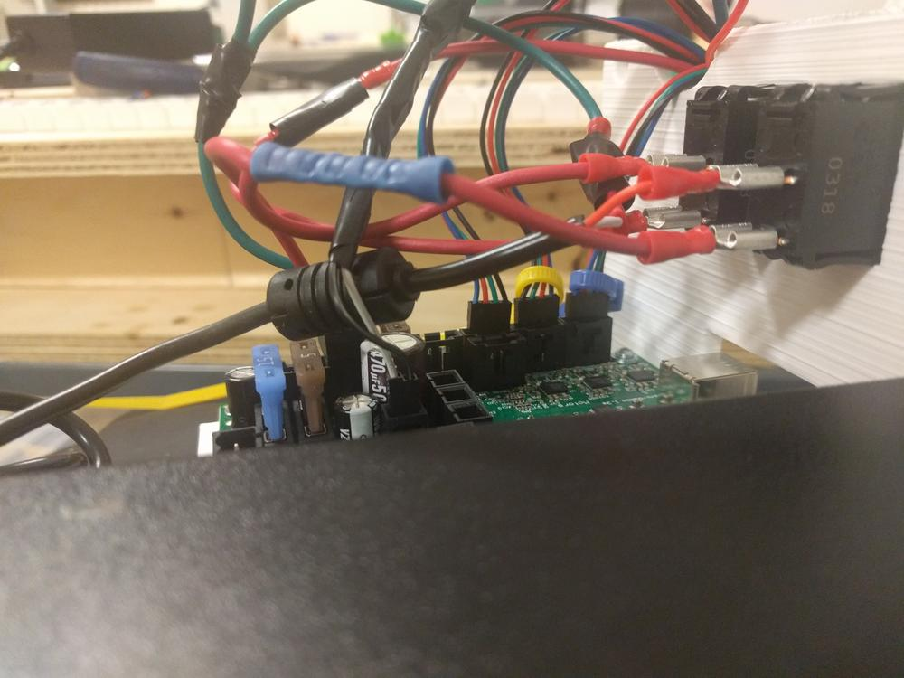
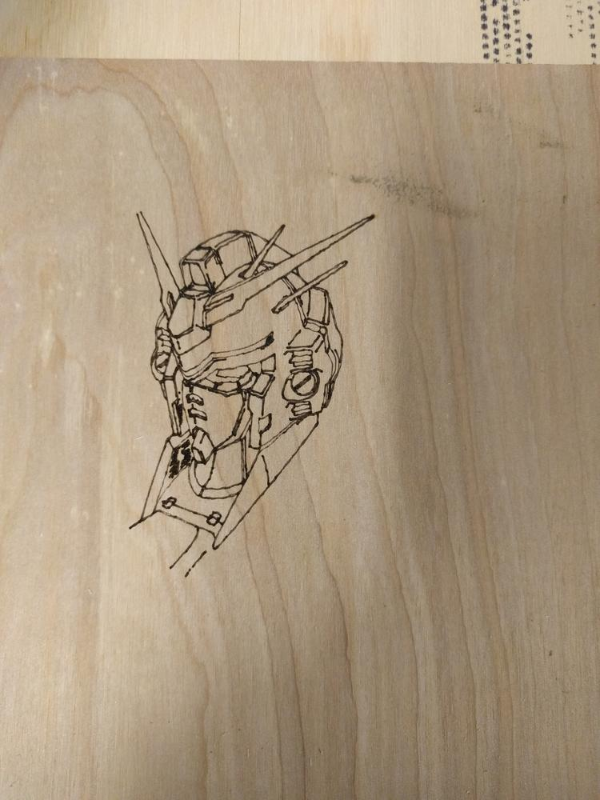
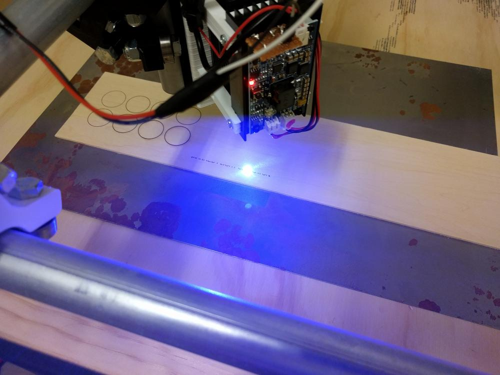

There seems to be a proliferation of inexpensive diode lasers available from overseas ranging from 1 to 15 W. It is somewhat concerning that someone can purchase such a high powered blinding device so easily. It is also very tempting...

<!--more-->

From [Banggood](https://www.banggood.com), I picked up a 5W 405nm laser diode and control circuitry for about $100. Most of my research into these modules were for 1 to 2.5W lasers, which seemed good for engraving, but not suited for cutting. My goal is to cut thin pieces of plywood, and experiment with a few other materials, so I opted for something with little more power without breaking the bank.

The driver board did not come with much in the way of documentation, but I was able to figure out there were two methods of control, one being the 12V TTL signal pin attached to the power plug, and the other a two-wire 5V PWM plug.

To test the laser functionality and figure out its control scheme, I set up a simple Arduino sketch to vary a 5V PWM signal as a potentiometer is turned.



The sketch is trivial, but can be found [here](https://github.com/geoffworks/LaserPWM). Use at your own risk.

In addition to the Arduino test, I wanted to test the 12V pin as well. Using the +12V fan pin on the MPCNC's control board, I as able to change the laser intensity in a similar manner with fan control gcode. since this was direct control from the board, I opted for this method.

## Updating Wiring
The next step was to update the wiring on the MPCNC. I took this opportunity to create a cleaner face plate for the machine, add a power switch for the board, and a second switch for the laser.

Using zip-ties, I marked which wires went to which axis, and pulled out the old printed faceplate and mount. With Fusion360, I made sure the plate would extend to cover the entire opening, and added two properly-sized rectangles to accommodate the switches.

I connected the hot line coming from the power brick to the first switch, then split it to the board and second switch. This gave me a master switch that needs to be enabled before the laser will work. Crimp connections were used to hold everything together. I then reattached all the stepper connections and enclosed everything in the MPCNC base. 

## Burning Stuff

I set up a Gundam head as my first laser operation, which seems to be the tradition when it comes to first cuts after a large upgrade. With clean lines and smooth operation, I forged ahead to more pieces.

## More lasing!

I engraved a few test circles to get an idea of how dark it will go under various laser intensities and speeds. I then started on my first project, a name tag for work.

The sheet metal underneath is used to prevent burning through to the MPCNC surface. Until I get more familiar with the operation of this laser, I want to err on the side of caution, and not burn more than is necessary.