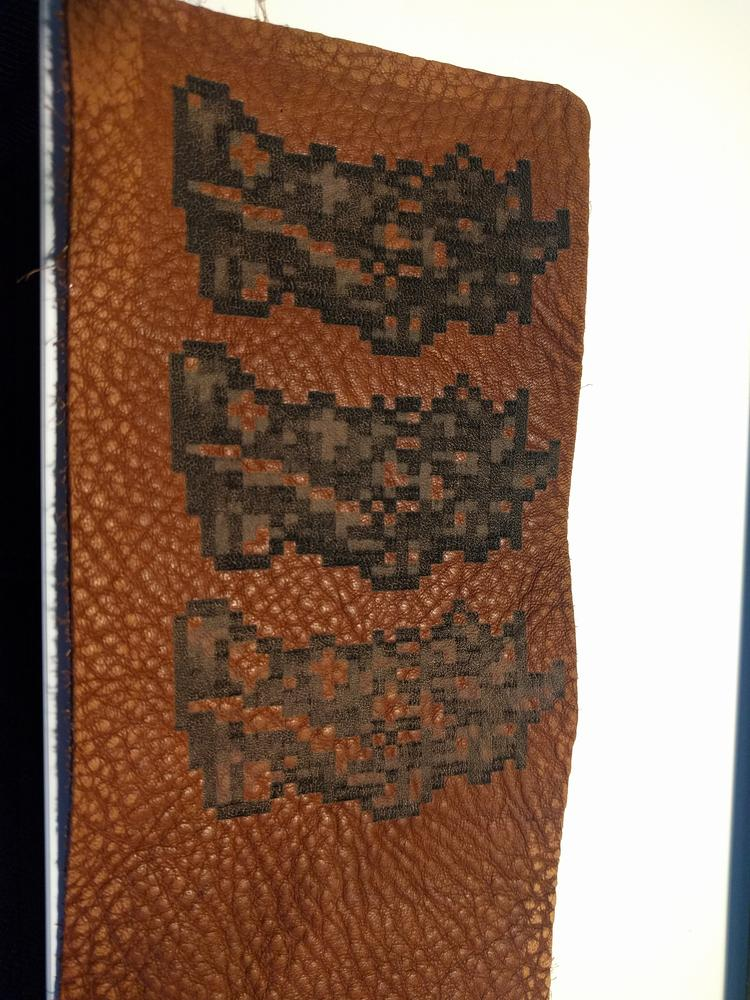
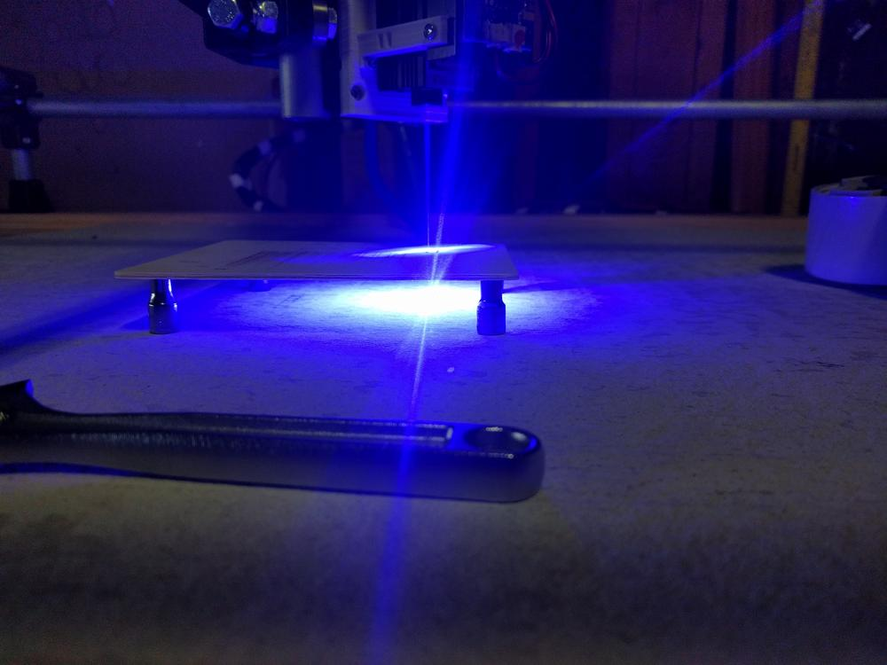
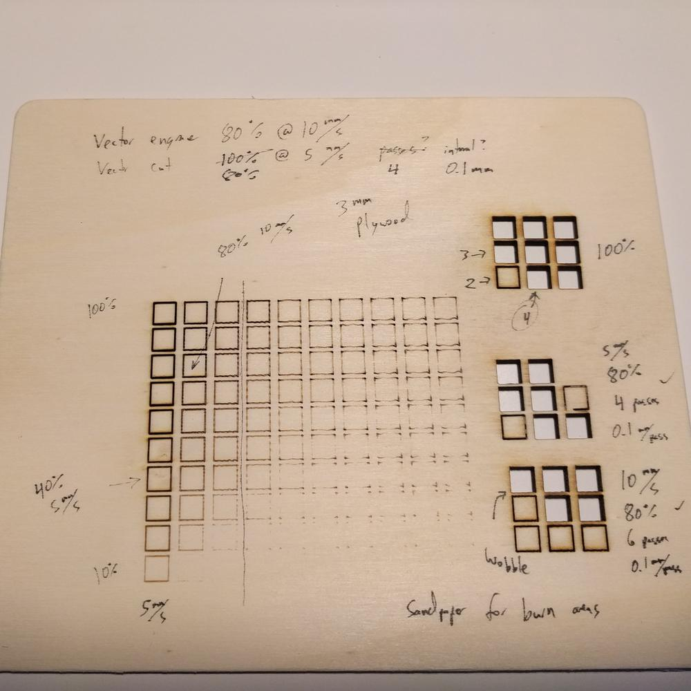
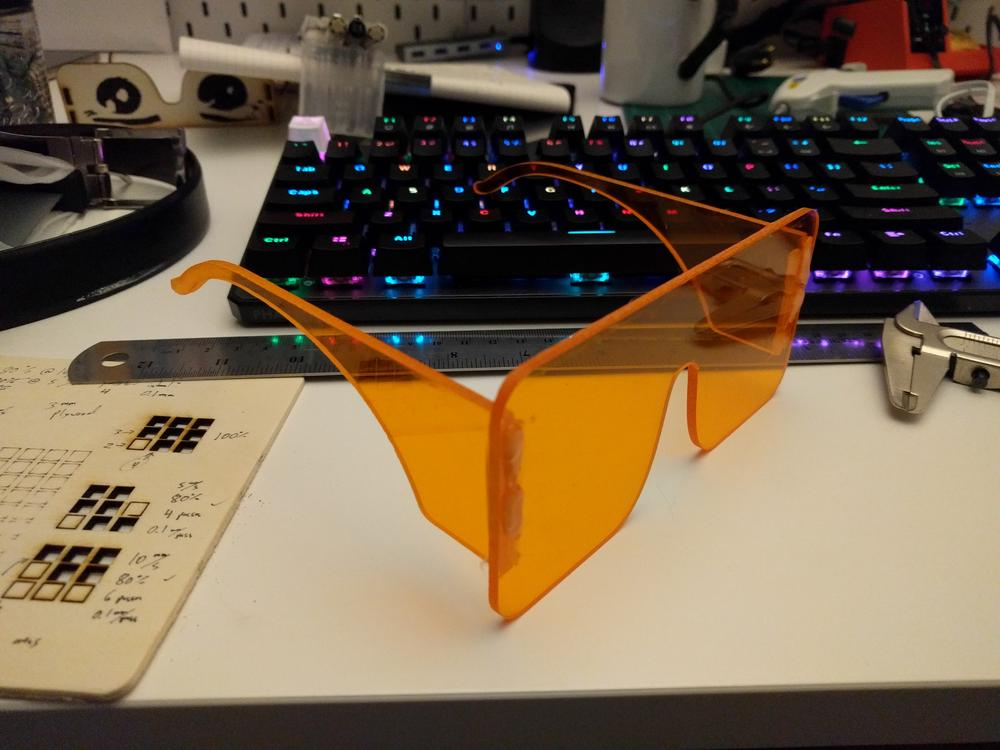

With the laser up and running, I wanted to try and dial in the settings to get good engravings and cut through some material. Most laser cutters are of the CO2 variety, which operate an order of magnitude faster than the MPCNC, and with two orders of magnitude more power.

There are lots of forum posts about setups similar to mine, but no two machines are alike, so I had to figure out my own parameters.

## Grayscale Engraving

The above is a sprite from the SNES game Chrono Trigger. If you squint your eyes, you might be able to make out the upraised sword and eyes, but color sprites do not translate well to grayscale laser engravings. Seeking to find a happy medium between charred leather and light marring, I varied the laser intensity a few times before moving on to something else.

## A More Quantitative Approach

As I started to lean towards cutting rather than engraving, I set up a systematic experiment to get better results. I generated a test grid of 5mm squares, varying the machine travel speed along the x axis, and laser intensity along the y axis.

For 3 mm plywood, the happy balance between speed and power was 80% intensity at 10 mm/s. Any faster, and I got wobbles from the toolhead oscillations, and any slower charred the edges too much.

The relatively low power of the laser requires multiple passes to cut though the plywood. On the right side, there is a separate set of grids where I did a number of passes at various speeds and intensities. The best result was 4 passes at 80% power and 5 mm/s, but I opted for the faster option of 6 passes at 80% power and 10 mm/s. The slight wobble and increased amount of char was worth it.

Up until now, I had been using a set up goggles that were delivered with the laser. They are designed for the laser wavelength, but they have an optical density (OD) of 2, which is not the best rating for eye safety

To operate a little safer in the garage, I picked up a sheet of OD 3 safety acrylic, designed a cutout that resembled what I wanted in eye-protection goggles, and set up the laser to run it. There is a strange sense of irony in using the tool to cut the material that is supposed to protect me from the tool itself.

The cut was 100% power at 5 mm/s, and it took 11 passes. Aside from the acrylic having the proper specs for protection from this wavelength, this material absorbed a ton of direct power before yielding to the laser. I feel comfortable using these as glasses for the occasional viewing of diffused indirect light.