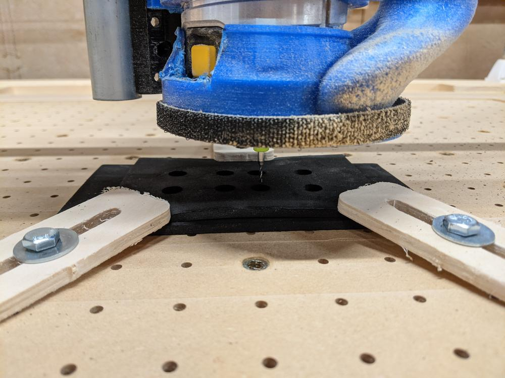
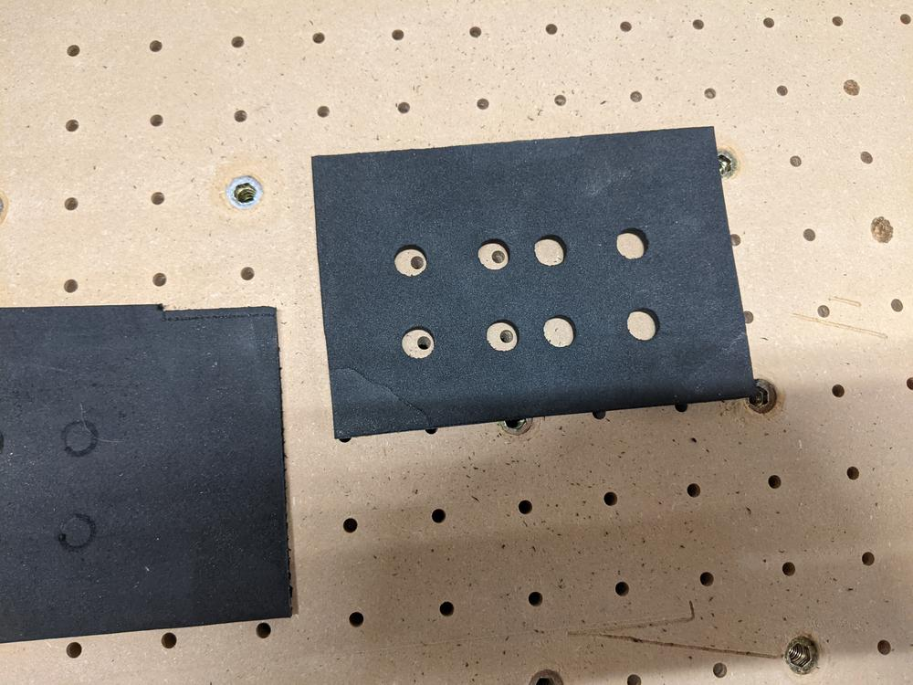
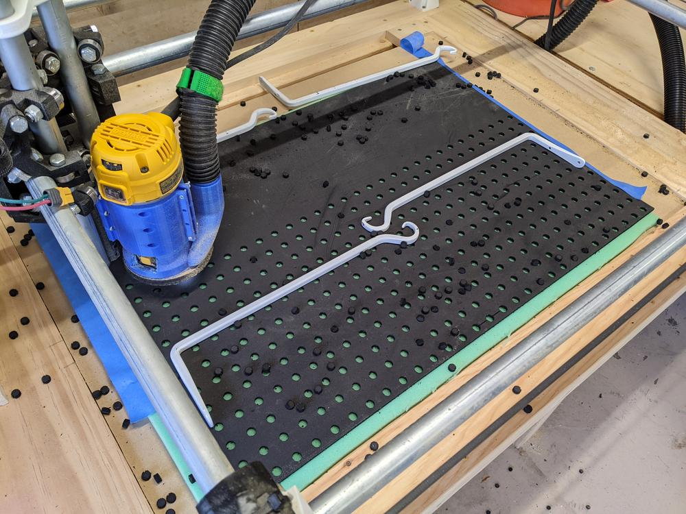
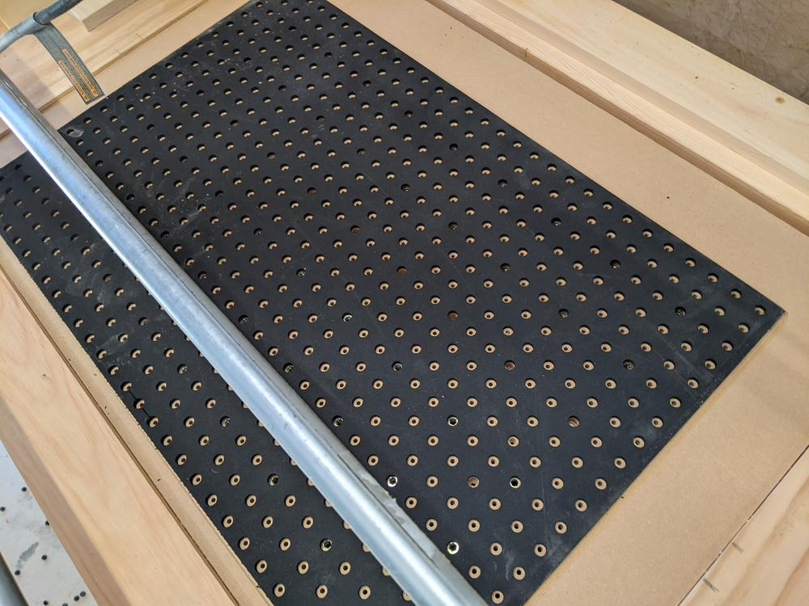

I have been thinking about this project for a long time. After I started using the needle cutter, I really wanted a vacuum table that could flatten the foamboard, and an underlying work surface that would not destroy the cutting tool.

<!--more-->

I decided to take a piece of EVA foam, and cut out holes in alignment with the existing vacuum table. This would form a soft surface for the needle to strike as it passed though the foamboard, while letting the vacuum pull evenly across the entire surface. To account for small errors in the machine, I made the holes 10 mm in diameter, and figured the 4 mm vacuum holes would be somewhere within each circle.

Since I had never cut this material before, I set up a few test cuts to figure out my feeds and speeds. This material is so soft, I am not sure if there is a "wrong" way to cut it, but 25 mm/s at 15000 rpm worked for me. 

With everything dialed in, and a satisfying test piece, it was time to set up the cut. Holes are spaced in a 1 inch grid across the material, totaling 600 holes. I had to manually set the order of the holes to zig-zag across the material from bottom to top, otherwise I would have had unnecessary travel which added about 20 minutes to the machine time.

The importance of a well-designed spoilboard can be seen in the lower left of the photo above. On a previous project, I cut a little too deep and hit a threaded insert, breaking my endmill. Fortunately, I had 4 more.

I keep the workpiece held down, I placed some porous green foam underneath the material. For the most part, this allowed the vacuum to hold the workpiece in place. The only workholding issue I encountered was the rotation of the downcut endmill lifting the workpiece at every hole. I added a few weights and painters tape, and periodically moved them near the cut locations to keep this from happening.

As the operation progressed, I realized I had forgotten a tiny detail: Each hole resulted in a tiny EVA foam disk getting flung across the garage. I swept up what I could, but I keep finding ones I missed.

An hour later, the spoilboard was complete, and lined up perfectly with every vacuum hole. I tossed a piece of warped foamboard down, turned on the vacuum, and watched it get pulled flat against the work surface. This will make working with foamboard much faster and more enjoyable.
