After a two week hiatus from the MPCNC, I got the itch to get back to making things. I wanted to salvage the spoilboard as much as I could, level it out, and create a few clamps to make workpiece holding a little easier.

<!--more-->

## Spoilboard Recovery
Last time I worked on the CNC, I ended up with a two part spoilboard where the second part did not match the alignment of holes in the first part. This essentially rendered the two-part assembly useless.

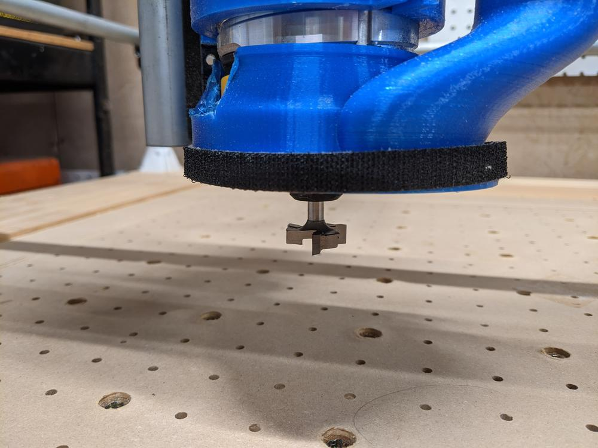

I decided to make the lower part of the board the only part, which meant using a surfacing bit to make the entire work area level and perpendicular to the router.

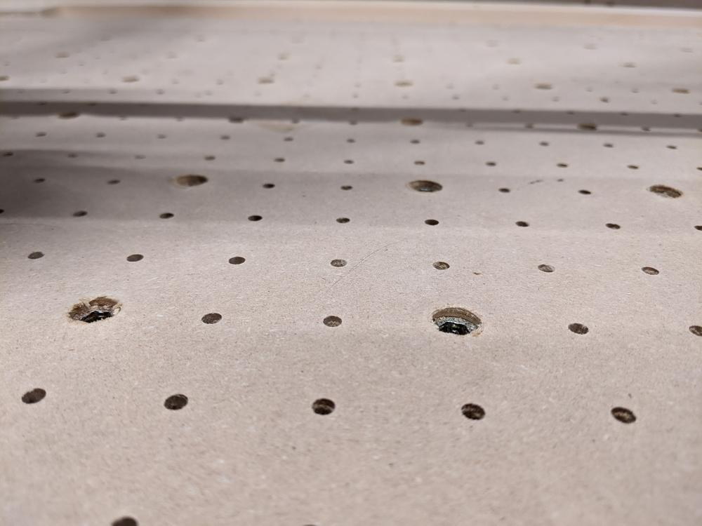

I planned a 1mm clearing operation over the entire work are of the board (776x511 mm, or a little over 30x20 inches). To keep from hitting any of the threaded inserts, I drilled them further into the board, leaving a few millimeters of of space between the top of the insert and the spoilboard surface.

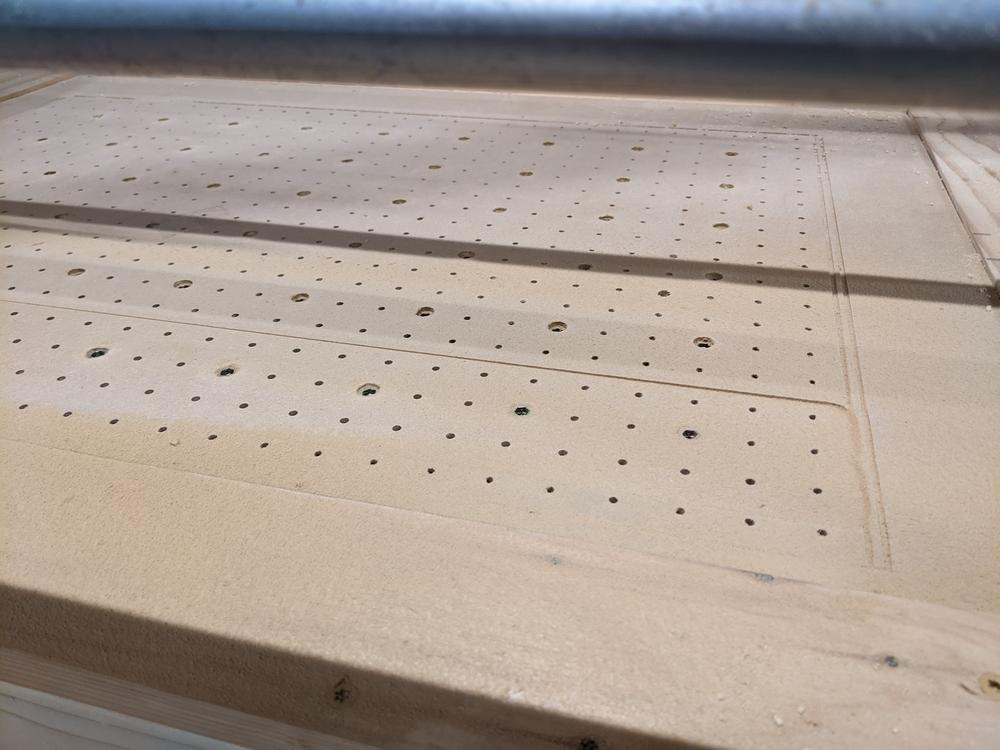

After a few passes, I could tell this was the right choice. The cut took about 10 minutes to clear the board.

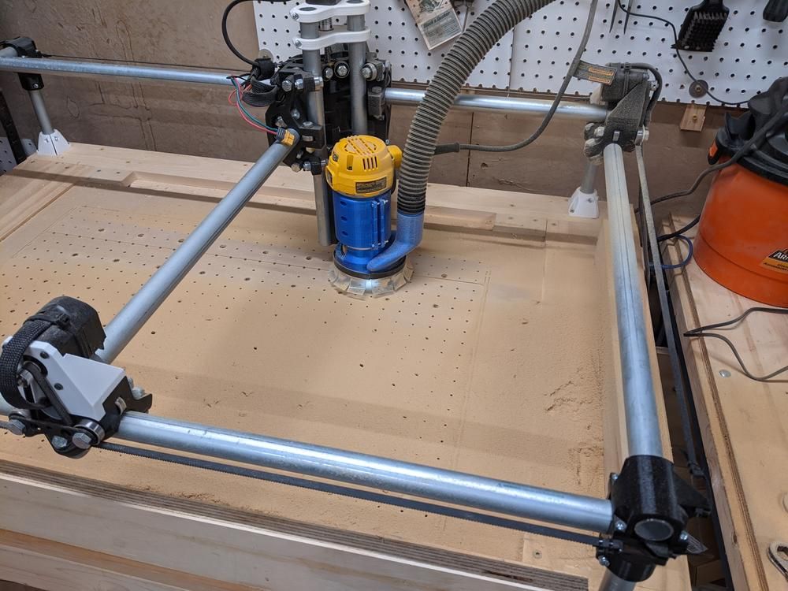

I was surprised at how much of the generated dust was not collected by the vacuum. I am using an inexpensive wet/dry vac designed for cleaning cars, which pulls less current than my main shop-vac.

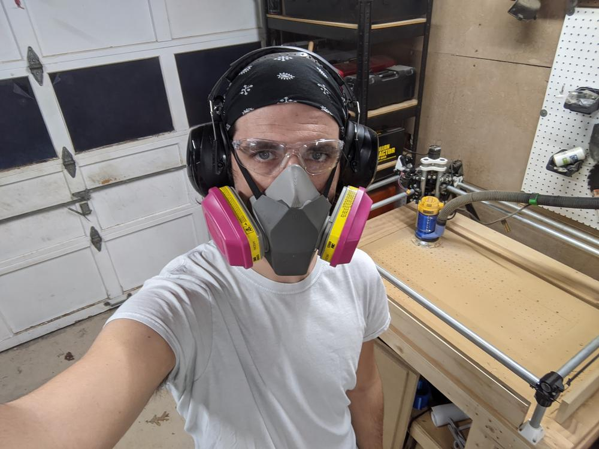

To make sure nothing goes wrong during cuts, I have been staying in the garage with the machine during the entire cutting operation. Don't forget to wear your dust mask!

The spoilboard came out nice and flat, and I was ready to move on to the other part of the project.

## Workholding Clamps

A key part of any CNC router is a workholding system. This can be a simple as double-sided tape, to as complex as hinged clamps that slide on a t-slot system. For my MPCNC, I wanted a set of slotted bars could be bolted into the threaded inserts, resulting in a low profile and easy-to-use clamping system.

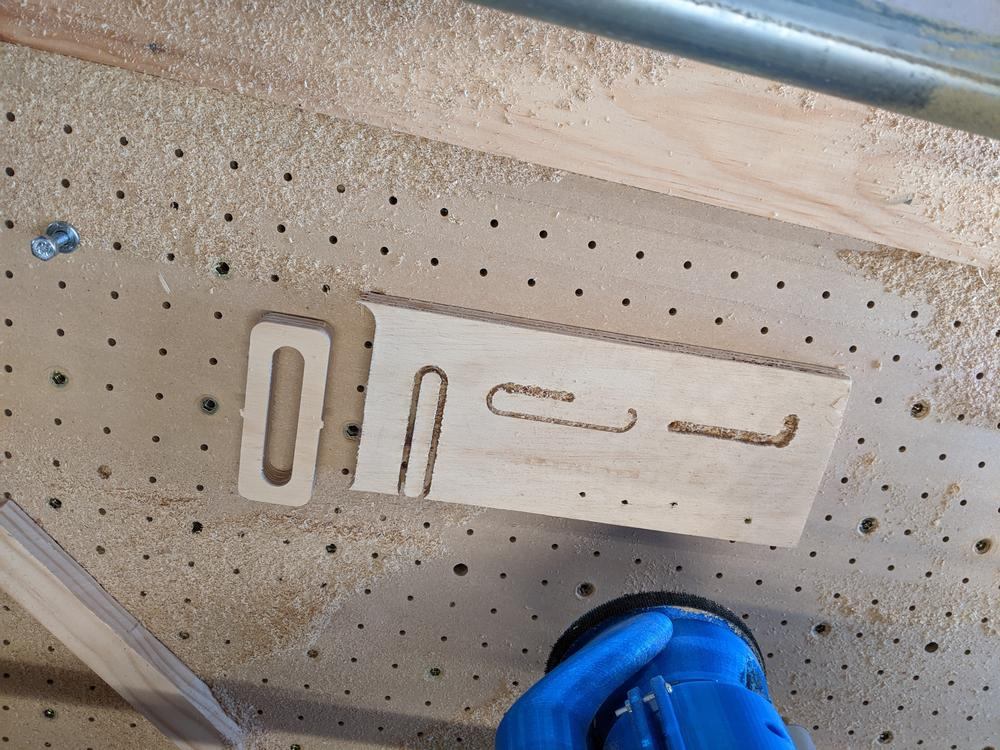

My first try was with 3/4" plywood. If I had put a little more thought into this, I would have realized this was going to be way too tall. It did give me a chance to test out my feeds and speeds on this type of material. A few false starts later, and I had my first clamp.

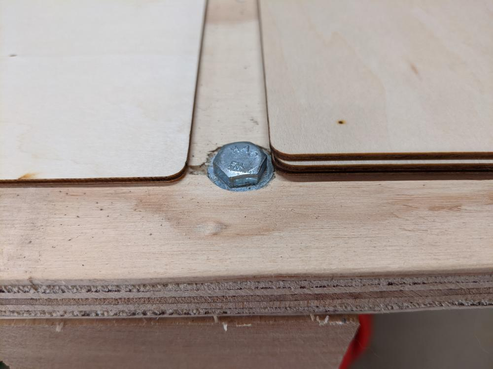

I realized I wanted something a little smaller than the plywood. Looking around the shop, I found a few 8x8 inch pieces of 2 mm sheeting I had originally used for laser cutting. This was a little too thin for clamps, so I sandwiched three of them together with some wood glue to make a sturdy 6 mm piece of stock for my clamps. This was left under some cement blocks overnight for the glue to dry. 

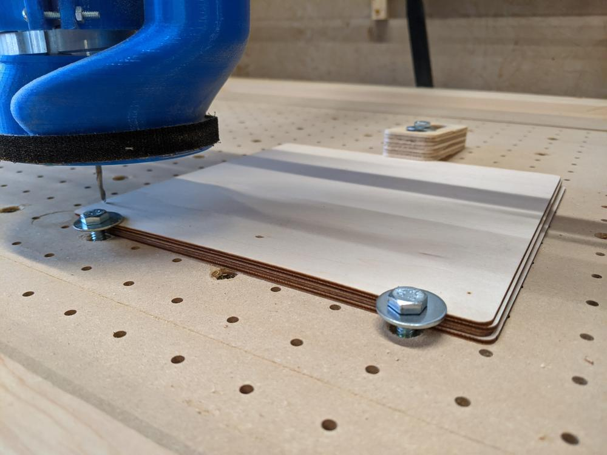

The next morning, I planned out a cut of 6 clamps, which should give me enough to work with for the time being. Using a few washers and my thick plywood clamp, I tightened the stock down and set up the operation. 

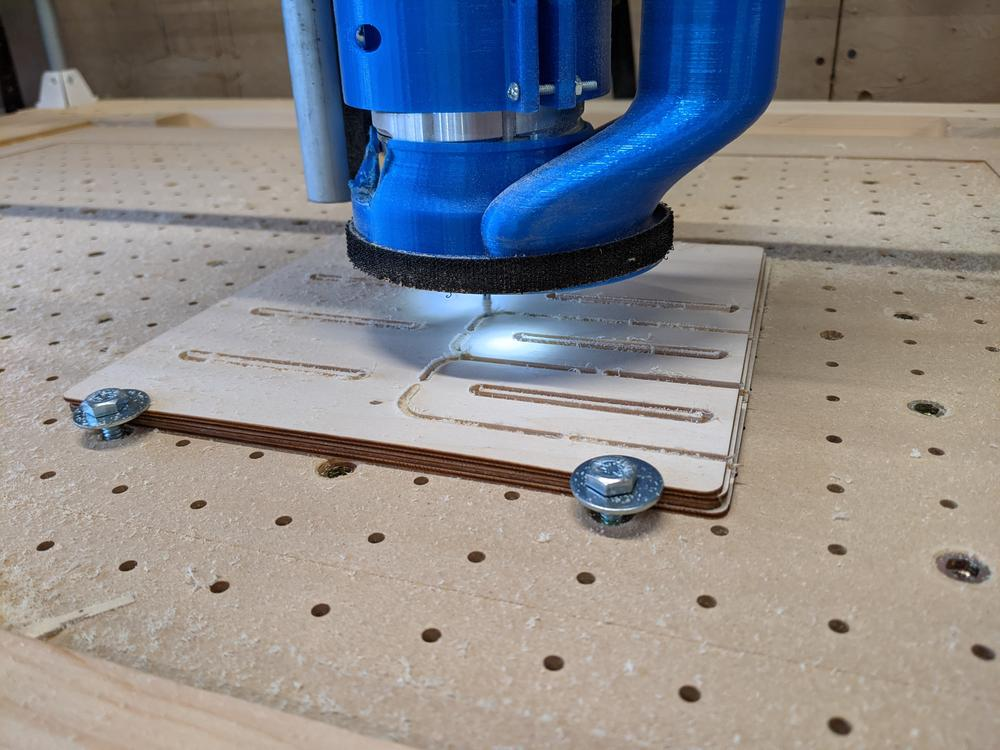

The clamps were designed to be 4 inches long, which stretched beyond the end of my material. Since the inner slot is still intact, I don't think this will cause and problems or clamping failures.

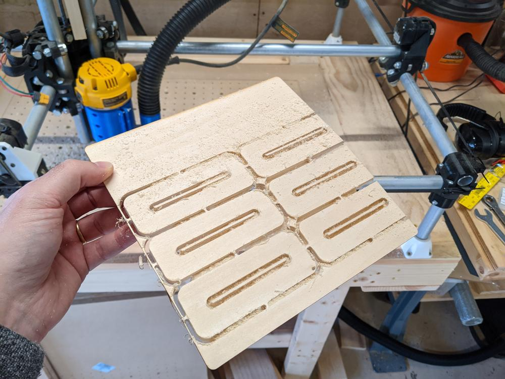

15 minutes of machining later, and I had my clamps cut out.

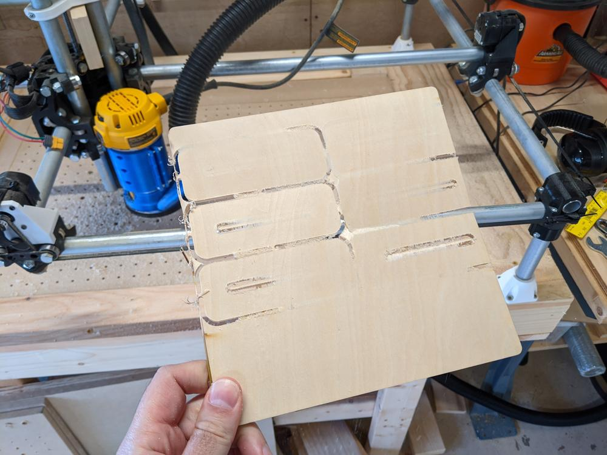

Since the stock was 6 mm thick, and I set my cut for 6 mm, I ended up with a few spots where it didn't quite cut through. If i had set the cutting depth just another millimeter thicker, it would have cut clear thought everywhere. All I had to do was bend the board a bit, and the pieces snapped right out.

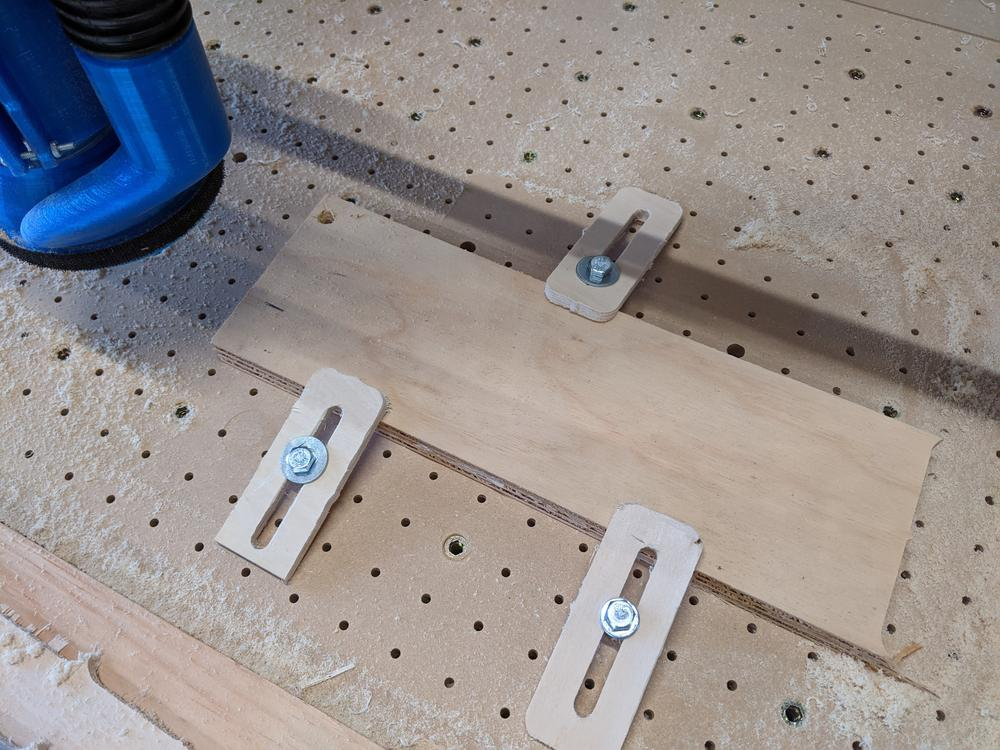

After a few passes with a sanding drum on a rotary tool, the clamps were ready for use. This will make it much easier to set up future cuts without scrambling and scrounging around for washers and makeshift clamps.