In the process of creating a spoilboard for the MPCNC, I came across several lingering issues with the machine that needed to be resolved. It ended up being an opportunity to correct a bunch of broken bits, tighten up nuts and bolts that had loosened, and come to terms with an accuracy problem I had been ignoring.

This project also gave me a chance to try a new method of documentation, and learn a lot about what works and doesn't work for my creative workflow.

## Spoilboard Requirements
A spoilboard (or sacrificial board) is a flat piece of material that functions as the work surface of a CNC router. As the machine works on material, cutting out parts and drilling holes, the tool will extend below the surface to get a complete cut. This ends up marring the spoilboard and degrading it's flatness. This board takes a beating for a time, and is then swapped out for a new spoilboard when the old one is too damaged to reuse or resurface.

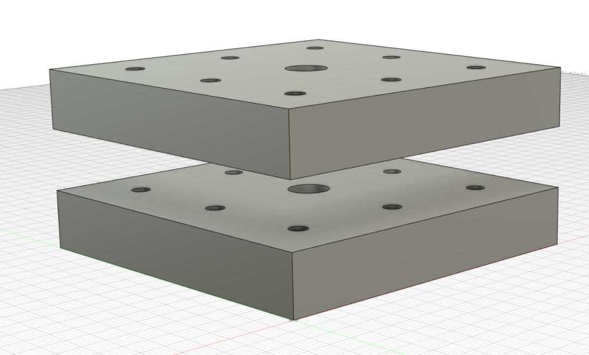

For my MPCNC, I wanted a surface that could be used as a vacuum table for large sheet material, but still had threaded inserts to which I could secure smaller pieces with standard 1/4-20 bolts. My solution was two stacked pieces of 1/2" MDF. The intent was to drill a 1" spaced grid of vacuum holes and a 3" spaced grid of larger holes through both boards. The threaded insert would be embedded in the lower board, allowing bolts to pass through the upper board to secure the workpiece to the top. This would allow for a replaceable spoilboard, without having to swap inserts or purchase a new set with every board.

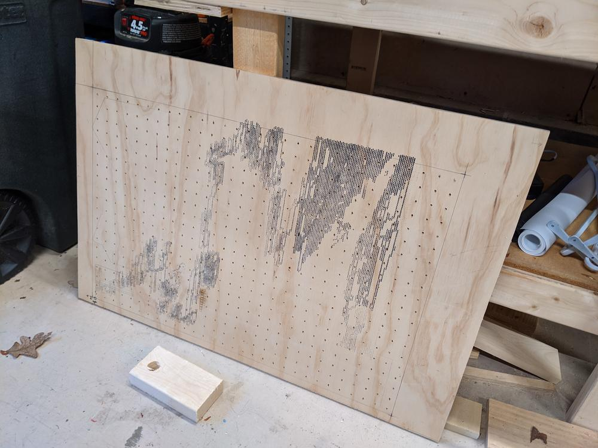

This is the old surface, from when the MPCNC was used as a needle cutter for making foamboard RC airplanes. The holes are spaced approximately 1 inch apart, but I did not think I could match the irregularity with the CNC, so this board will be reused elsewhere.

## Broken Z Axis
My first setback came when I was testing out feeds and speeds for drilling the vacuum holes. As I was focused on grabbing video footage of the cuts, I forgot to start my cut at home (coordinates 0,0,0). This blunder caused unexpected motion of the router, driving it into the test piece and dragging it across the work surface. In recovering from this mishap, I realized some key parts of the Z-axis hardware were cracked and loose.

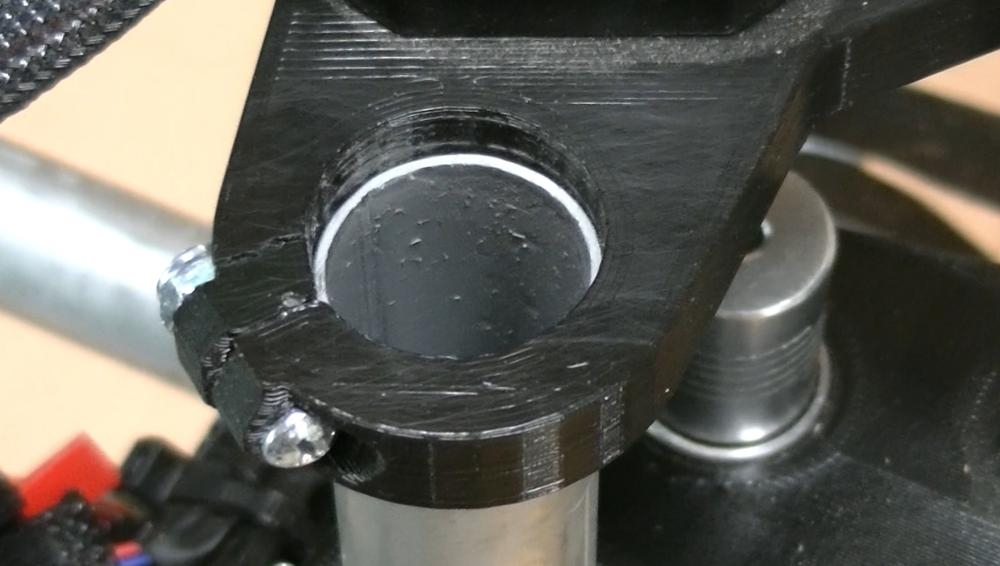

This was probably caused by over-tightening of the bolt that is supposed to keep this part clamped around the conduit, combined with the stress of use over the past two years. PLA is easy to print with, but is known for being quite brittle under stress. To correct this issue, I figured the best course of action was a reprint of the hardware

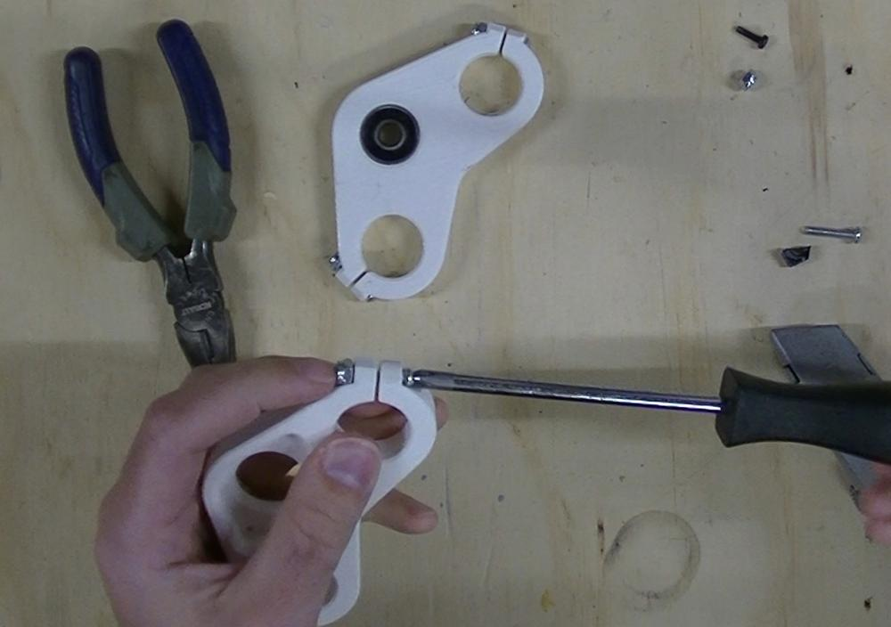

3 hours of printing later, I reassembled the Z-axis and was ready to start milling again. No over-tightening this time!

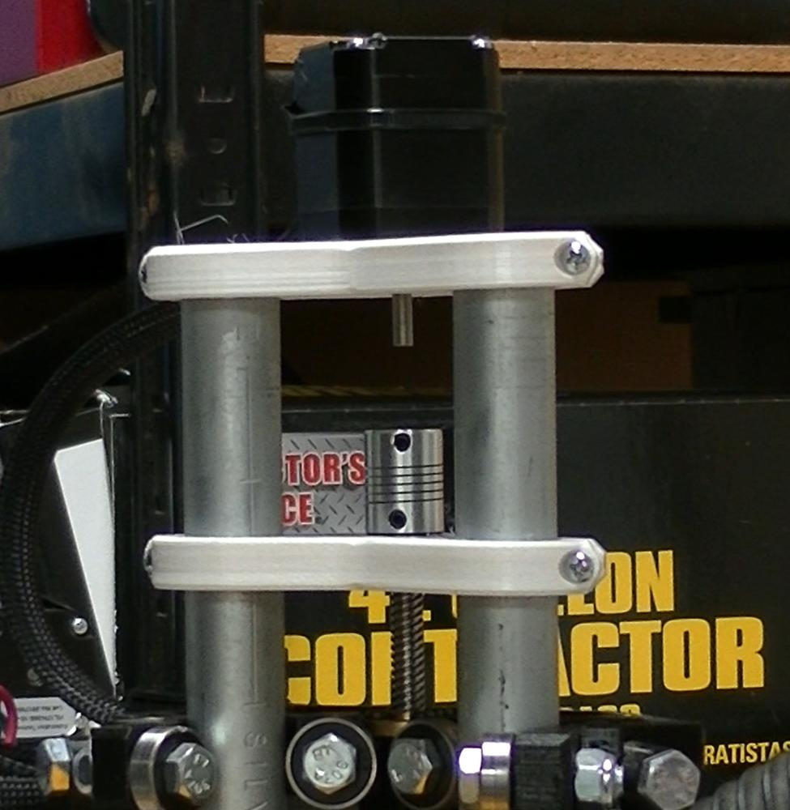

## Vibrations and Loose Bits
After running a few more test cuts, I noticed a bit of vibration on the Z-axis. Looking the machine over, I found the nut on the main bolt holding that axis together was missing!

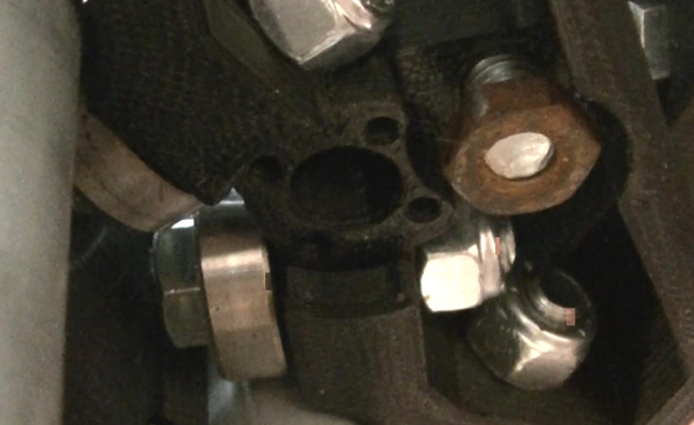

7/16" locknuts are not something I keep on hand in the garage. Looking through every bin, bucket, and drawer, I finally found a matching nut on the bottom of my radial arm saw. Since I can get away with not using that tool for a bit, I swapped it over to the CNC.

## Non-Squareness and Missed Steps

After resolving these setbacks, and figuring out the parameters of the cut, I moved forward with making the bottom portion of the spoilboard. I set up a helical drilling action for 4 mm holes across the entire 20x30" work surface, and went back to do 8.5 mm holes for the threaded inserts.

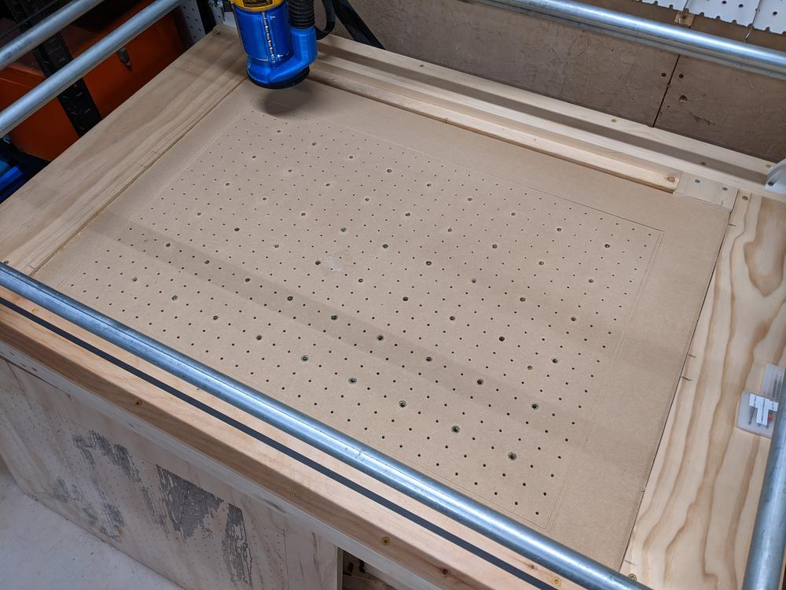

Emboldened by the success of the bottom board, I set up the top spoilboard in a similar fashion. Using some 1x4 strips, I raised the board off the first surface, loaded up the same gcode for the bottom surface, and started the next operation.

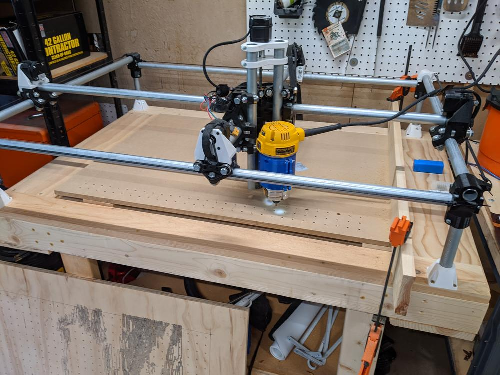

I checked in on the machine about halfway thought the run, and noticed my grids of holes were coming out in a trapezoid shape! Not only did this ruin my last remaining piece of MDF, but it also drilled holes that would not line up with the lower sheet.

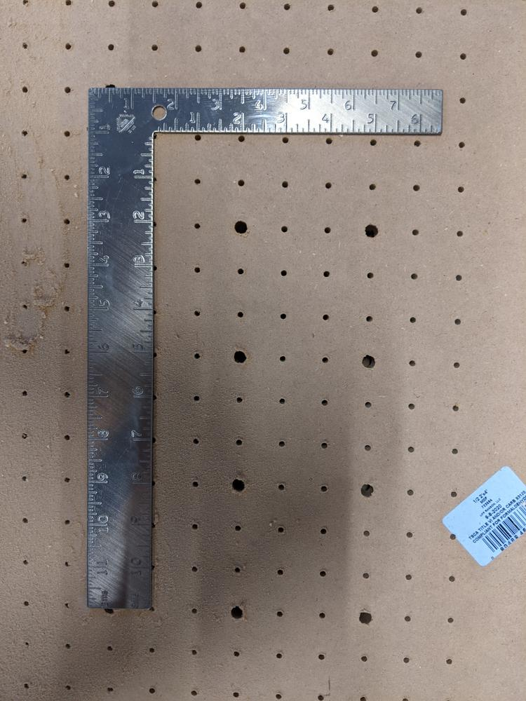

At some point in the repositioning of the router, I accidentally commanded a movement that was outside the bounds of the machine. This pushed the X-Y gantry against the frame, causing the motor to skip a few steps and set the axes askew. Once I cancelled the drilling operation and disabled the stepper motors, the axes snapped back to perpendicular, but the damage had already been done to the workpiece.

As I cleaned up the mess, I took a closer look at the lower spoilboard (the "successful" one), and realized these were slightly off axis as well. This entire time, my machine has been cutting everything with small slant to it. I should have been more rigorous in my setup and ensuring everything was square, but better late than never, I suppose.

## Still Operational

It's easy for me to get so wrapped up in a project that it becomes my only focus. A part of me enjoys working on something over which I have complete oversight, especially in this day and age when so much seems to be spiraling out of control. However, when mistakes are made, there is no one to blame but myself. I like the sole responsibility of it, but it's easy to get frustrated with myself over these setbacks.

With this frustration, I walked away to regroup. Sometimes, all I need is a little distance from a problem. A day later, I came back, looked at the bottom portion of the spoilboard, and decided I can make this work for the time being. Hoping for a quick win, I found an interesting logo from a [band I enjoy](https://www.youtube.com/watch?v=aPefIzoSn-A) and set up a cut.

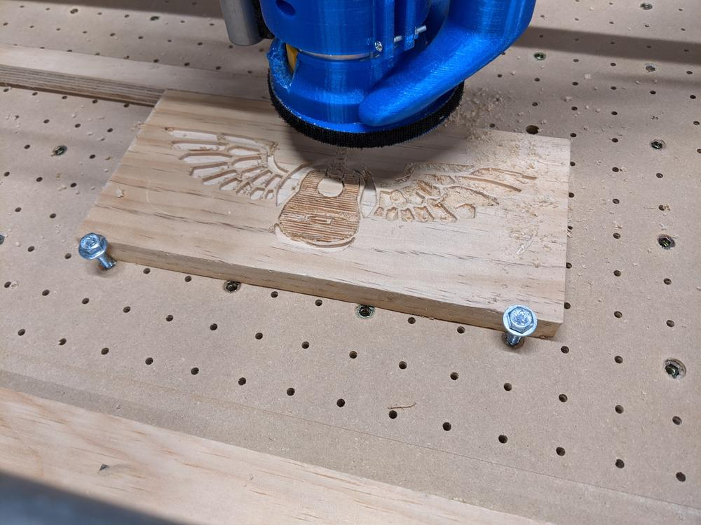

Even though the spoilboard did not go as planned, I ended up with a display piece I can put on my shelf. It's a nice reminder that things don't always work out the way I expect them to, and a failed project does not mean the effort was wasted.

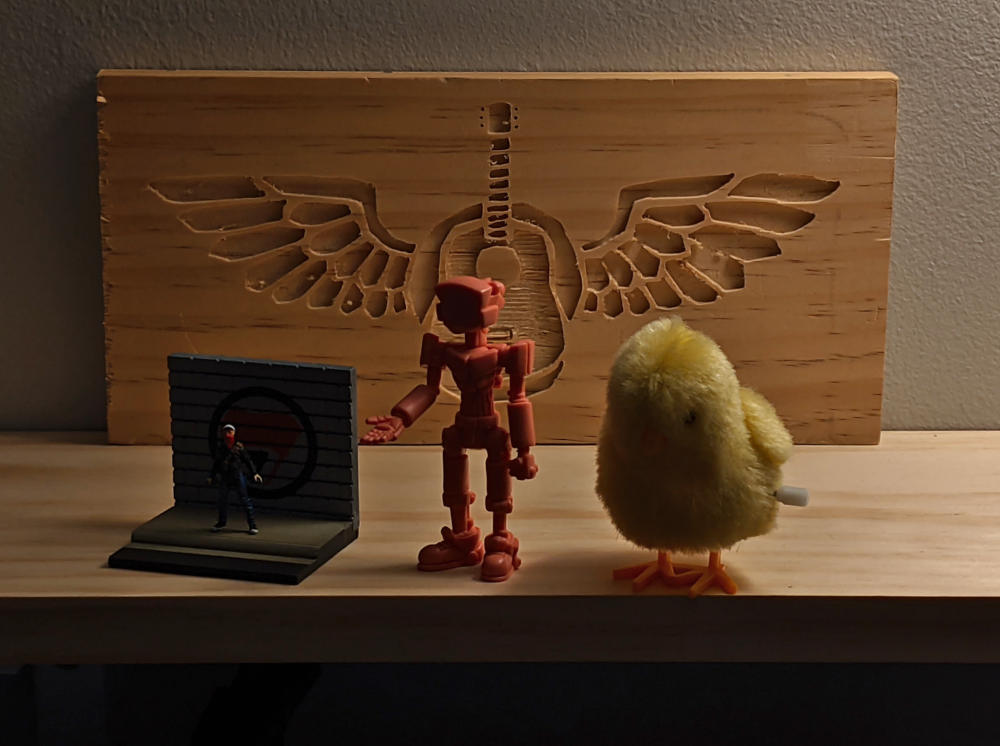

## A Note on Documentation and Sharing
Whenever I work on a project like this, I try to take pictures throughout the process. These photos occasionally end up on social media in real time as the project progresses, but more often are collected at the end and assembled into the documentation found on this blog. Sifting though these pictures after project completion is enough to replay the process in my head, but sometimes I am missing key photos that I wish I had for a blog post.

For the spoilboard, I tried to go in a different direction. I attempted to film most of the process with a few cameras, with the intent to assemble the footage and narrate the project. What I ended up with was 30 GB of various views of the MPCNC in various states of operation (or non-operation). All in all, a collection of dead footage of me doing things off camera, with the occasional shot of me driving the router into the table or forgetting some key step in setting up a cut. Juggling filming and the project left me feeling frustrated and disappointed in the end result of both a video and the project itself.

I don't think filming projects is something I have the patience for. Making sure I have the right footage, good camera angles, and keeping batteries charged distracts me from the process of making and problem solving. And after the project is done, the thought of editing all that footage makes me never want to touch a camera again.

I think I will stick with photos and after-the-fact writeups. No YouTube stardom for this maker, but I can live with that.