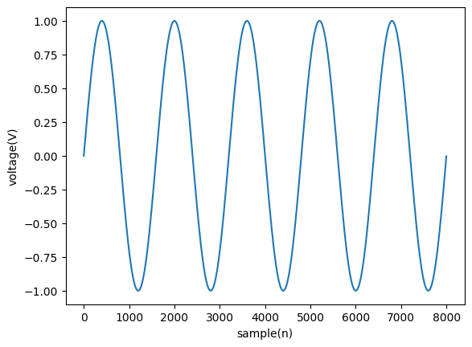
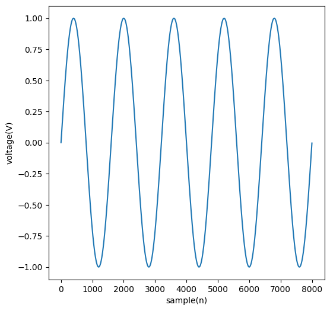
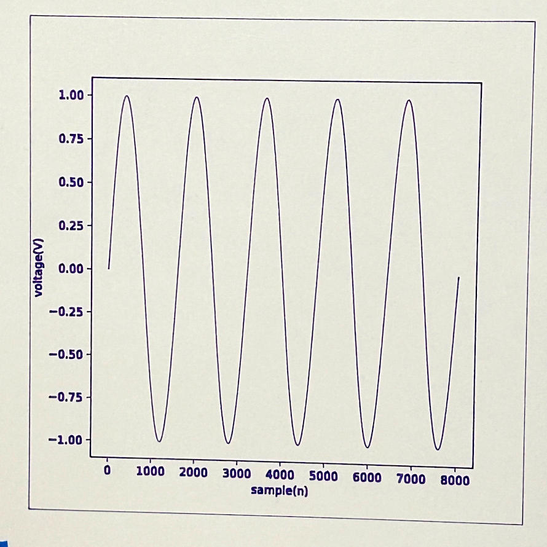

Several months ago, I built a pen plotter from an open-source design from thingiverse and modified it to hold a different servo and be wall-mounted.

The goal of this project was to take a simple 2d plot generated in python, and export it to a gcode format that is readable by the pen plotter device.

<!--more-->

The workflow from start to finish is as follows:
1. Create a plot figure using commonly used python libraries
2. Export that plot to an svg file
3. Generate a gcode file for my plotter using the vpype-gcode plugin 

## Creating a plot
First, a plot was created using matplotlib to handle the figures, and numpy for access to math and array operations. (Plot copied from [here](https://stackoverflow.com/questions/22566692/how-to-plot-graph-sine-wave))


```python
import matplotlib.pyplot as plt
import numpy as np

Fs = 8000
f = 5
sample = 8000
x = np.arange(sample)
y = np.sin(2 * np.pi * f * x / Fs)
plt.plot(x, y)
plt.xlabel('sample(n)')
plt.ylabel('voltage(V)')
plt.show()
```
### Result:


## Saving a Figure
Figures can be saved by calling `plt.savefig("filename.svg")` before running `plt.show()`


```python
Fs = 8000
f = 5
sample = 8000
x = np.arange(sample)
y = np.sin(2 * np.pi * f * x / Fs)
plt.figure(figsize=(6,6),dpi=100)
plt.plot(x, y)
plt.xlabel('sample(n)')
plt.ylabel('voltage(V)')
plt.savefig("sine_wave.svg", pad_inches=0.1)
plt.show()
```

### Result:    


This saved the figure to `sine_wave.svg` in the same directory as this notebook. Using optional args in `plt.figure` and `plt.savefig`, the plotted image will have the following parameters:
* 100 dpi (dots per inch) `plt.figure(dpi=100)`
* 6.0 x 6.0 inches in size (W x H) `plt.figure(figsize=(6,6))`
* 0.1 inch padding around the image `plt.savefig("sine_wave.svg", pad_inches=0.1)`

## Generating Gcode
The following shell command takes the output svg file and writes it to a gcode file

`vpype read sine_wave.svg gwrite sine_wave.gcode`

Before running this command, I set up a default profile for my machine that will handle flipping the y axis and setting home as the current position on start.

Since this is a shell command, it must be called in this notebook using the `subprocess` module.


```python
import subprocess

vpype_export = "vpype read sine_wave.svg gwrite sine_wave.gcode"
print(subprocess.Popen(vpype_export, shell=True, stdout=subprocess.PIPE).stdout.read())
```

## Pen Plotter Results
Running the resulting gcode through the pen plotter yielded a clean image with suprisingly clear text.



The only issues I noticed were the doubling of lines along the plot box, and the outer rectangle that was a result of including the white backgound in the exported SVG. I think I can resolve this in future plots.

## Conclusion and Future Work
All in all, I consider this a promising start to future plots. For my next steps I would like to try splitting the plot into multiple colors, and having the plotter prompt for pen changes within a single gcode file.
