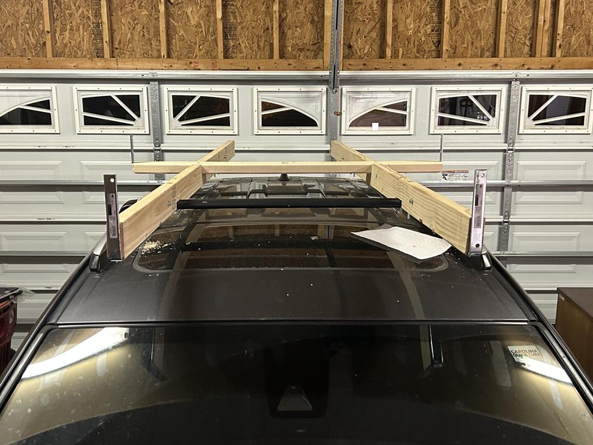
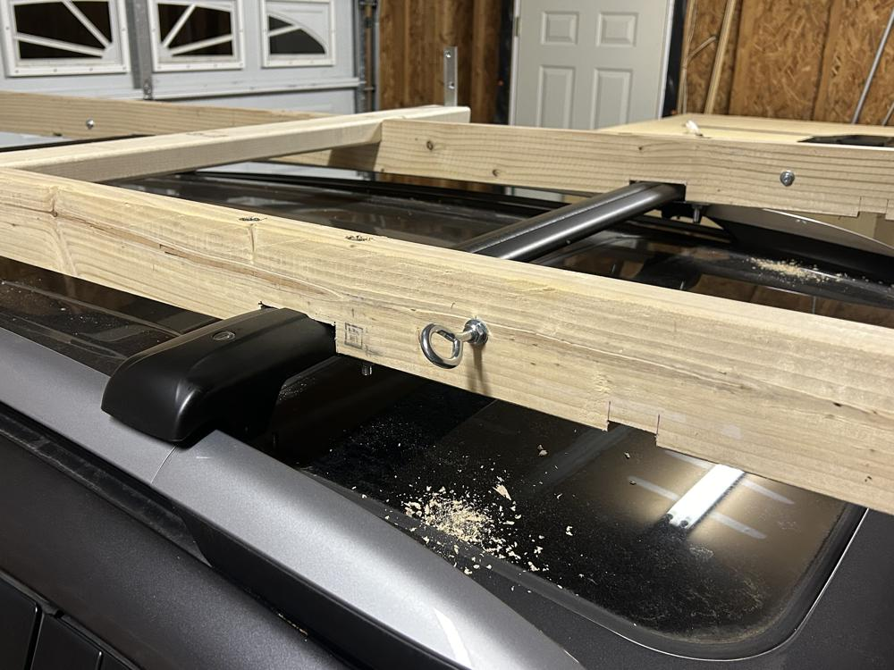

I needed a way to transport plywood from the store back to my house using my Rav4. In the past, I have had the sheets cut small enough to load in the back of the car, but this time I wanted the freedom to cut it myself to my own specs. 

<!--more-->

I cut notches in the bottom of two 8' 2x4s to fit the location of my roof rack cross bars. I then drilled a hole on both sides of each notch to run a 4.5" 5/16" hex bolt from top to bottom. This bolt hole was countersunk into the 2x4 to keep from scraping anything that goes on top of the rack. The bolts are used to attach a 6" piece of straight mending brace to the bottom of the cross bars, holding each rail firmly in place. I also added an 8" corner brace at the front of each rail as a stop for the plywood.

At the midpoint of each rail, I cut a notch in the top to fit a 4' piece of 2x4. At each end of the 2x4 I added a 6" corner brace to keep plywood sheets from sliding left and right. This might be overkill, but I'd rather over-engineer than under-engineer. The 2x4 crossbar is attached with two 1/4" hex bolts that go into threaded inserts embedded in the lengthwise rails.

20" back from both ends of the rail, I drilled a hole to fit a 5/16" eyebolt. This is where the ratcheting straps attach to.

For my first test, I loaded up 2 1/2" sheets of plywood, which a sheet of pegboard sandwiched between them. Tightening down the ratcheting straps keeps the sheets firmly in place, and the side bracket give me peace of mind that nothing will slide to the left of right if I have to make a sharp turn.

The first test was a success, and I now have a way to transport full 4'x8' panels of material back to the house.