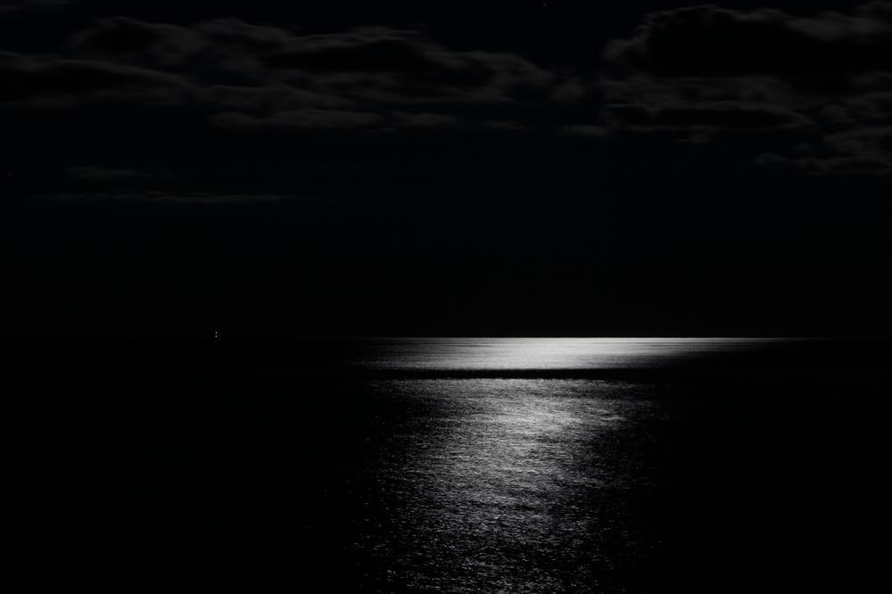
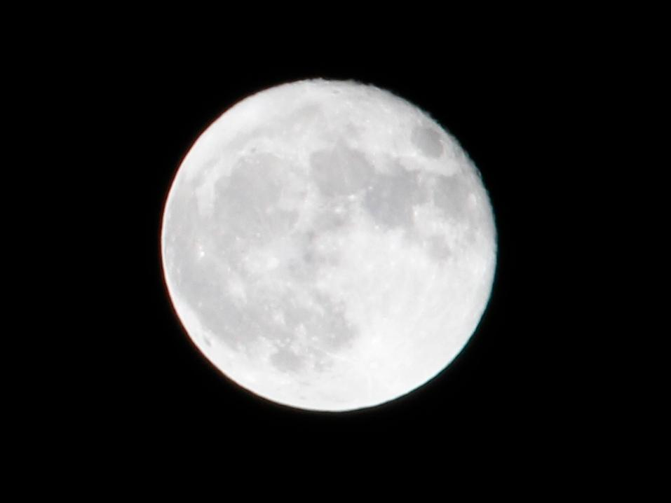
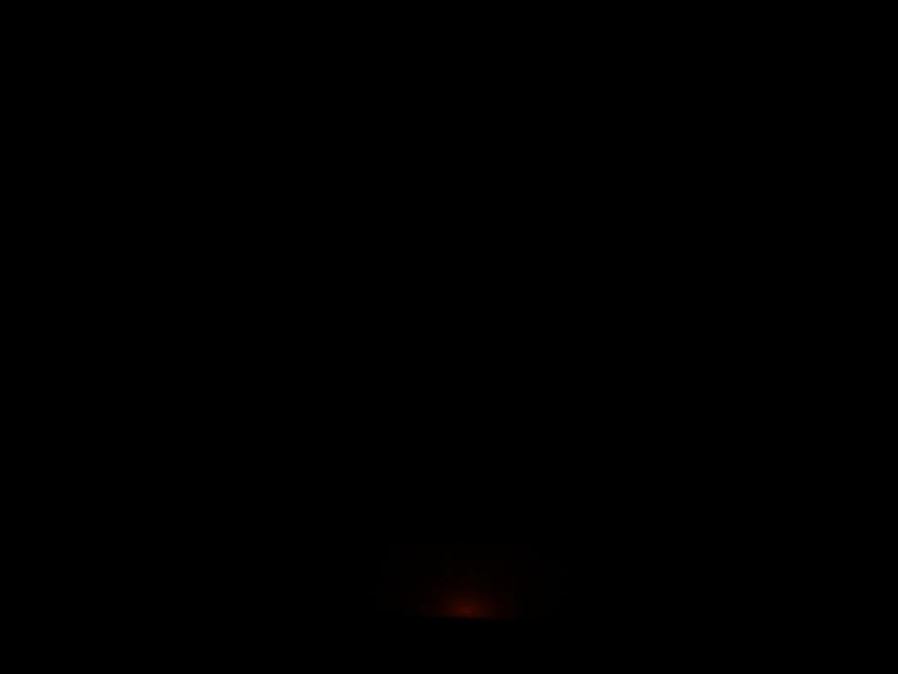
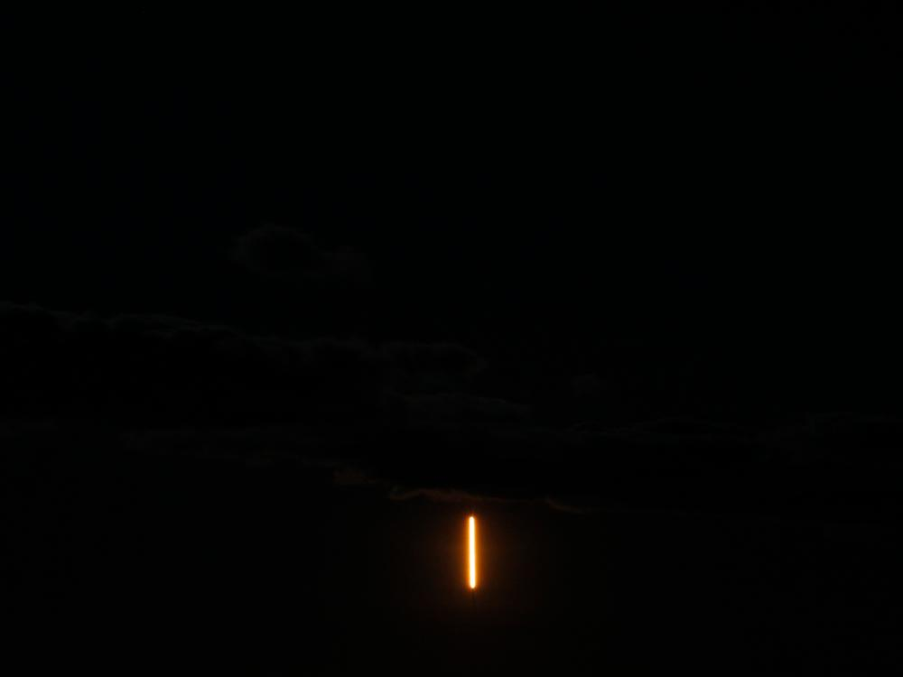
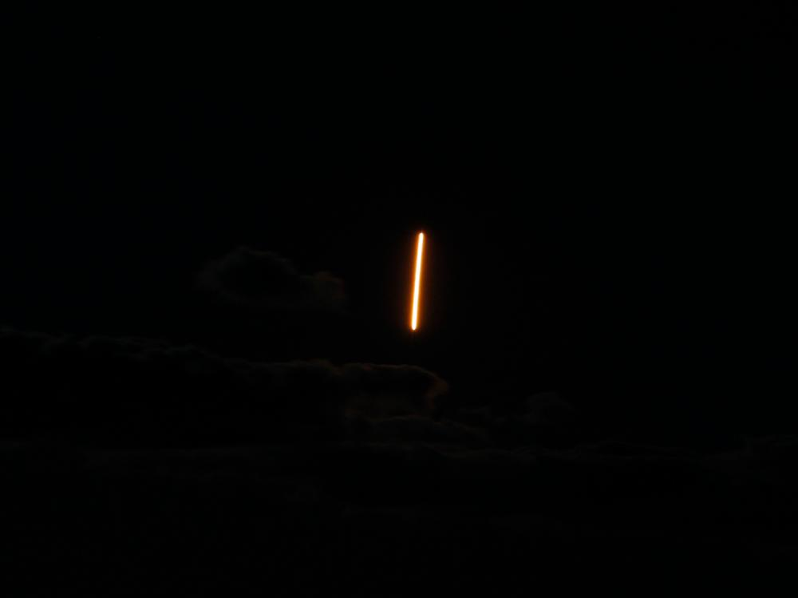
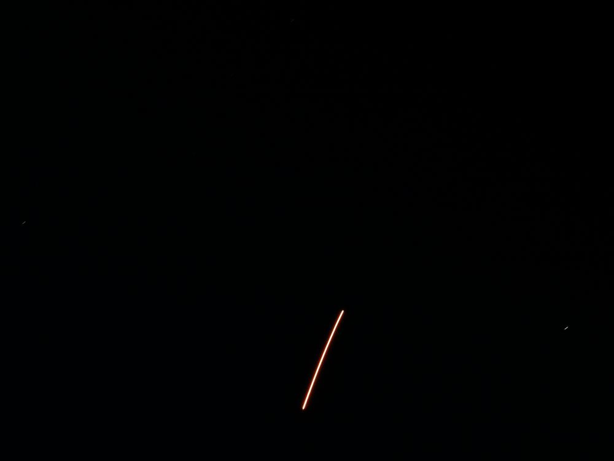

This weekend, I got a chance to see the Antares rocket take off from Wallops Flight Facility. The facility is on the Atlantic coast of Maryland, and I am roughly 50 miles away on the west side of the Chesapeake. The mission was a resupply to the International Space Station, carrying cheese, nitrogen, and other essential items.

## Camera Setup
My wife and I got out there early enough to get my camera setup, a simple tripod holding a Canon T3i with a 55-250mm zoom lens. I took a few shots of the water to get my exposure times and aperture dialed in.

I fully expected to be running a wide open aperture, but the moon was so bright I had to step it down a little bit.

## Lift Off
Right on schedule, at 9:16 PM, we started seeing a glow on the horizon. It was spectacular sight, and I didn't have my camera settings set to do it justice. Stats: 6.00s f/18.0 ISO400 	

Then the rocket appeared over the horizon, like a bright orange ball, brighter than any meteor or (non-Sun) star I have ever seen. 	

*Stats: 65mm 6.00s f/10.0 ISO400*

*Stats: 65mm 6.00s f/10.0 ISO400*

*Stats: 65mm 15.00s f/10.0 ISO400*

On the last picture, there is a faint image of a star on the right side, showing the trail of a long exposure. I did not realize the moderate focal length of 65mm over 15 seconds would bring out so much movement in the stars!

This was a great experience, and I hope I get the chance to see a night launch again. I will try to better dial in my camera for the next one, and snap a bunch more pictures.
