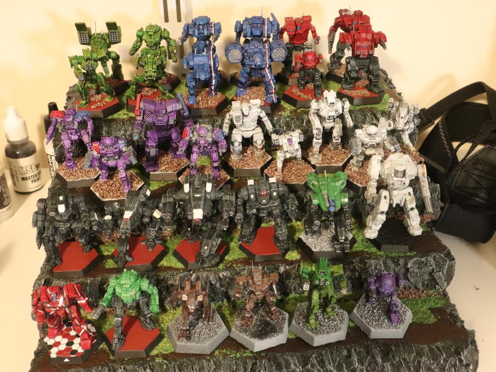
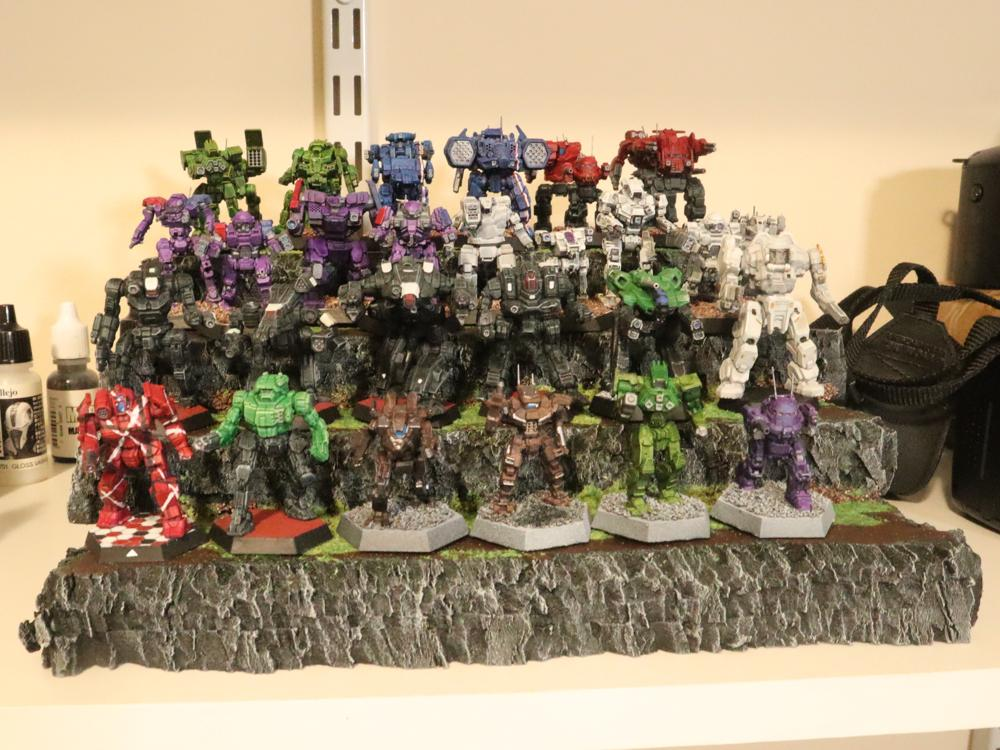
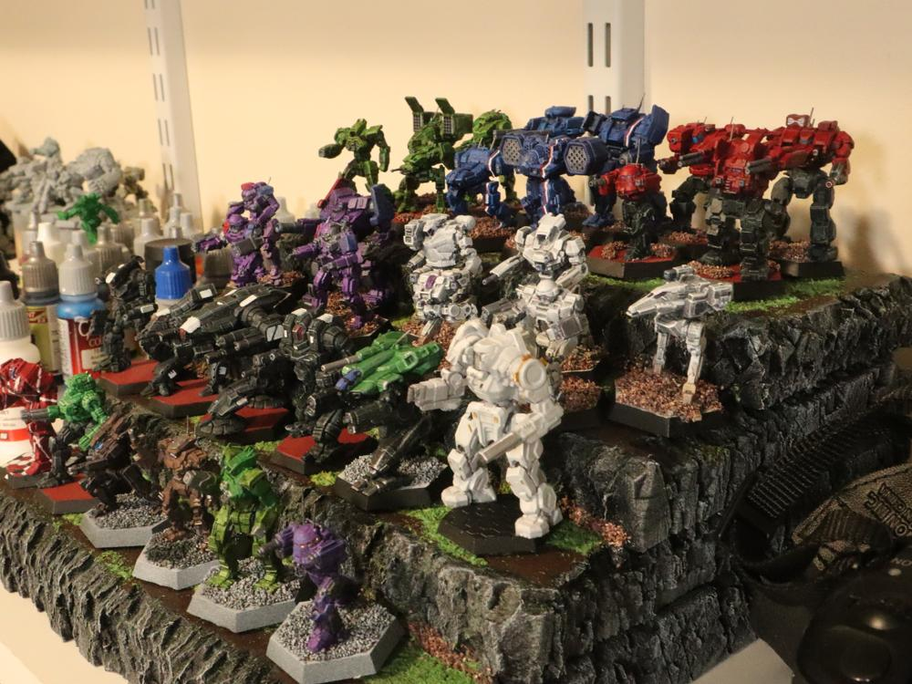

As my collection of 3d printed and purchased Battletech figures has grown, I needed a better way to display printed pieces. This homemade tiered shelf is what I came up with.

<!--more-->

I started with a 2x2 foot, 1 inch-thick piece of XPS foam from the local home improvement store. The foam was cut into four tiers, each 10 inches wide and 10 to 4 inches deep, in 2-inch increments.

Following [this youtube video](https://www.youtube.com/watch?v=vXPKMtKSXH8) from Okay Hobby Time, I cut lengthwise into the sides of each tier, vertically at random angles, and used a plastic scraper to rough up the sides to a rock-like appearance. The tiers were then assembled with Super 77 spray, and covered with a mixture of matte Mod Podge and black acrylic paint for a base coat and sealer.

Once dry, I applied a quick drybrush of Granite Gray to the sides, and painted some Burnt Umber on top to give a "dirt" look to the flat surfaces. I then brushed on some white PVA glue in select areas, and dropped a few colors of homemade sawdust flock on top. This was followed by some basing gravel to the cracks at the bottom of each tier. Everything was sealed with a liberal application of watered down PVA from a spray bottle.

These quick-and-dirty terrain hills are so easy to churn out, but the patterned edges make it hard to see past the obvious construction foam material. I could have spent some more time crafting the edges like Okay Hobby Time did, but it does the job of displaying minis on the shelf without looking too out-of-place. For a future piece of actual gaming terrain, I might try [this method](https://www.youtube.com/watch?v=qg3nzWJ1x0g) from Haunts' Wargaming. 

Overall, this cost me a few bucks in material and a few hours of my time, and looks a lot better than a scattering of minifigures on the flat shelf. I have enough foam left over for another terrace, and more minis in the painting pipeline, so I'll probably make another one for the ever-growing collection :). 