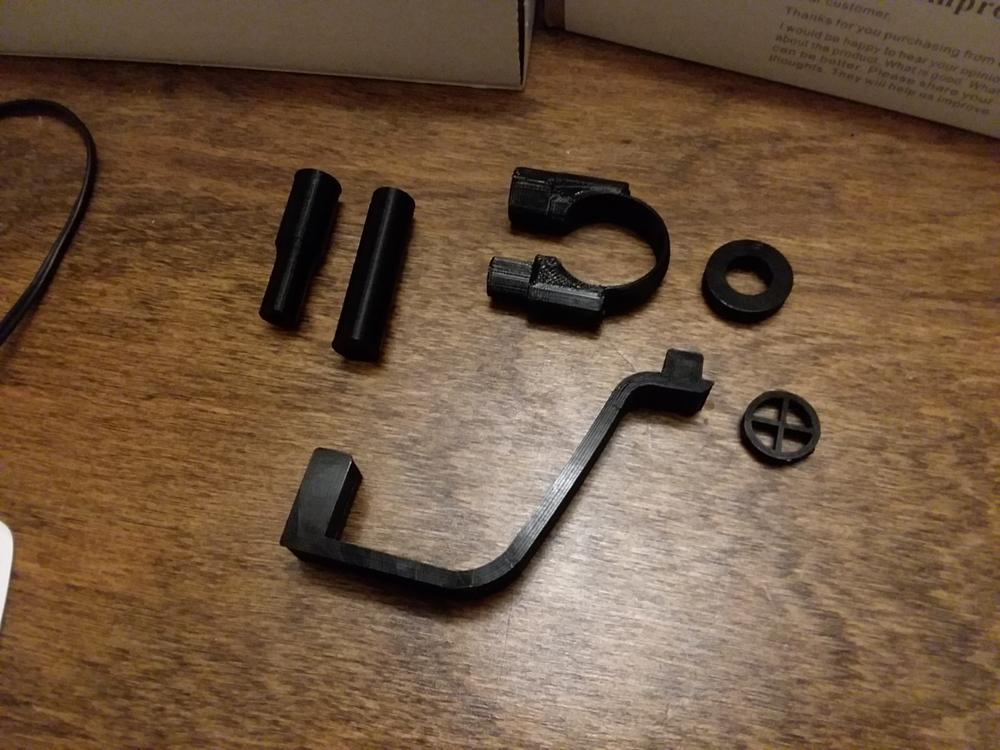
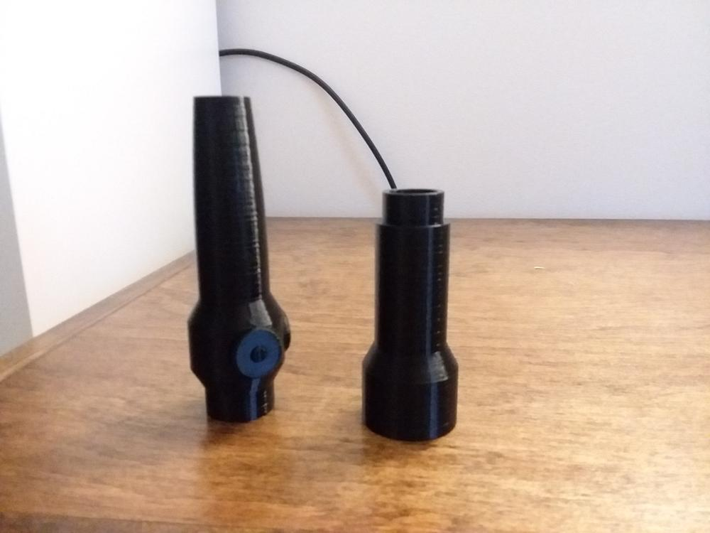
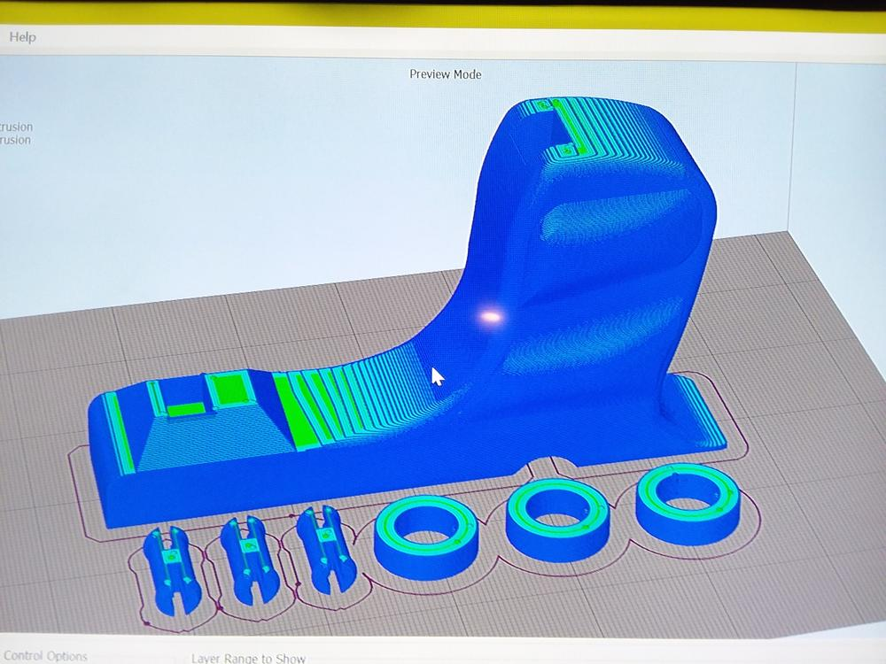
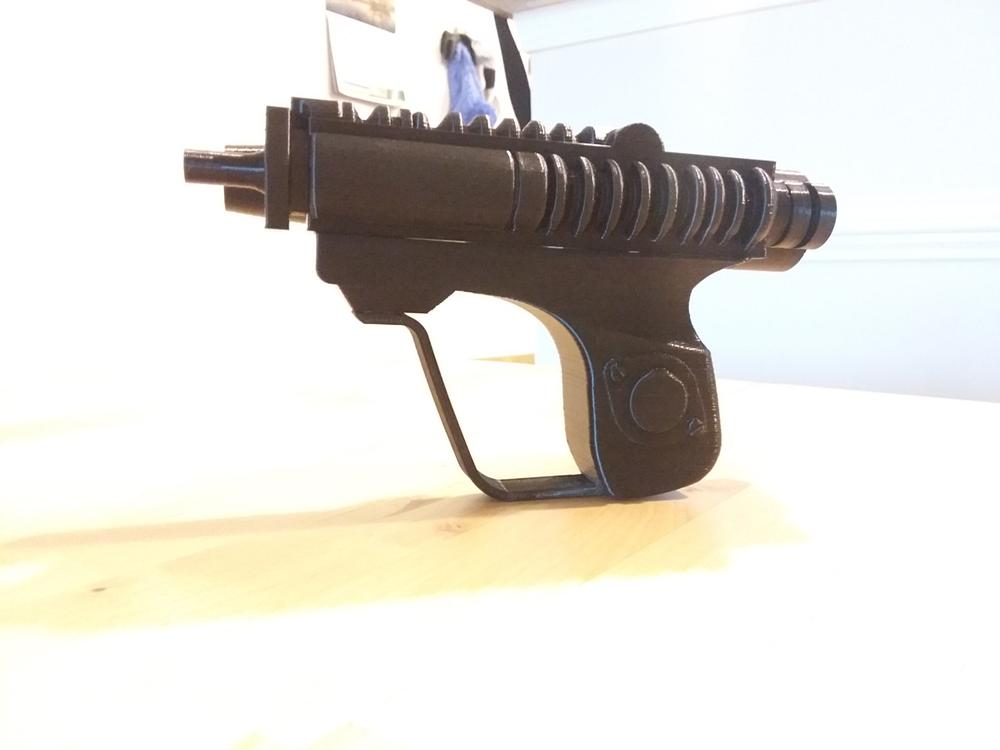
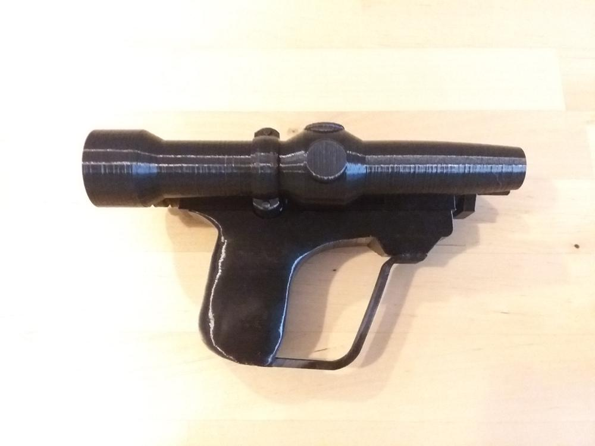
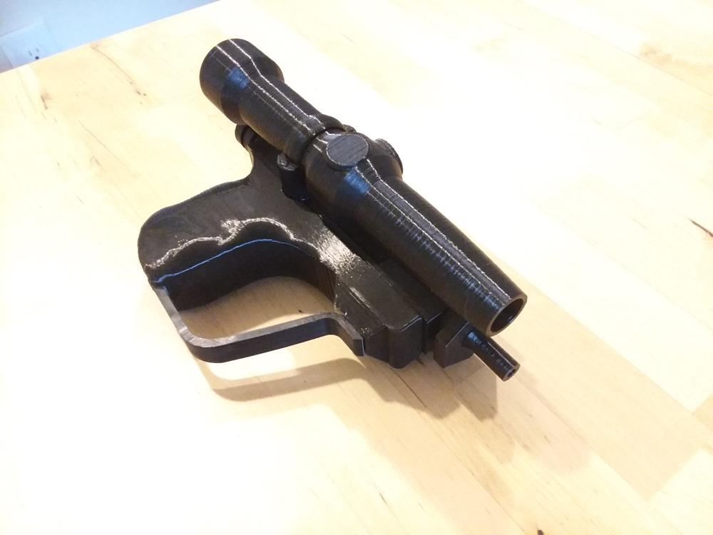

A friend of mine recently joined the 501st, a group of Star Wars fans who cosplay in full sets of screen-accurate Stormtrooper armor for charity events. He opted for a biker scout variant, which includes a distinct laser pistol as a sidearm.

To help complete his set of armor, I printed a replica of this blaster.

<!--more-->

The first bits of the blaster were pretty straightforward prints. This included the hand guard, tip, and parts of the scope.

The second print was for the scope, which was split into two parts. These were printed vertically, to prevent marring the smooth round surface from support structures if it were printed sideways.

Next, I printed out the handle and rings that sit on the back of the blaster. Since I used lower layer height to maximize detail, this print took upwards of 10 hours. It really brings out the detail of the grip, especially with the ridges for the fingers to wrap around.

The barrel (the long upper part with the disks, ridges and sights) was a tricky print. It could only be printed right side up, forcing the disks to print with a large overhang. This overhang results in unsupported areas during printing that are prone to failure. After two unsuccessful attempts, I finally got a good print.

With everything printed, it was time for assembly!

The blaster was designed to press-fit together, and fortunately most of the pieces had the tolerance to hold together through friction alone. The concentric rings on the back did require some glue to keep in place. Otherwise, this was a painless assembly resulting a clean-looking prop.

