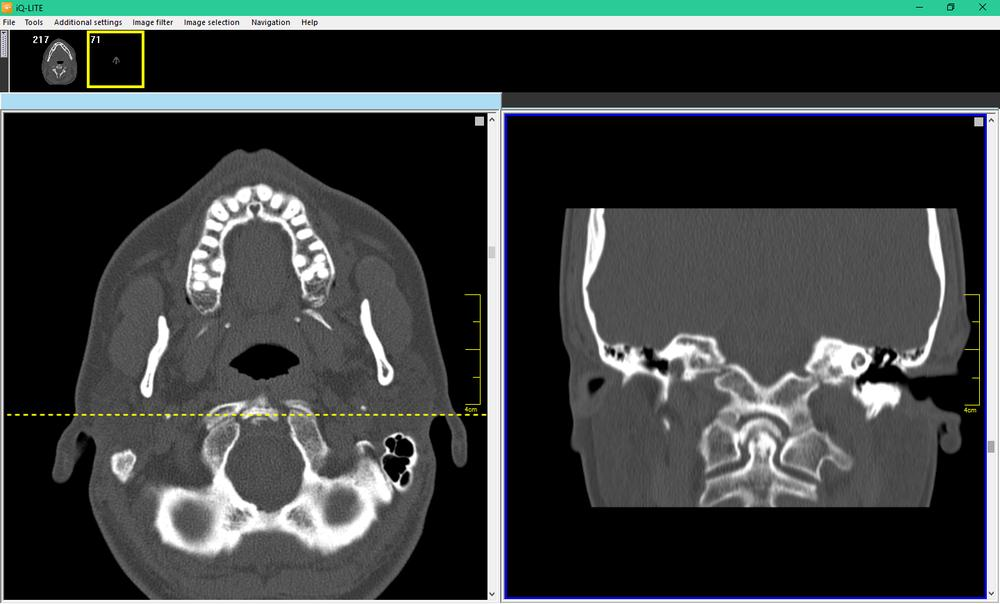
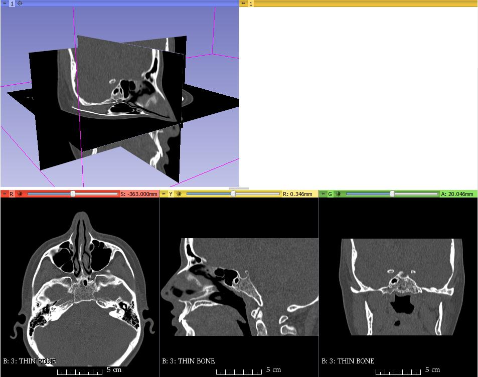
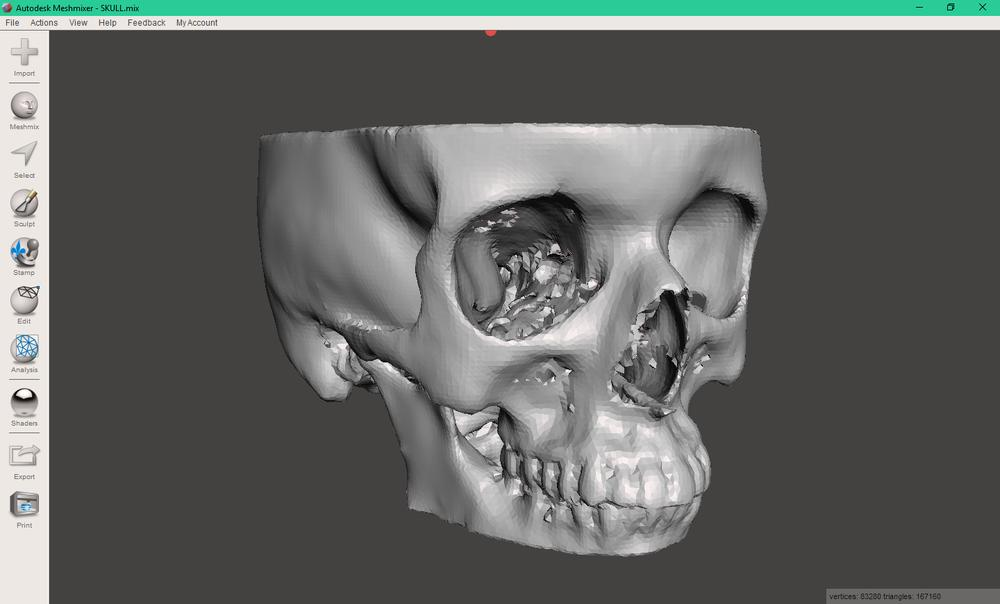
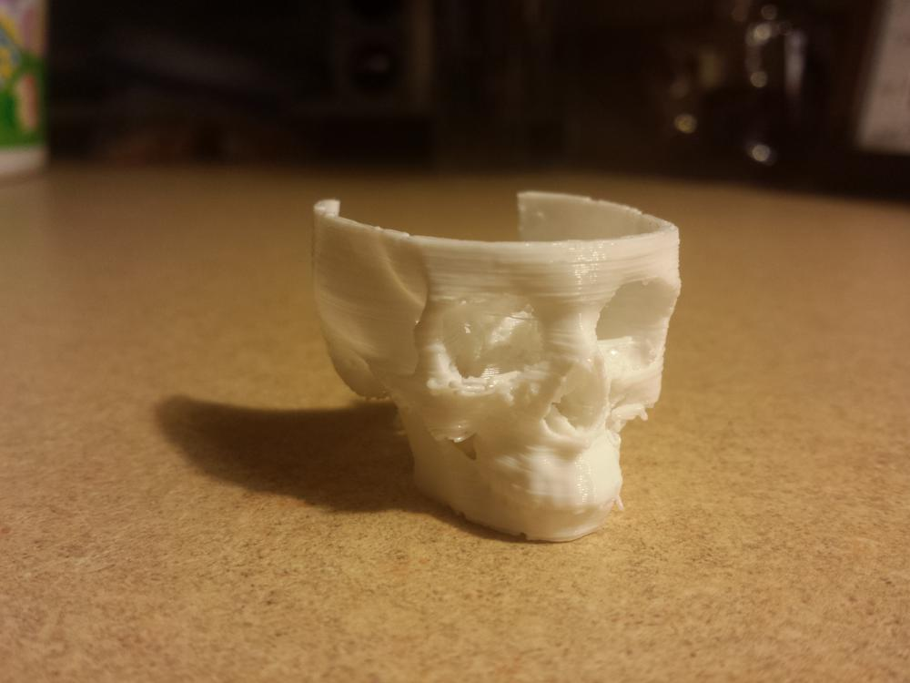

Recently, I have been reading on 3d printing in the medical field. The ability to go beyond a screen allows for visualization and practice of surgery without the patient having to go under the knife. A friend was kind enough to get me a copy of her recent CT scan data so I could attempt to get a 3d-printable object out of it. Using the guide found [here](http://openpaleo.blogspot.com/2008/12/3d-slicer-tutorial.html), I had little trouble extracting the data, generating a model, and exporting it to an STL file.

The disk containing the DICOM data came with a lightweight viewer, and allowed me to look at individual slices from the CT scan. The scan focused on the nasal cavities, and extended nearly to the back of the skull. I ended up with a complete set of images from the forehead down to to most of the lower jaw.

 CT Scan: White areas are bone structures\[/caption\]

Using 3D Slicer, I extracted the data into an STL file. This program took each image and fused together the dense areas (bone), giving me a full model of the skull. Being constructed from such high-resolution data, the resulting STL was a massive file, and my computer did not enjoy working with it.

Using Autodesk Meshmixer, I simplified the STL by smoothing over some rough areas, and reducing the triangle count. This made the model much easier to load and slice for 3d printing.

I scaled the print down to a quarter size to reduce print time. I hope to print this at full size when I get a chance. This would be a nice conversation starter sitting on the coffee table...