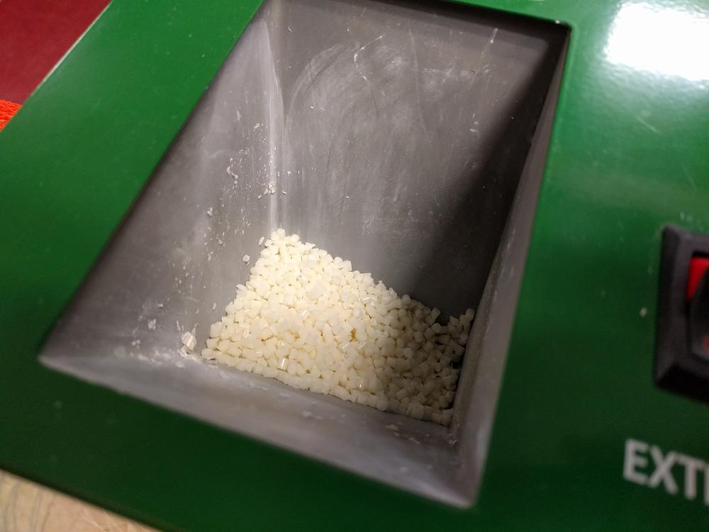
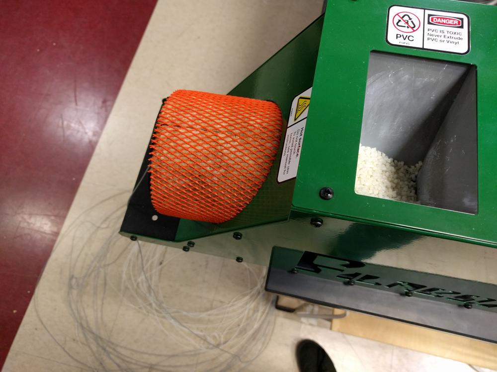

Despite the wide range of available thermoplastics, sometimes spools of filament with desirable electromagnetic or mechanical properties are not commercially available. For this reason, our research group acquired a Filabot filament extruder. Pellets of thermoplastic are loaded in through the hopper, and pushed through a heating element via an auger. The nozzles are bolts with different sized holes for 3 mm and 1.75 mm filament.

Today I got a chance to make some filament. The process is simple enough, though extrusion is extremely slow. Setting up a spooling apparatus with built-in quality assurance is my next project.

