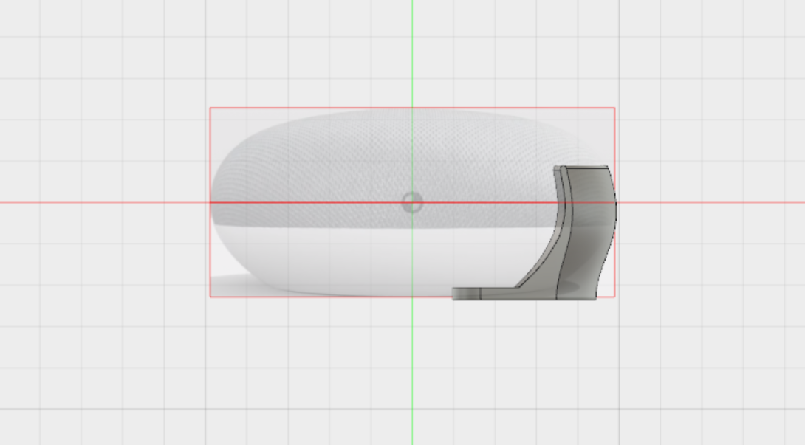
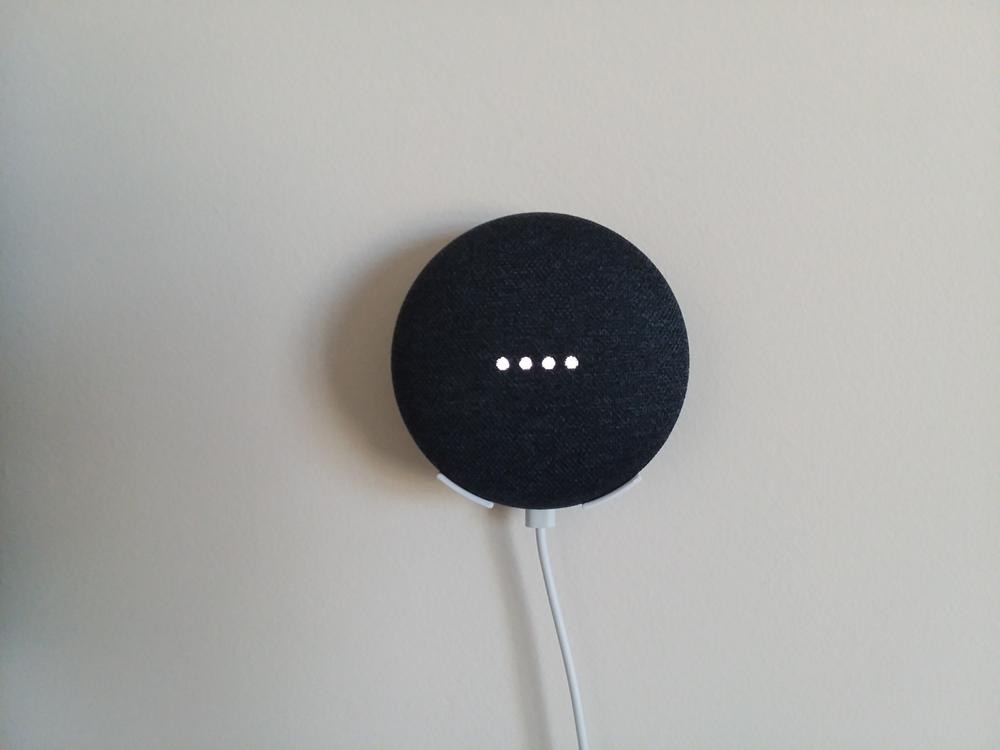
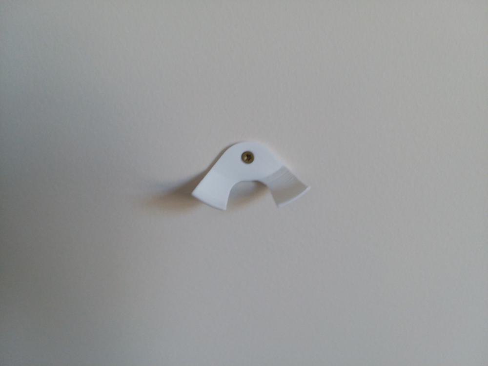

Over Christmas, I took advantage of Google's sale on the Google Home Mini to pick up a few for the apartment. Even though it doesn't take up a lot of desk space, I wanted to mount it to the wall to keep it off the limited shelf space, and to hear it throughout the room. To resolve this, I came up with the following wall mount. The design started with a few reference images I found online. Using Fusion 360, I attached the images as a background canvas, scaled them according the measured width and height of my Mini. I then traced the profile using the spline tool, and revolved the profile around the center vertical axis of the device. This resulted in an accurate fit without having to make a bunch of measurements or figuring out the quantitative geometry of the device curves.

One downside of this method is depending on the reference image to be accurate to the physical device. Features can be inaccurately represented due to perspective distortion, which makes tracing the outline a risky move. However, the time saved with tracing, combined with the rapid prototyping makes this a method worth pursuing. This took less than an hour to design, and less than an hour to print. I was also able to revise the file and reprint to strengthen the edge between the curved shelf and the wall-touching surface of the mount.

