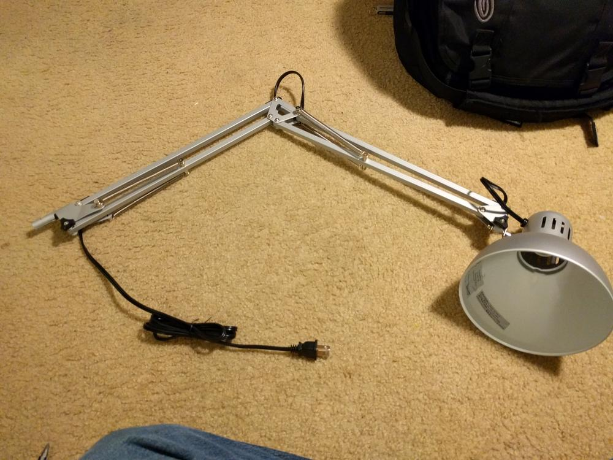
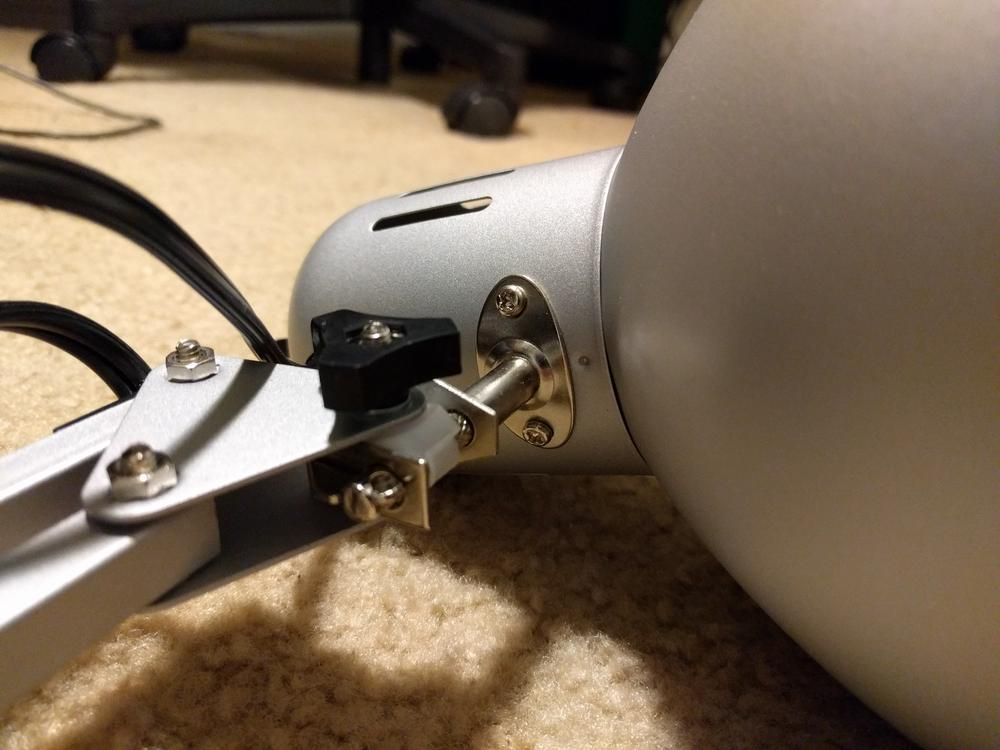
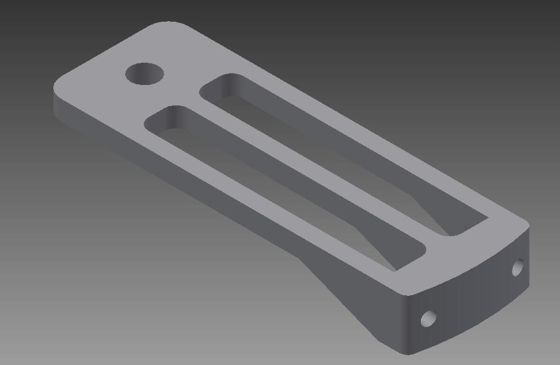
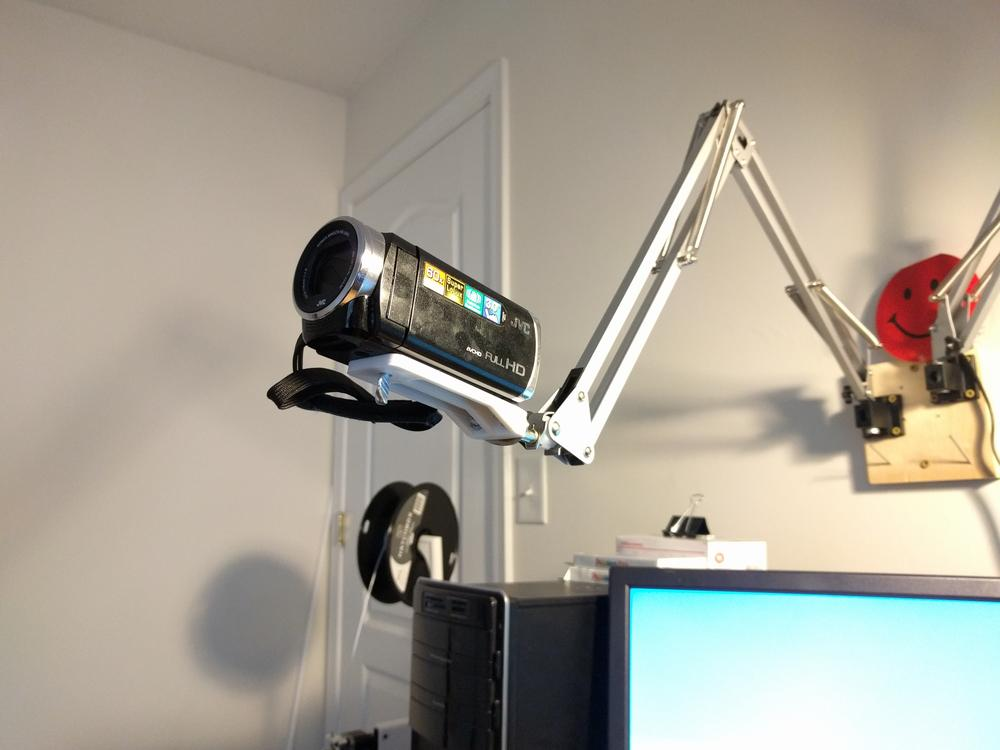
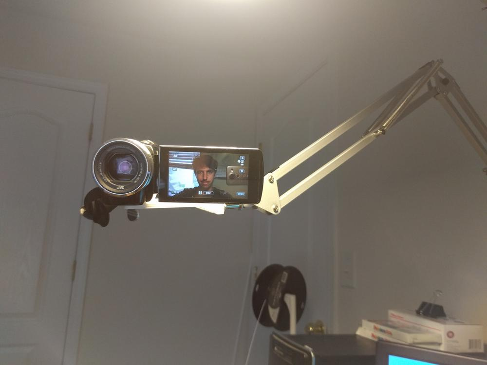
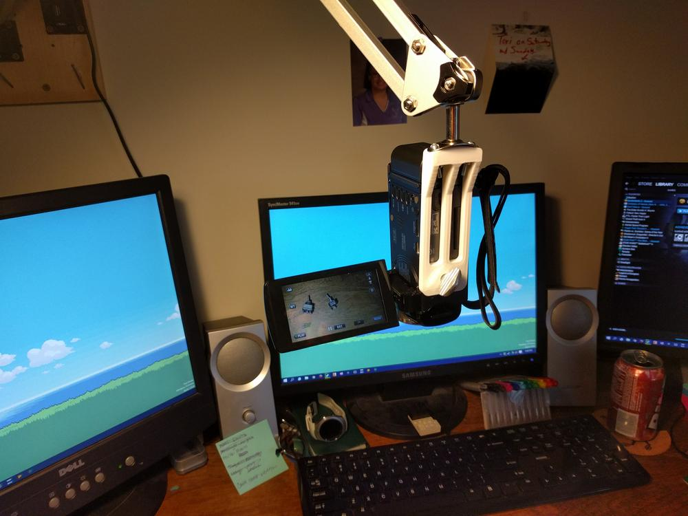

At less than $10, the [Tertial lamp from Ikea](http://www.ikea.com/us/en/catalog/products/20370383/) is my favorite source of workspace illumination. So far, I have one in the garage over my workbench, and one over the desk in my office. They are easy to move into place, and will hold fast when let go. For the price, this lamp can't be beat. The mechanics of these lamps is also interesting. Forces and torques are balanced through the weight of the lamp and counter-acting springs. Friction in the joints accounting for slight inequalities in the strict world of theoretical classical mechanics. All in all, the architect's lamp is a useful platform for keeping a light bulb positioned and re-positioned precisely  where it is needed.

In preparation for adding some more content to this blog and my [YouTube](https://www.youtube.com/user/ggtuttle) channel, I needed a video camera stand that could handle a variety of viewing angles, but easily removed when not in use. This need drove me to create a simple attachment for this cheap lamp.

\[gallery ids="416,418" type="rectangular" link="none"\]

The first thing to do was remove the actual lamp part from the arm. This is done by taking out the two small screws below the rotating switch, cutting the lamp cable, and pulling the excess though the hollow square tubing.

In AutoDesk Inventor, I modeled the above mount after a few revisions. For attaching the camera, the large hole will easily fit a 1/4"-20 screw, the standard hardware for a camera mount. I tried to match the curve of the back to match the original plate on the arm, but slightly mis-measured the curve. However, the  holes lined up perfectly, and the piece was attached with a pair of small machine screws and nuts I got from my local hardware store.

As you can see from the above pictures, the camera mount can be easily positioned to provide a variety of camera angles. If you are interested in printing out the piece, which should accommodate any small camera or camcorder with a 1/4"-20 mount, you can get the file from my Thingiverse page [here](http://www.thingiverse.com/thing:1693067). Keep an eye out for some videos in the future!