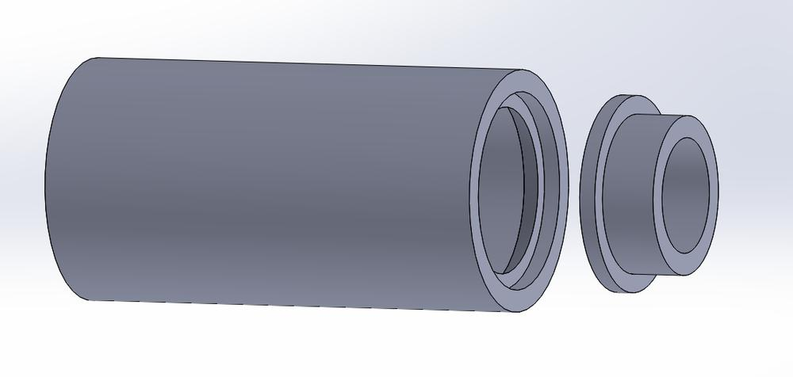
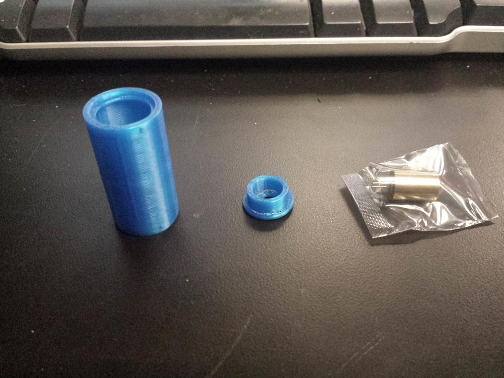
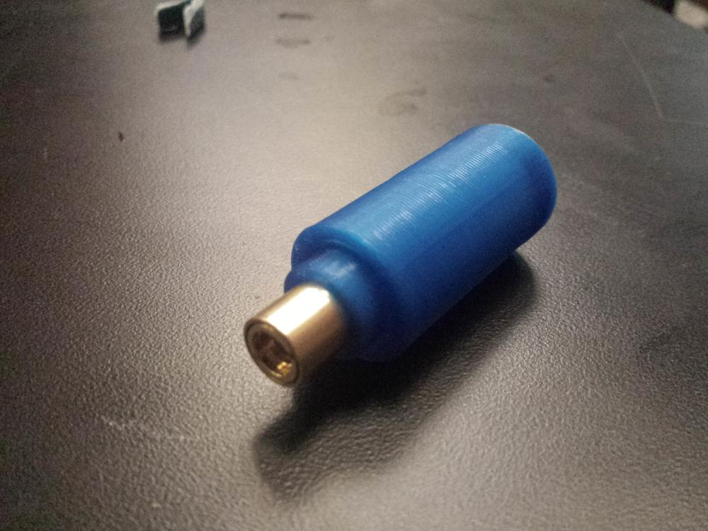

A friend of mine was in need of a set of cheap lasers for a class he was teaching on optics. Instead of using enclosed laser pointers that ran on obscure button cell batteries, he decided to purchase laser diodes and wire them for connection to a benchtop power supply. This allows for a more hands-on approach for the students, getting them more involved in the projects they are working on. 

To make the lasers more durable for repeated classroom use, we decided to 3d print some enclosures for the electronics. The housing needed to be small enough to position easily, but large enough to hold a wire knot. If the power connections were pulled, the force would be on the knot, instead of the solder connections to the diode.

The mount was created in two parts, to allow easy removal of the laser diode and to insert the length of excess wire. This ended up being a successful prototype, and he ended up doing a small production run on his classroom printers.

