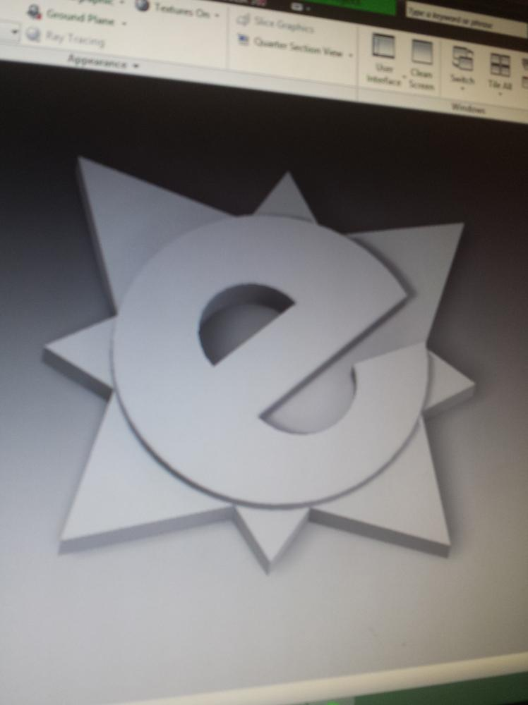
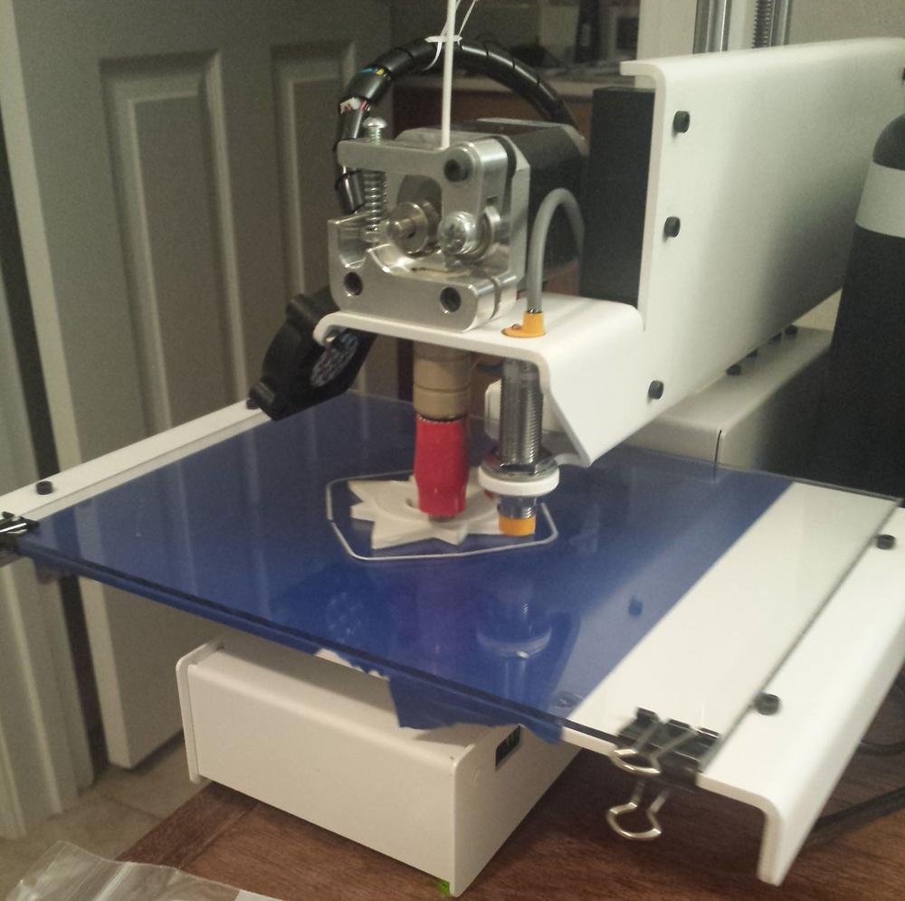
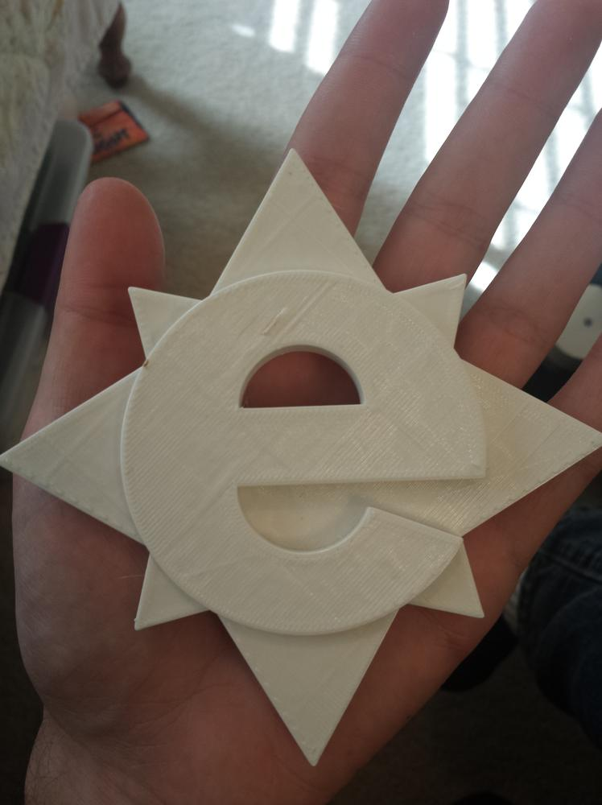

The other day, I was tasked with 3d printing a logo from a nearby company. The design was a simple compass with a superimposed letter "e." Being such a simple design, I decided to model it directly in AutoDesk Inventor.

<!--more-->

Overall, I am happy with the way the logo turned out. This piece had the biggest footprint of anything I've printed so far. Because of the large area of contact between the piece and the bed, as well as the sharp corners, the first few prints were subject to quite a bit of warping. I was able to resolve the warping issue by replacing my blue painter's tape with a sheet of polycarbonate, cut to the size of the print bed. For adhesion purposes, it is the best material for PLA.

So far, the only problem I have run into is the automatic z-leveling on the Printrbot. The sensor requires a metal bed to function, so I needed to slide a flat metal object to each of the probe points during initialization, and adjust the probe height to compensate for the metal objects height.

