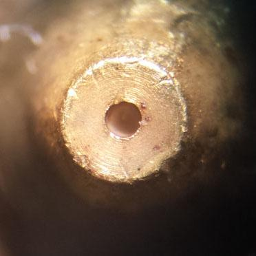
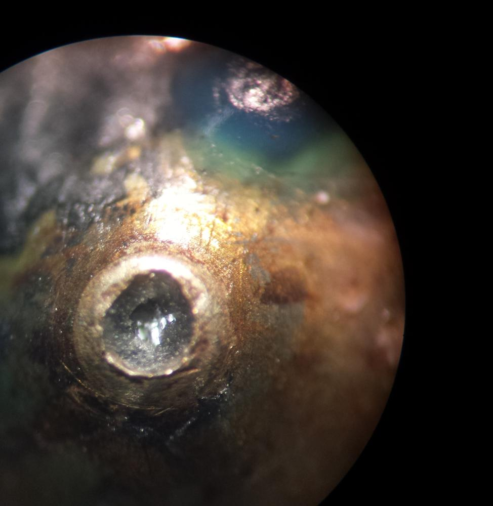

I picked up a new hot end for the Printrbot the other day. This one is modeled after the popular E3D V6 hot end, which has an all-metal design. Unfortunatly, you get what you pay for, and this inexpensive clone oozed out the top and bottom of the heater block. Lesson learned, buy the official tried-and-true equipment. While I was heating things up to remove the stray PLA, I was able to use one of the microscopes in the lab to check out the new 0.4mm nozzle that came with the hot end. Here is a pic I snapped with my phone on the microscope objective, and an older pic from a few months ago of an old nozzle for comparison:

