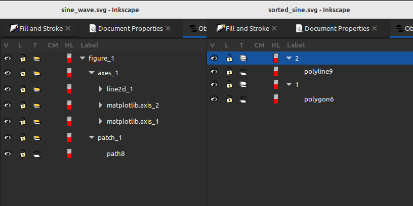
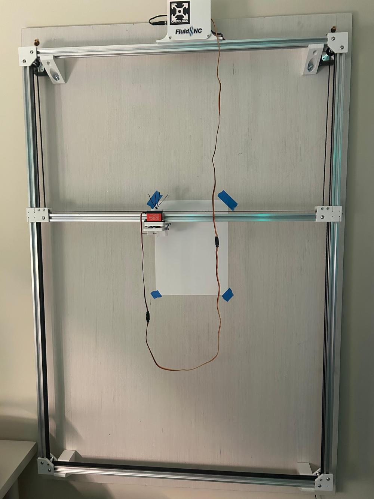

My last pen plotter adventure resulted in a simple method to generate a 2d plot in python, export that as an svg, then translate that svg into something readable by my pen plotter. For my next trick, I aimed to optimize the process of exporting multiple colors.

<!--more-->

I wanted to figure out two things:
1. How to group gcode operations by color
2. How to prompt for pen changes so I only need one gcode file.

Building off the plot from last time (which I copied from [here](https://stackoverflow.com/questions/22566692/how-to-plot-graph-sine-wave)):

```python
import matplotlib.pyplot as plt
import numpy as np

figure_size = (3.0,3.0)

Fs = 8000
f = 5
sample = 8000
x = np.arange(sample)
y = np.sin(2 * np.pi * f * x / Fs)
plt.figure(figsize=figure_size,dpi=100)
plt.plot(x, y)
plt.box(None)
plt.tick_params(
    axis='both',
    which='both',
    bottom=False,
    top=False,
    left=False,
    right=False,
    labelleft=False,
    labelbottom=False)
#plt.xlabel('sample(n)')
#plt.ylabel('voltage(V)')
plt.savefig("media/sine_wave.svg")
plt.show()
```
    


If you read the [last blog post](), you will notice this plot looks quite different. The actual plotted data is the same, but I removed the tick boxes and axes labels. Depending on your browser settings, you may or may not see a white background that bounds the plotted data.

Through a lot of trial and error, I found this stripped-down plot was easier to manipulate, as the labels often skewed the plot to one side of the figure, or were half-cropped by the bounds.

## Grouping By Color
To plot this properly, I want to group all lines by color, and place each color in its own layer. Fortunately, vpype can do this with a simple [read command](https://vpype.readthedocs.io/en/latest/reference.html#read), combined with the appropriate arguments. Placing `--attr stroke` after `read` will do exactly what I need.

Side note: I am writing all this in a Jupyter Notebook. Vpype can be imported as a python module, but I was having trouble getting the commands to work. Since most of the documentation and examples I found used the vpype command line interface, I decided to follow suit via `subprocess`.

```python
import subprocess

vpype_command = (
    f'vpype read --attr stroke media/sine_wave.svg '
    f'scaleto {figure_size[0]}in {figure_size[1]}in '
    f'write media/sorted_sine.svg')
print(subprocess.Popen(vpype_command, shell=True, stdout=subprocess.PIPE).stdout.read())
```

The command above is doing three things in a single line:
1. Reading the plotted sine wave and sorting by the stroke color attribute into layers
2. Ensuring the svg is scaled to the original size (defined above in `figure_size`)
3. Writing the sorted svg to a file

Comparing the layer structure of the two svgs side by side, the original single-layer `figure_1` has been split into two layers `1` and `2`, each with a different color.



## Plotting Each Layer with a Different Pen
My next goal was to generate gcode that would pause before each layer and prompt for the proper pen to be loaded. [Vpype-gcode](https://github.com/plottertools/vpype-gcode) works by processing svgs according to a predefined machine profile. This machine profile will generate specific gcode at each feature of the svg (start of the document, layer changes, etc). The profile for my machine is below:

```TOML
[gwrite]
default_profile = "coreXY_pen_plotter"

[gwrite.coreXY_pen_plotter]
document_start = "G92 X0 Y0\nG90\nG21\n"
layer_start = "M0 (MSG Change Pen to {vp_name})\n"
segment_first = "G00 X{x:.2f} Y{y:.2f}\nM3 S255\n"
segment = "G01 X{x:.2f} Y{y:.2f} F6000\n"
segment_last = "G01 X{x:.2f} Y{y:.2f} F6000\nM3 S0\n"
document_end = "M3 S0\n G0 X0 Y0\n"
unit = "mm"
vertical_flip = true
info= "This gcode profile is correctly inverted across the y-axis"
```

The key to pausing and prompting was the entry for `layer_start`. At the beginning of each layer (ie, color group), the machine will pause (`M0`) and ask the user to change to the pen that matches the layer name (`(MSG Change Pen to {vp_name})`)

My machine uses parentheses and the `MSG` prefix to specify what information, if any, should be sent to the controller screen.

With the machine profile properly configured, I ran the gcode export command and copied the file to the plotter.

```python
vpype_export = "vpype read media/sorted_sine.svg gwrite media/sorted_sine.gcode"
print(subprocess.Popen(vpype_export, shell=True, stdout=subprocess.PIPE).stdout.read())
```

## Testing



Once I started the plotting operation, the processor reached the first layer and immediately prompted me for the first pen. Success!


In between layer 1 and 2, the machine lifted the pen, paused, and prompted me for the second pen.


The simple test worked well enough, but I was starting to get tired of this simple sine wave, and wanted to try something a bit more complex:



```python
import matplotlib.pyplot as plt

from mpl_toolkits.mplot3d import axes3d

plt.style.use('_mpl-gallery')

# Make data
X, Y, Z = axes3d.get_test_data(0.05)

# Plot
fig, ax = plt.subplots(subplot_kw={"projection": "3d"})
fig.set_size_inches(3, 3)
ax.plot_wireframe(X, Y, Z, rstride=10, cstride=10)

ax.set(xticklabels=[],
       yticklabels=[],
       zticklabels=[])

plt.savefig('media/3dmesh.svg', transparent=True)
plt.show()

```


When I tried passing this plot through vpype for sorting and conversion to gcode, I received an error regarding "empty lists". After some digging around, it turns out the exported svg contained some empty objects where the axes would have rendered (had I turned them on). I could not figure out how to prevent these objects from being exported, so I manually deleted them before sorting and exporting to gcode.

Another thing that got lost in the conversion was the grey backgrounds along the plot planes. These were converted to outlines of varying levels of grey.

Once sorted, I consolidated the 7 resulting layers into 3: Black, Grey, and Blue. These were converted to gcode with no issues.


Aside from a slight misalignment on the black axes, I am pleased with the result.

## Wrapping Up

These past two endeavors have been a great refresher for jupyter notebooks and python. It's been a while since I got to dig into some interesting problem solving though scripting, and it was nice to get the pen plotter moving again. The tool chain I've worked out makes it easy to get from simple idea to a simple pen plot, but I think I'm coming up against the limitations, especially the issues I had with the empty objects.

When I revisit pen plotting for these sorts of generative art shapes, I think I'll try working in [vsketch](https://vsketch.readthedocs.io/en/latest/index.html). Until next time!