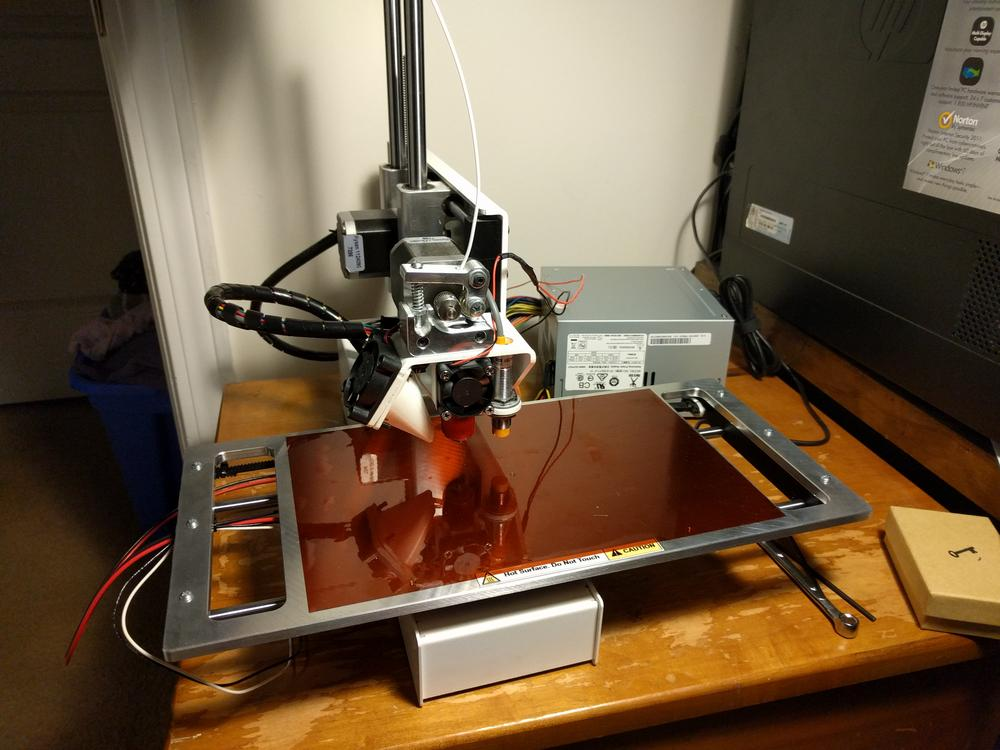

Though I received it weeks ago, I finally got a chance to install the x-axis upgrade for my Printrbot. I now have 4 more inches in the x direction, and a heated build plate.

I also installed a new Ubis13 hotend to replace the offbrand E3DV6 that leaked all over the place. This required printing a new fan mount, which you can see coming off the hotend in the picture. I'm looking forward to printing with new materials and making use of the extra space. More to follow!