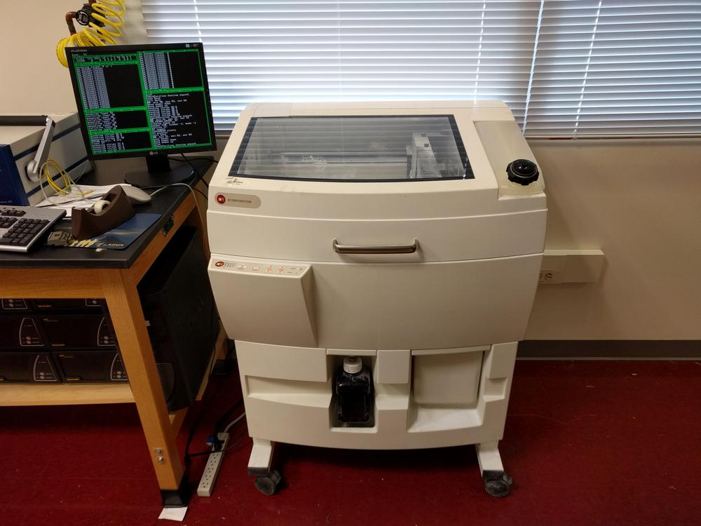

A little over a year ago, our group acquired this old ZCorp 310 printer from surplus. This machine uses powderbed technology, where an inkjet deposits liquid binder on a plaster material, fusing it together into a solid object. This brand of printer is rarely seen nowadays, since the company is now owned by 3D Systems. With no material, no accessories, and no software, we were unsure if it was even functional. After a bit of digging though some forum posts, I was able to get a copy of the manual for the printer. This gave me a decent guide to get the printer hooked up and powered on. By connecting the printer to my computer via a crossover cable, I could edit the network settings and make the printer accessible from anywhere on campus!

The last step was to procure a copy of ZPrint, the slicing software for all ZCorporation machines. A local supplier of 3d printers was able to get me a copy of the software, and I can now send jobs, perform maintenance routines, and check on the printer without the crossover cable. The next step is to perform a deep clean on the liquid binder lines, find some new inkjet heads, and pick up some binder (though judging from MSDS sheets and alternative binders, a mix of 90% water and 10% glycerin could do the trick).