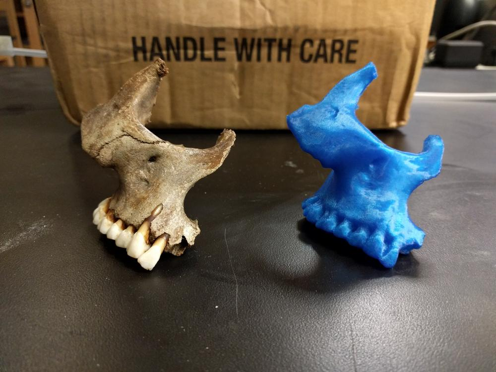
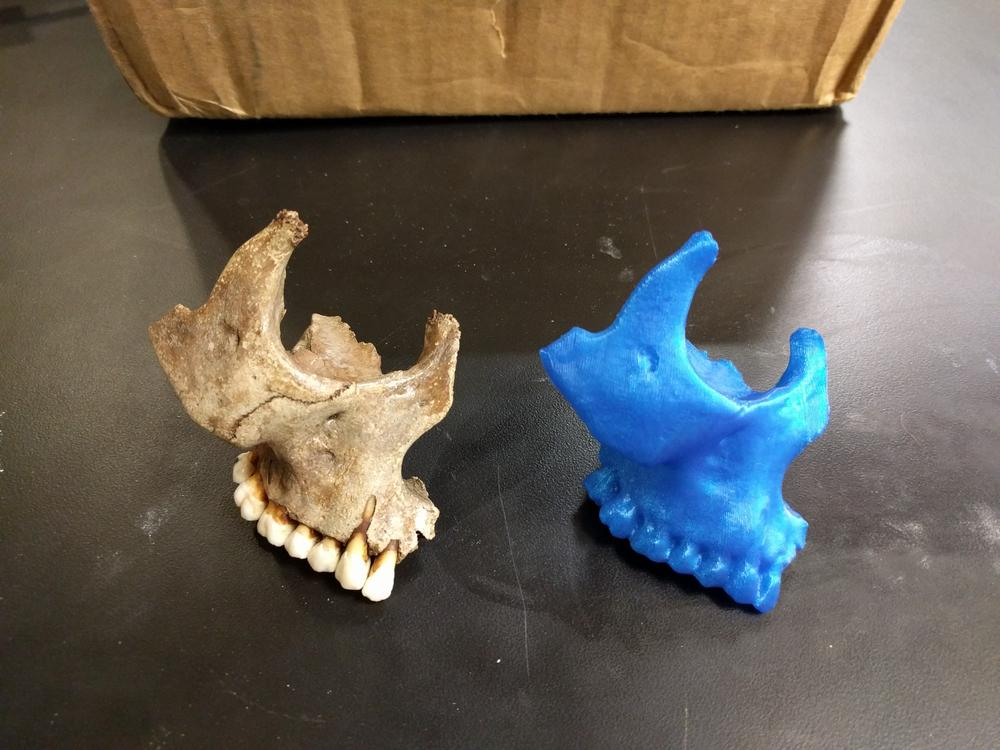

In collaboration with my university's anthropology department, I had the opportunity to scan skeleton fragments with the intent to 3d print copies. Yesterday, I finally got a sample scanned and printed.

I placed the skull fragment on the rotating platform of a NextEngine 3d scanner, giving a full 360 degree view of the object. I did this twice at different orientations, and used the scanner software to fuse the scans together. This gave me a point cloud that covered most of the object. The point cloud was then converted into a 3d mesh, and exported as an STL file. The STL was imported into Autodesk Meshmixer. This free software was used to fill in holes the scanner could not resolve, and to reduce the triangle count of the STL file to make the model computationally easier to handle. This did result in some loss of resolution, but the printer used for fabrication would have lost these details anyway.

The patched and reduced triangle file were saved and imported into Simplify3d. This program sliced the file into GCode, and fed into a Flashforge Creator Pro 3D printer at 0.2mm layer heights.