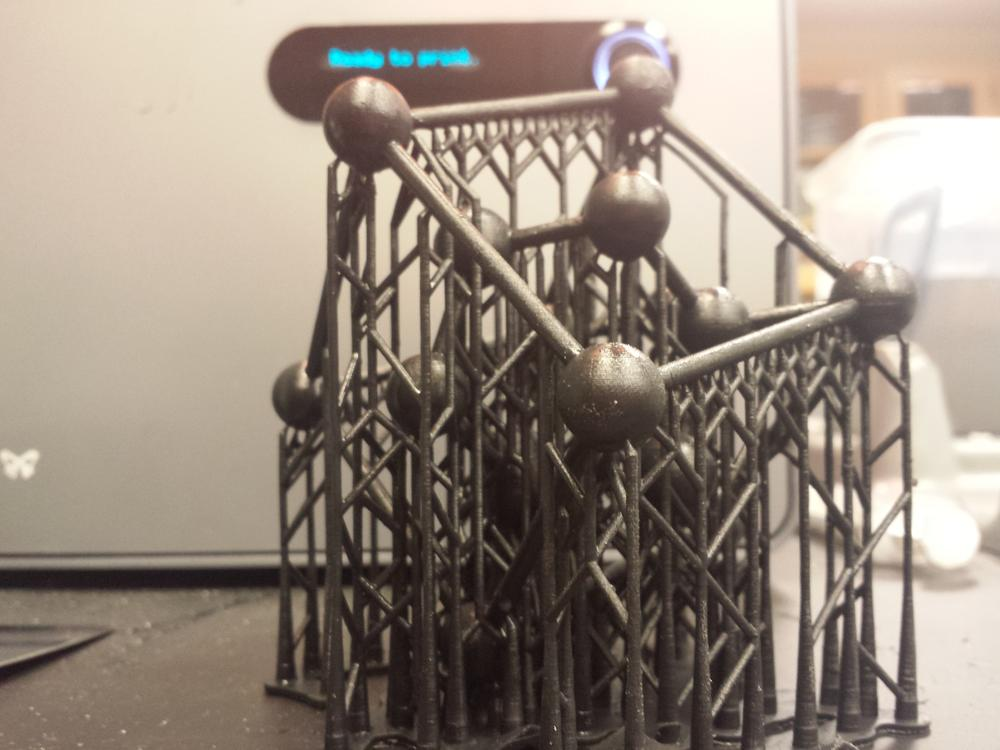
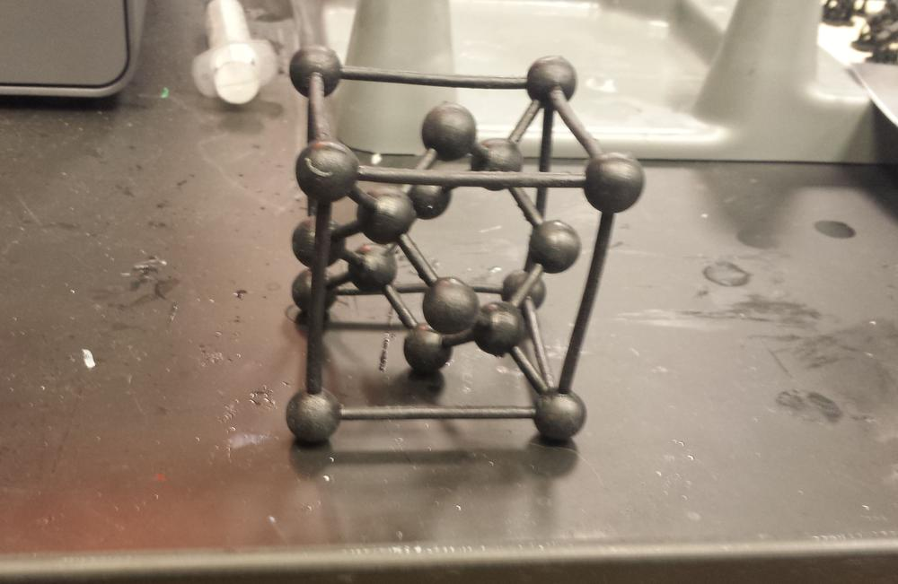

For a demonstration piece, I was sent a model of a silicon unit cell to print. This was an enjoyable endeavor, and lead to an interesting discovery in the post-processing procedure on the Form1+

  

I ended up printing two of these. One was left in the alcohol bath for 2 days, and when removed, was extremely flexible. While I need to be careful with the timing, the flex should make it more resistant to cracking, especially if the unit cell is being passed around during a demonstration.

