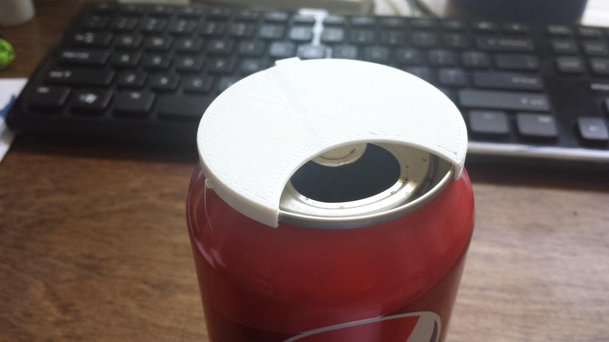
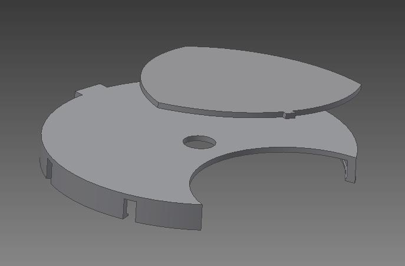
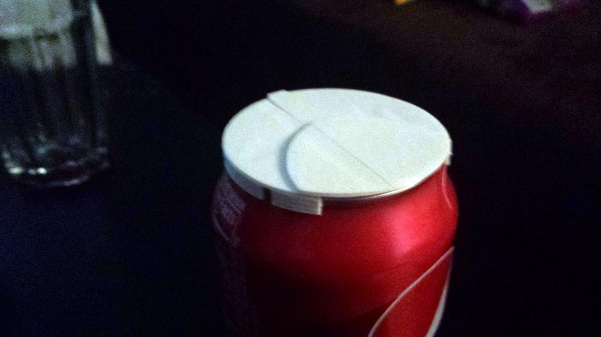
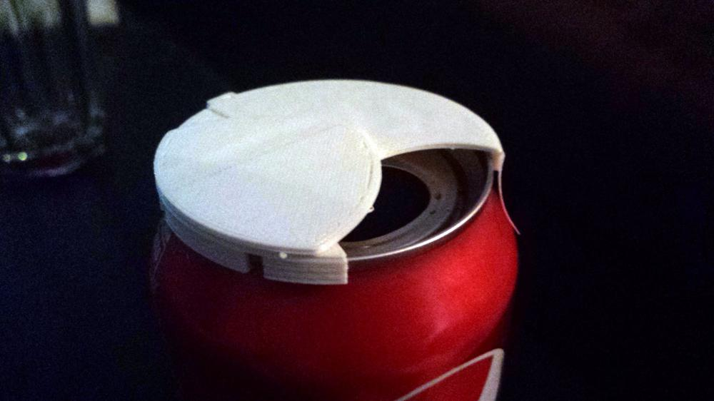

A close friend works at a nearby bee farm, assembling and packing various products to ship out. This manufacturing involves a lot of dust floating around the production floor, and he asked if I could print something that would snap over his soda can to keep the stray particles out. I figured this was a perfect opportunity to practice some 3d CAD and get the printer going. 

I intended the first version to simply rotate around the top of the can, protecting the hole from dust. The fit over the lip of the can was a bit tight, making rotation difficult. While this may have gotten the job done, I figured I could do better, so I moved on to Version 2. 

 Version 2: Modeled in AutoDesk Inventor\[/caption\] Version 2 was a vast improvement. I turned the solid lip into a series of tabs, to make the lid easier to remove, and added a swivel lid on the top.

