Today, we're going to take a 3d printed tabletop miniature and replicate it with a two part mold. This will speed of production of a part that would normally take two to three hours, and give us the freedom of different materials and colors.

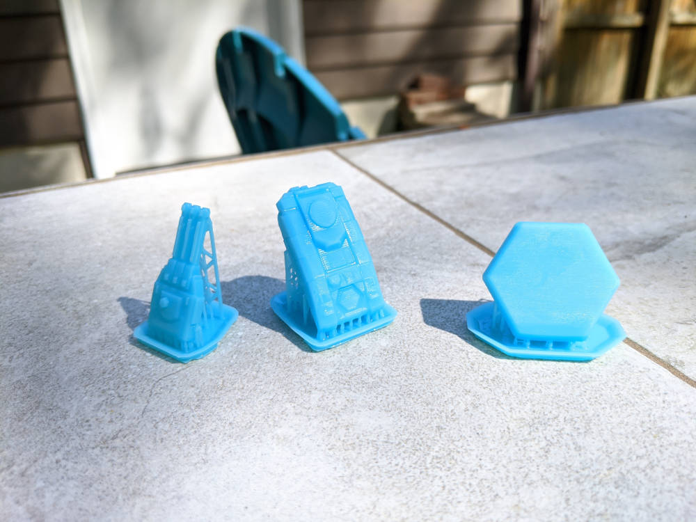

Two part molds allow us to cast more complex shapes than a one part, or open-face, mold. This open face creates a flat surface on the piece we are making. Sometimes this is desirable, in the case of the hex base seen above. However, the tank base and turret have detail on both the top and the bottom, and the only way to preserve this detail is with a two part mold.

### 1. Setup
Our mold will be made of a flexible silicone rubber that is easy to work with and tear resistant. In this case we are going to use Mold Star 15 Slow. This material has a 45 minute working time, and cures in 4 hours. This gives us plenty of time to mix the two parts and remove bubbles.

Once this mold is made, we will cast our part with Smooth Cast 300, which has a 3 minute working time, and cures in about 10 minutes. This will result in a part made out of a hard white resin.

#### Materials
- Mold making silicone rubber
- Disposable mixing cups
- Popsicle sticks
- Casting resin
- Bamboo skewers

#### Tools
- Sandpaper, files, and/or snips
- Kitchen scale
- Wall-building material (I prefer Legos for reusability, but foamcore board will work)
- Sulfur-free modeling clay (In this case Plastilina)

### 2. Part Preparation
Depending on our source part (the tank, our master part), this can be a tedious process. Just like in life, the more work we put in up front, the easier thing will be in the future. So lets do Future Us a favor, and make sure our master has no traces of support structures, print lines, or other artifacts from the printing process.

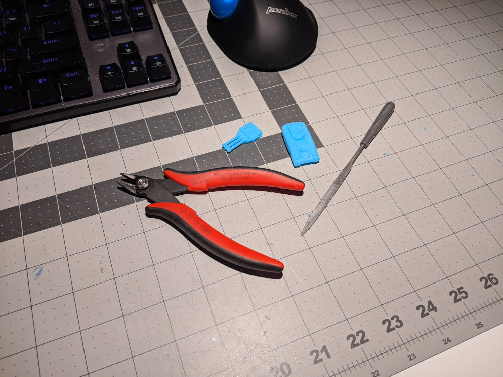

We can use angled snips to remove support structures close to the surface of the part, and sandpaper or a file to smooth it down flush with the tank surface. This piece was printed on an Anycubic Photon, so print lines are not too big of an issue. If this was printed on an FDM printer, this would require more sanding.

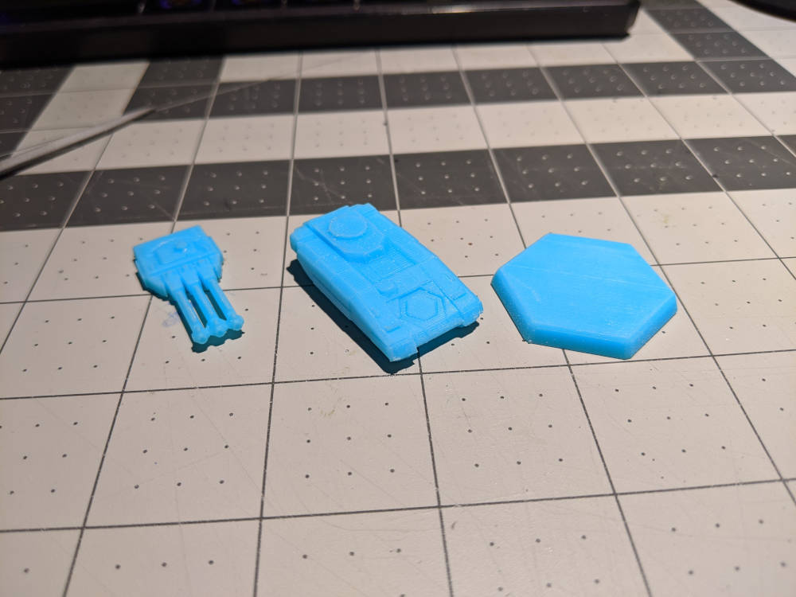

### 3. Bury in Clay

Our next step is to bury the master halfway into clay. We start by building a box out of a somewhat rigid material. Legos allow for easy rebuilding and reuse, but some foamcore and hot glue will work as well. Ideally, we will re-use this box for making the second part of the mold.

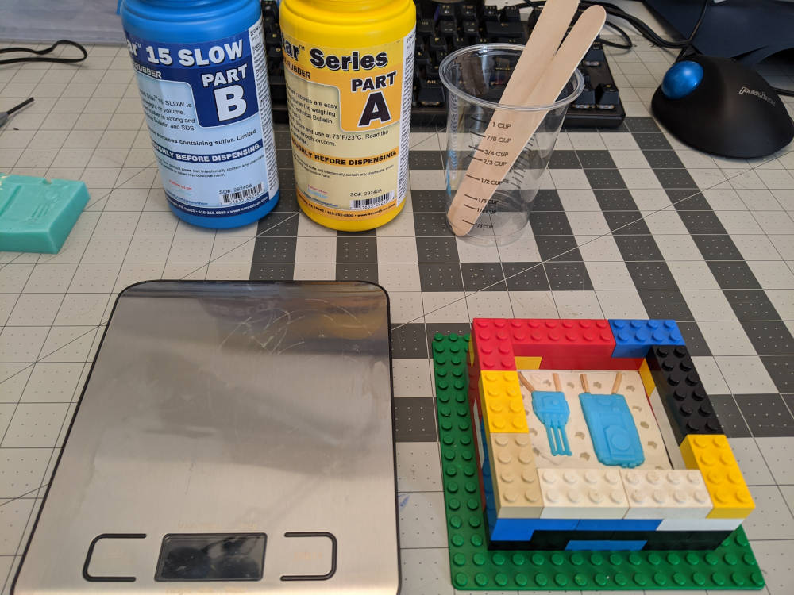
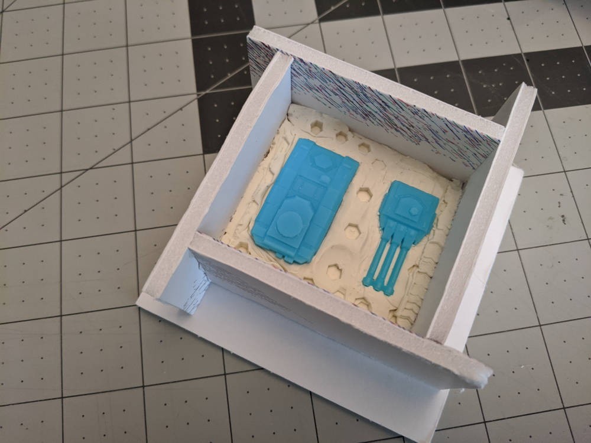

After building the box, we add a lump of clay smoothed down as flat and level as possible. We then push our part halfway into the clay, and push the clay up against the part to make sure there are no gaps for silicone to seep down under the part. In our final cast, there will be a seam where the clay meets the part, so I try to put this in a place where it is not noticeable, or easy to sand down later.

We will also add some bamboo skewers to act as air relief and a pour spout. These should be positioned at what will be the top of the mold, and in the highest parts of the piece to keep air from getting trapped and forming bubbles in our final part.

Last, we use a small blunt tool to make registration marks in the clay. In this case, I used an allen key pushed about half a centimeter, taking care not to disturb the part or the skewers.

### 4. Mix and Pour Silicone
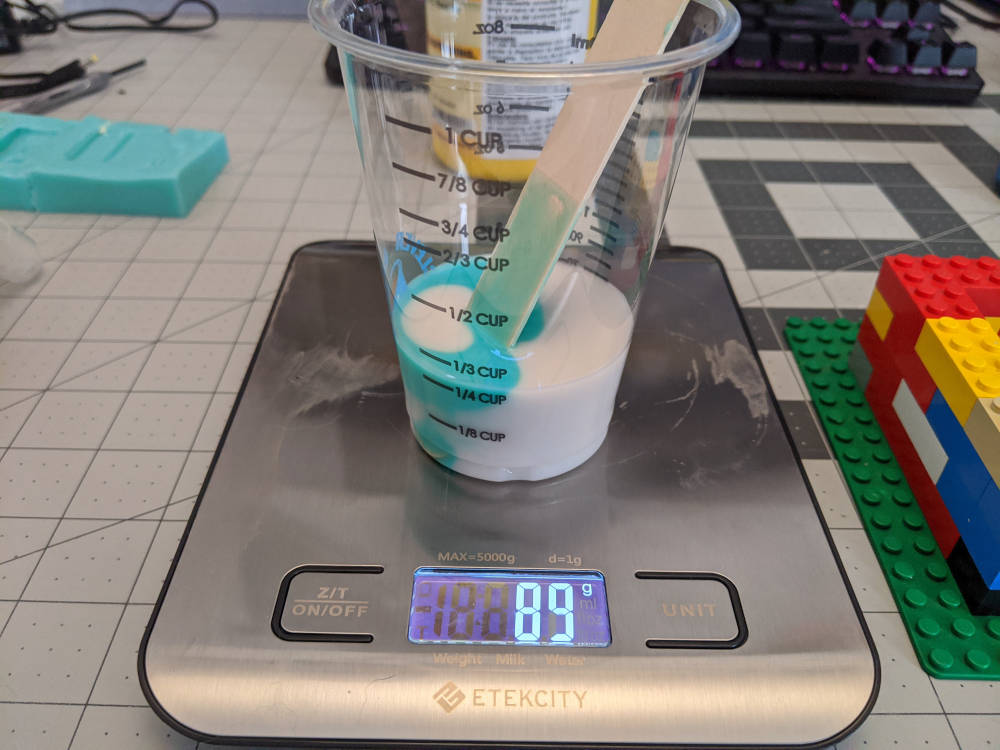
To estimate the amount of silicone needed, we need the volume of the box above the clay, extending about a centimeter above the part. We multiply the length, width, and height from clay to one centimeter above the piece.

```
Volume = L x W x (H + 1 cm)
```

We then take this number, and multiply it by the specific gravity of our silicone. In the case of Mold Star 15 Slow, this is 1.18 grams per cubic centimeter.

```
Mass = Volume * 1.18 g/cc
```

Since our silicone is mixed in a 1 to 1 ratio, we measure out half of the mass from above for Part A and Part B, making sure to tare the scale as not to measure the mass of the cup as well.

Mold Star 15 Slow has a 45 minute pot life, so we have plenty of time to mix the two parts thoroughly. Be sure to scrape the sides and bottom of the container.

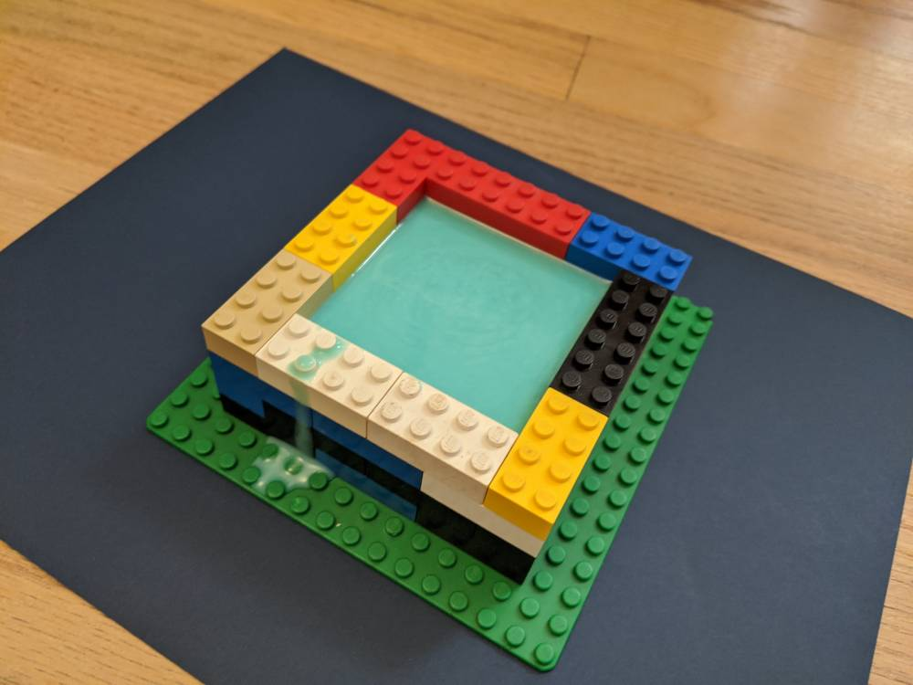

To remove the air bubbles we have mixed into our silicone, and minimize the air in our final part, we need to pour into the mold from a high level in a thin stream. We place our box on the floor (with a piece of newspaper or other covering for protection), and pour from about eye level. In the picture above, we can see where I misjudged my pour and had to course-correct. All the more reason to pour in the thinnest stream possible and use a floor covering!

We pour into the lowest spot in the clay, allowing the silicone to flow up and around the part, until it is sufficiently covered. We place our part out of the way, and allow to cure. 15 Slow cures in about 4 hours, but I usually give it an extra hour or two just in case.
### 5. Flip and Remove Clay
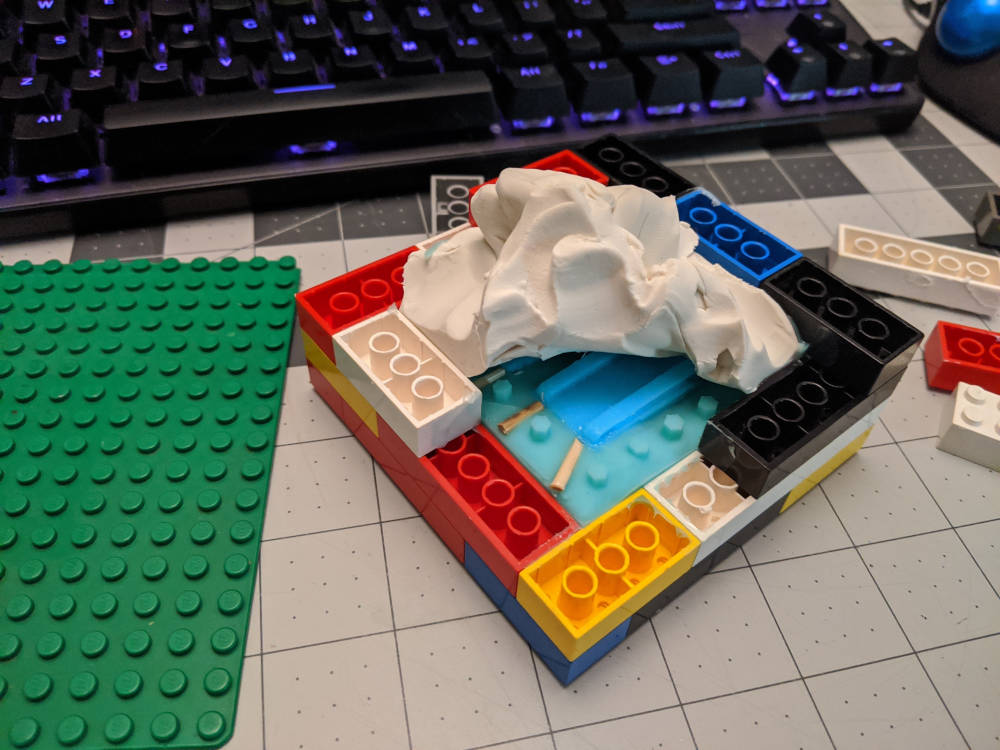
Once part 1 is cured, we remove the bottom of our box. For lego, this is as simple as taking off the baseplate. If we used foamcore, we could use an xacto to cut away the bottom of the box.

Carefully peel away the clay, taking care not to disturb the part. In this case, I had to remove a few bricks to get my fingers underneath the clay. We then remove this bits of clay still stuck to the mold and piece.
### 6. Apply Mold Release
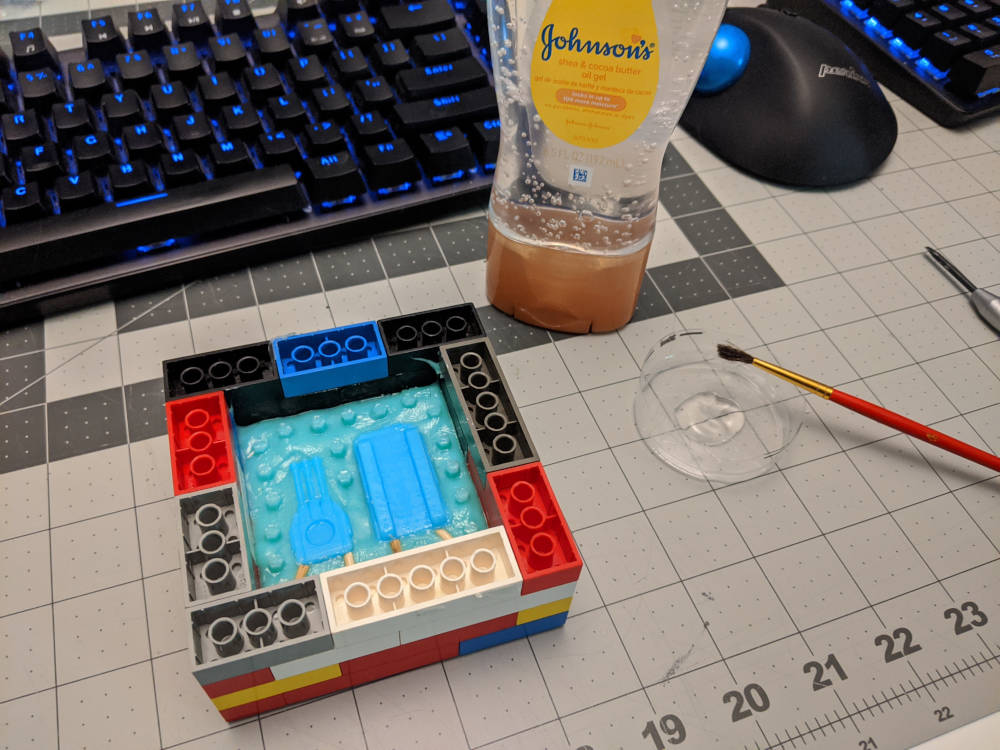
Next, we will add a thin layer of mold release to the mold. There are several release agents that will work, such as purpose-made sprays or petroleum jelly. For this mold, I used baby oil.

We apply the oil with a brush to all exposed surfaces of the mold, including the registration marks. 
### 7. Mix and Pour Silicone Again
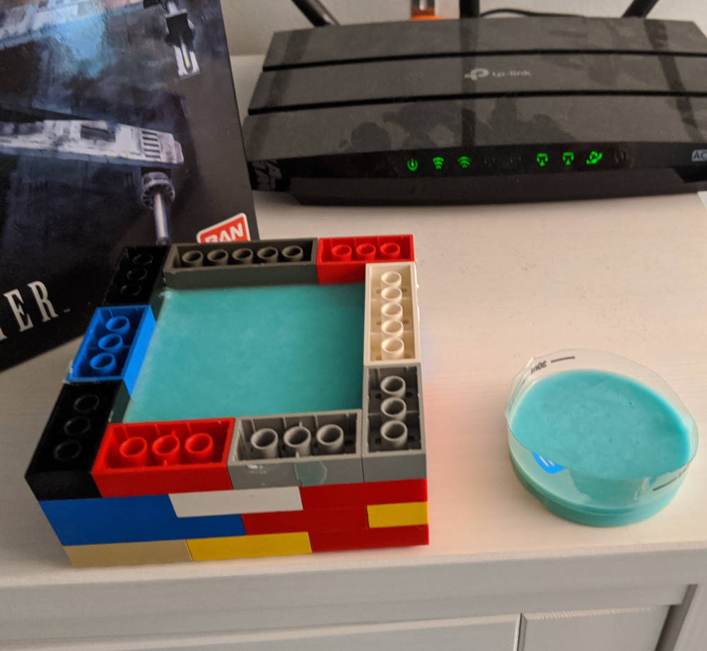
This is essentially a repeat of step 4. We mix up the same amount of silicone from before, and pour into our flipped-over box.

In this case, I ended up with some extra silicone after covering the part. With the long work time afforded by 15 Slow, I quickly glued the hex base to the bottom of a cup to make an open-face mold. This can be seen on the right.
### 8. Split and Clean
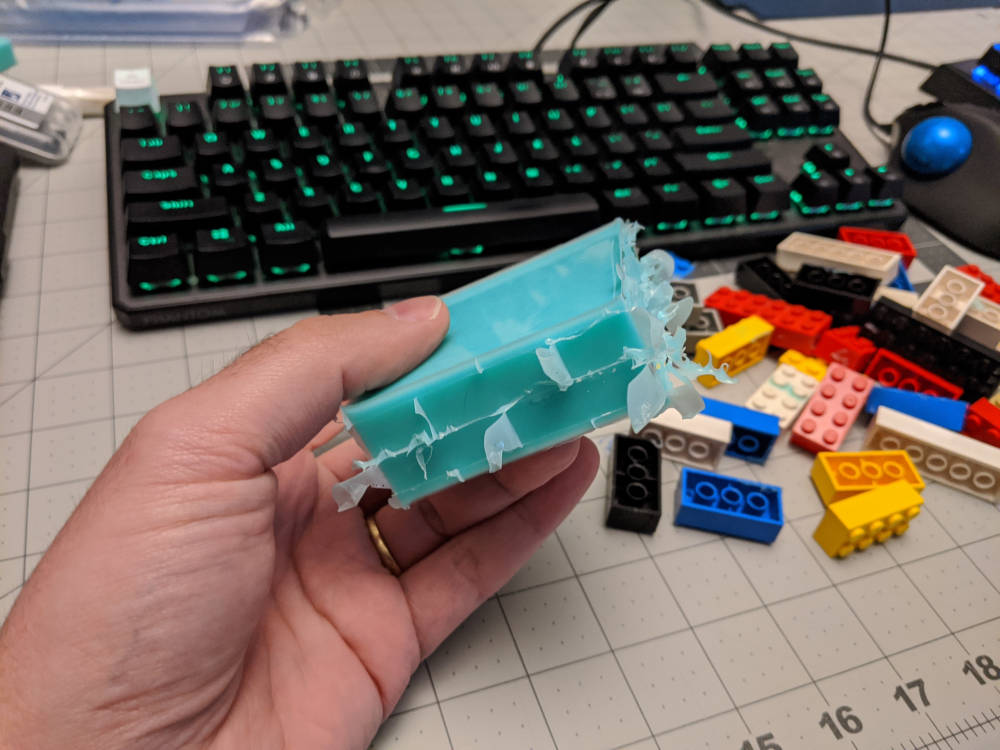
After waiting for 4-6 hours, we are ready to finish off our mold. We disassemble the box, trim off the flashing that seeped through cracks, and slowly peel the two halves apart.
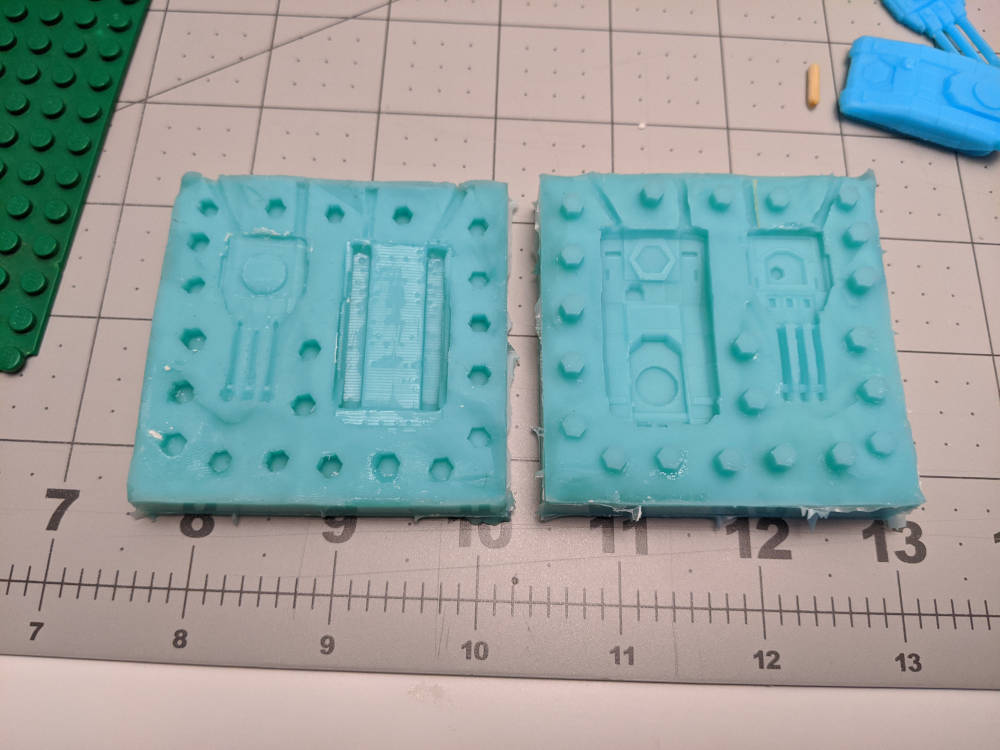
Looking at the mold, there are a few things we can do to make it work a bit better. First, the pour spout is too small, so we can carefully use a hobby knife widen the hole and make it easier to add resin to our mold. Another improvement would be trimming off the excess silicone that seeped between the bamboo skewers and the part, sealing up our air release vents.
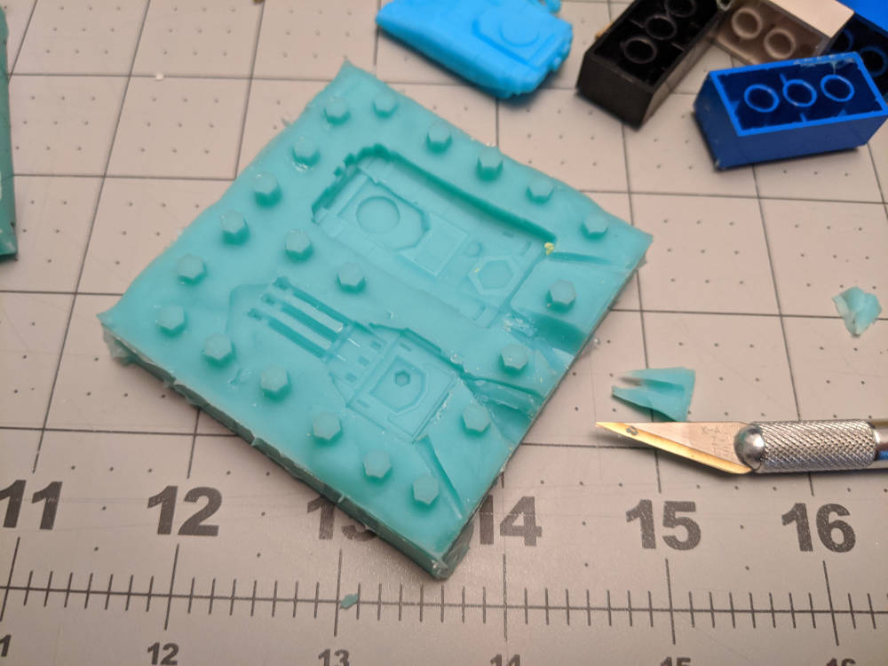
### 9. Try it Out!
Let's go ahead and make our first copy. The first pour will probably reveal some shortcomings in our mold, and is a good opportunity to make adjustments.
#### Combine and Support Mold
We start by putting our two parts together, and bracing with something solid. I took the Legos from earlier and assembled them into panels, but we could have just as easily used two blocks of wood.

When securing the mold parts together, we need to use something firm that will keep everything in place during casting and curing, but not too tight that it deforms the shape of the mold. For this mold, I used two rubber bands doubled over a few times. A wood clamp would work just as well, as long as it is not made too tight.
#### Mix and Pour Casting Material
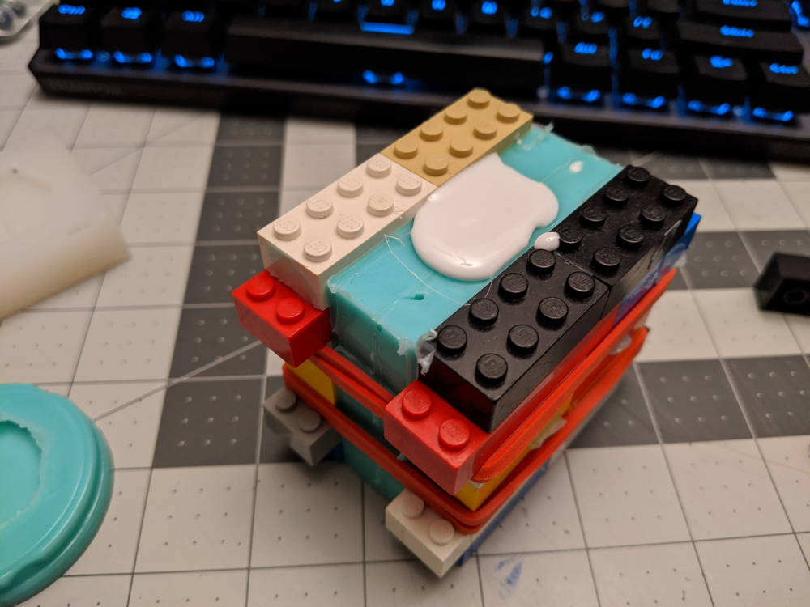
For this cast, we are using SmoothCast 300 resin, which has a 3 minute pot life and fully cures in 10 minutes. I recommend setting a timer while mixing and pouring as not to miss the 3 minute window.

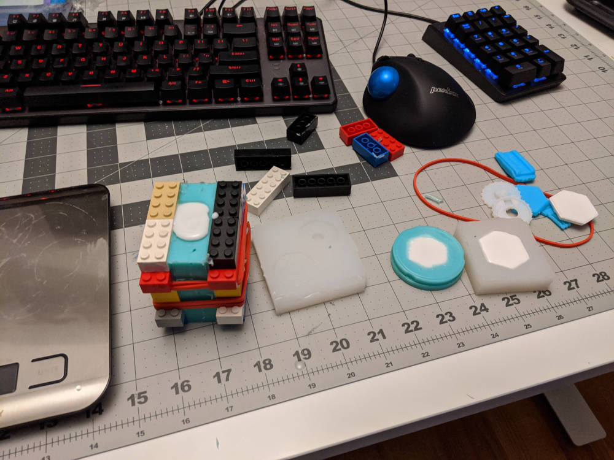

Since our part uses such a small amount of resin, I mixed up a little extra for the hex base and a few other molds. To get a rough idea of how much to measure out, I weighed the master part on the scale, and measured out half that much for both part A and part B.
#### Remove and Finish Our Copy!
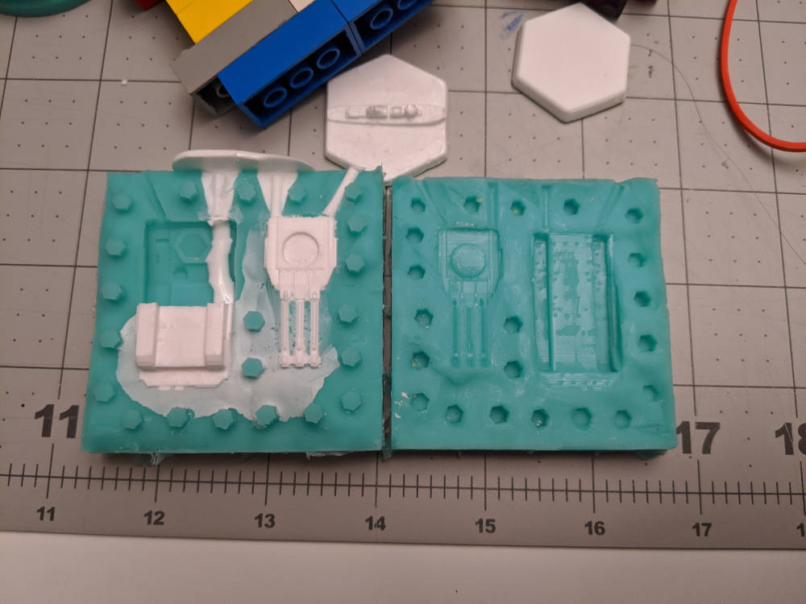
After about 10-15 minutes, we are good to remove our piece. From the above picture, we can see I did not get a full pour for the tank body. This is because my air vent was not clear, so I had a huge air bubble. This, combined with trying to pour a little after the 3 minute mark, resulted in a failed casting. I removed the casting, cleared the air vent with a hobby knife, and tried again.

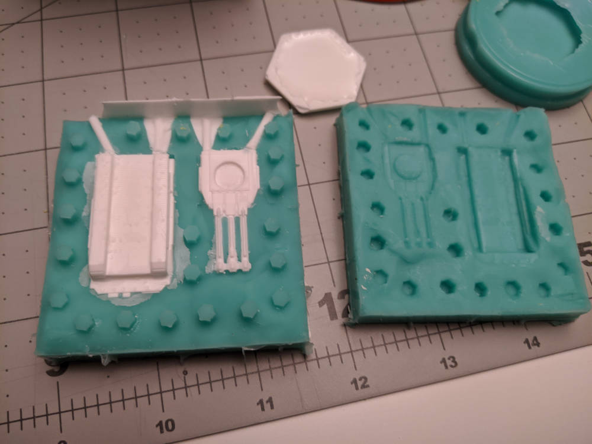
Much better result this time! Once we remove the piece, we can trim off the flashing and sprues, giving us a quick replica piece in about 20 minutes.

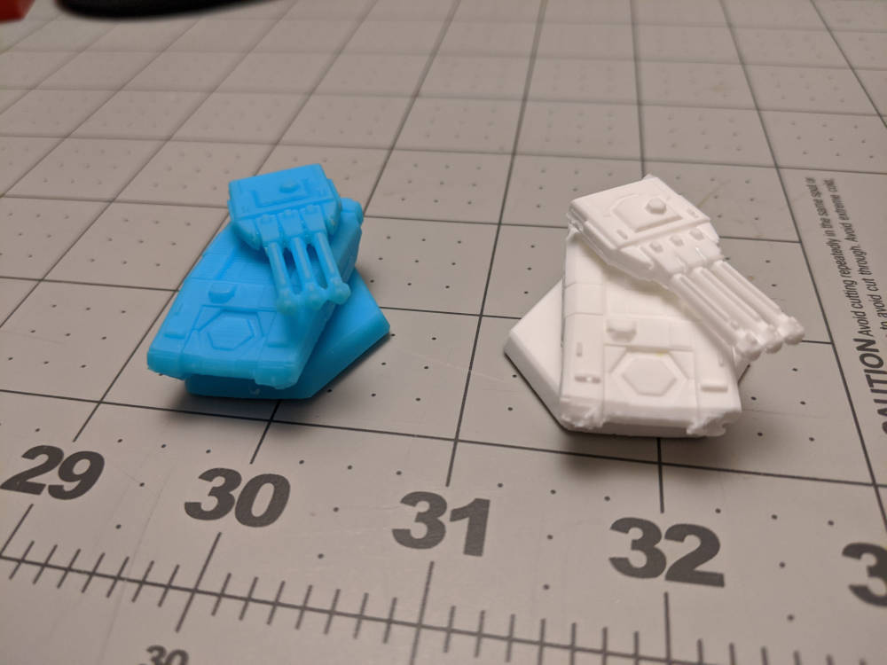