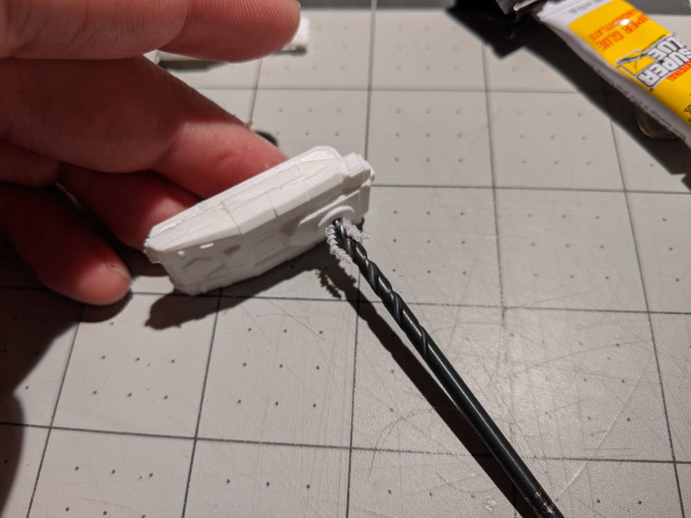
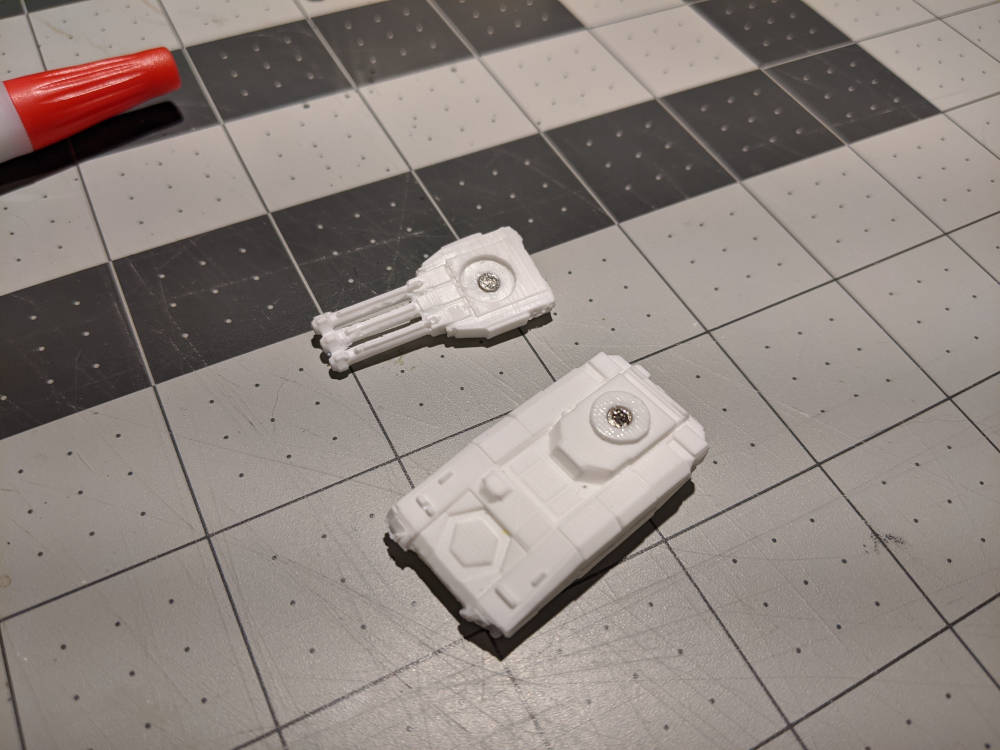
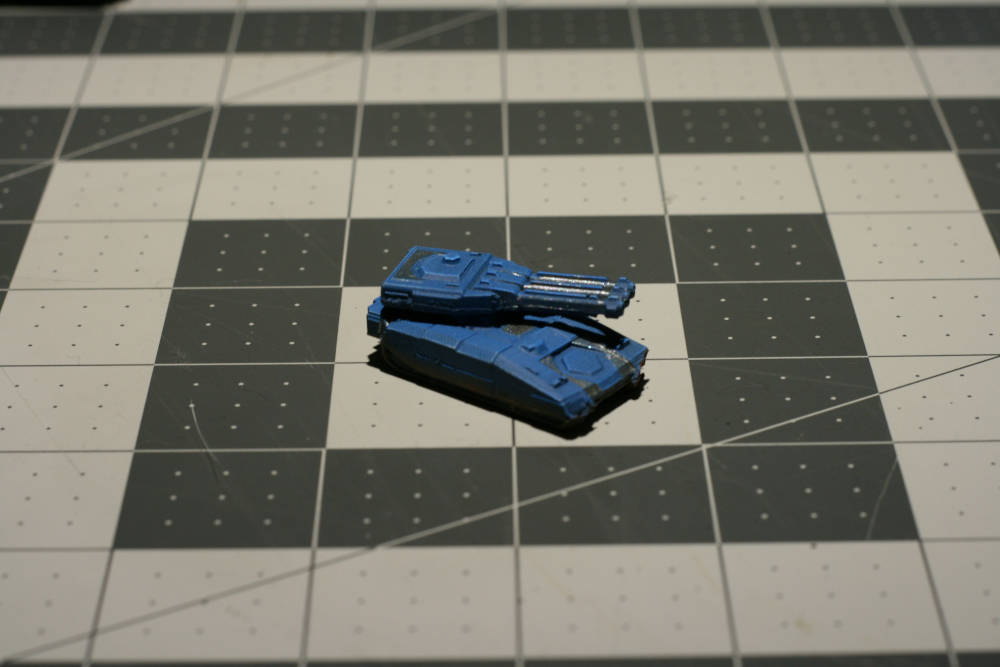
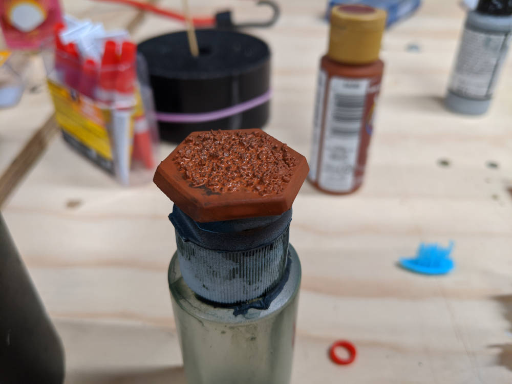
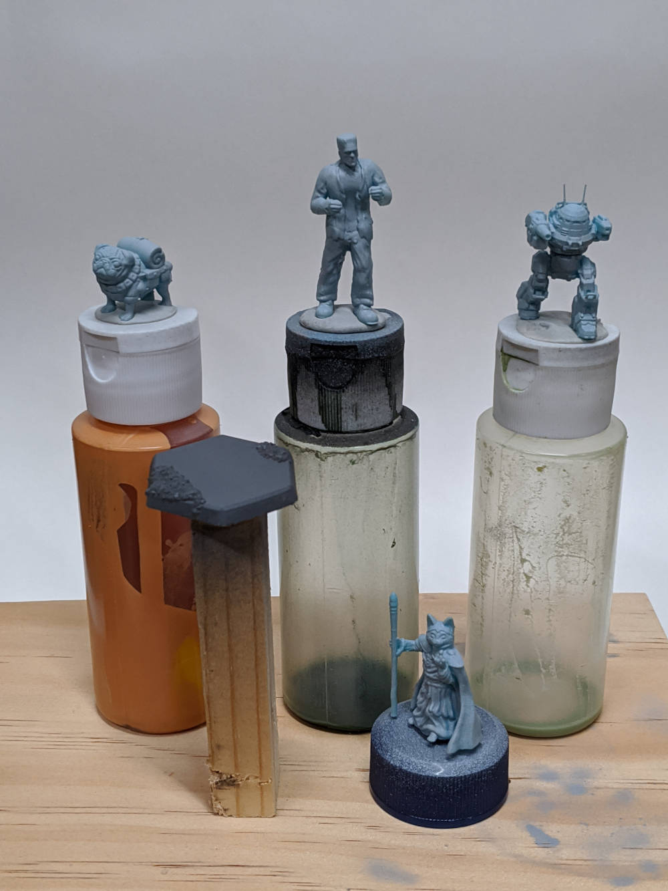
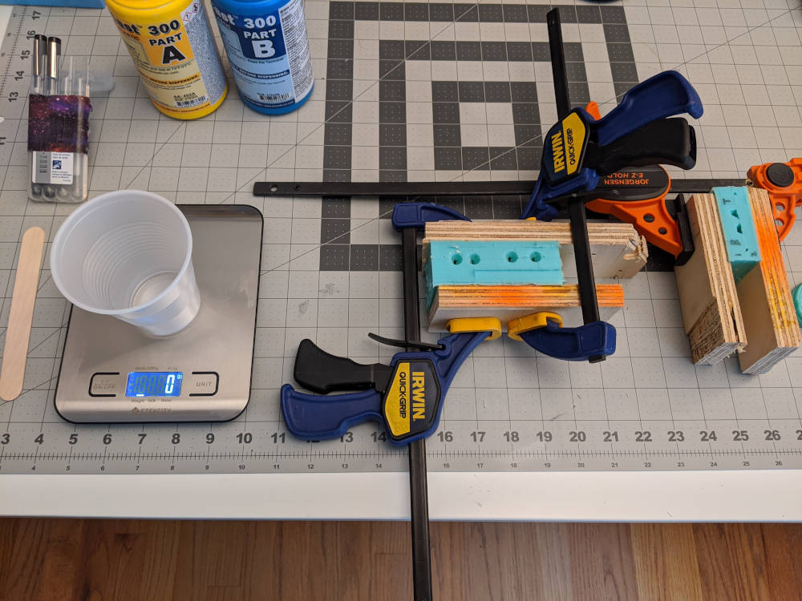
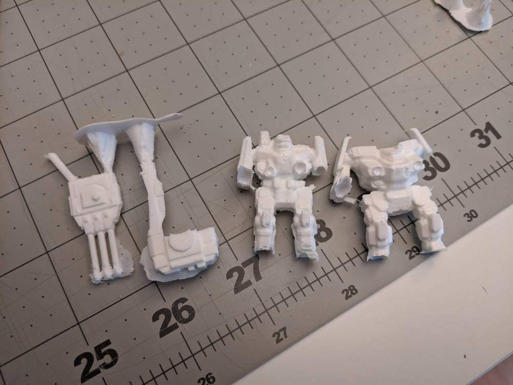
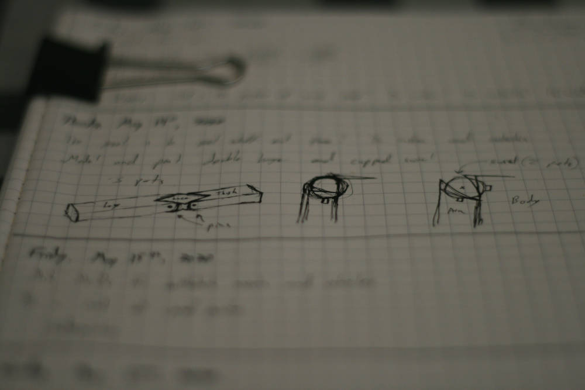
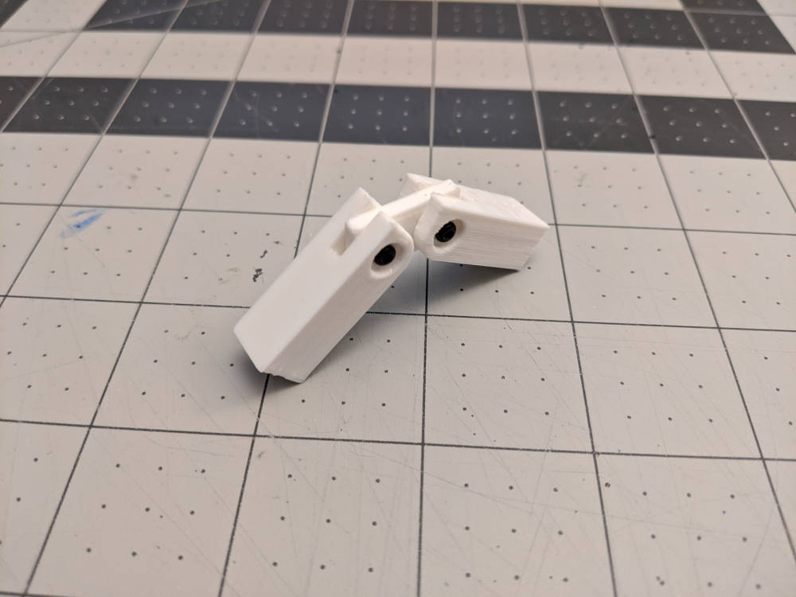

---
It's been a pretty productive week, and I got a chance to try out a bunch of new things and get some ideas for future projects a bit outside my norm. Here's a quick recap of what I've been up to this week:

### Magnets, Painting with Vallejo, and Basing

To make my growing Battletech collection a bit more modular (and to keep from making/buying too many minis) I have been toying with the idea of swappable turrets and weapons for my pieces. My recent Schreck Tank cast seemed like a good candidate to test this out.

After picking up some small magnets from Amazon, I used a slightly oversized bit to hand-drill a hole in both the body and turret of the tank, going just far enough to keep the magnet flush with the surface. I then used a dot of CA glue to hold the magnets in place, making sure the orientation was correct to attract the turret.

This was a fun project, and I will probably find ways to magnetize future minis. There were 300 magnets in the pack I picked up, so there are plenty of materials available. Even though this project was born from making a small collection more versitile, it's probably going to push me to get more minis...

In addition to getting the tank put together, I wanted to get it painted. It was the perfect opportunity to break out the Vallejo paints I ordered weeks ago and give them a shot.

I can't believe how much better they are than the craft paints I am used to working with. They are so smooth, give great coverage, and thinning them down doesn't turn them into a watery runny mess. With the right thinner, they even work with the airbrush!

I also used this week as an opportunity to step up my basing game. Following [Uncle Atom's secret techniques](https://www.youtube.com/watch?v=XL_xRxbxnbE), I used CA glue and baking soda to add some coarse sand to my hex base. After the glue sets (which happens instantly with baking soda), I primed black and painted brown with terra cotta craft paint.

This turned out pretty good, but I did not take into consideration how large the coarse sand would look. At 6mm scale, the tank is riding over small boulders. There is another base below, where I was a little less zealous with my sand application, and more generous with the baking soda.

### Other Minis

Most of my figures trend towards stompy robots and tanks, but every now and then I will paint something a little more human. My wife asked me to make her a Frankenstein's Monster, which led me down a rabbit hole of searching for the perfect mini, finding none, then doing a Meshmixer mashup of a body with good proportions and a classic horror movie head sculpt. Fortunately, at 28mm-ish scale, I can't see the terrible joint I made at the neck.

Not wanting to print just one piece, I loaded up a few more that turned out surprisingly well. These are primed and ready for painting.

Side note: I am really pleased with this picture. I used a backing for some sticker transfer paper as a white backdrop, and used my phone to take a "portrait mode" photo, which blurs the background and may do some sort of enhancement for the subject matter. I would like to get some more images like this for future projects.

### More Casting

This past week, I also tried to make another set of molds for two battlemechs. Unfortunately, this one did not turn out as good as I had hoped. First, I forgot to make registration marks in my mold, so I cut them into the first half, hoping they would get filled by the second half. This worked for the most part, but does not look as clean as my other two-part mold. Second, there were so many protrusions and odd angles to the battlemechs, so the molds lack definition in parts where I did not apply the clay well enough.

The casts ended up with way too many air bubbles to make them usable. The arms are obliterated, and the feet didn't even form. This may be remedied in the future with pressure casting and using a less viscous resin. SmoothCast 300 has a 3 minute pot life, which is pretty quick to mix, pour, and get throughout the mold before setting. I may look into a different material in the future for these complicated molds, and breaking down the figures into separate limbs for easier mold making.

For now, I will set mold making aside in favor of some different projects

### Action Figure Joints

This week, I started thinking about getting into making custom action figures. At the moment, I am interested in combining the technical aspect of the articulations with the art of sculpting the figure. I would like to do this all in CAD, 3d print the pieces, and then do some casting for small scale production.

To test the waters, I designed and printed a double hinge, like what would be used in a knee or elbow joint. I was surprised at how much thought goes into developing something with correct range of motion, tight tolerances, producible in mass quantities, and is still unobtrusive enough to keep the hinge from being the focus of the figure.

I think I will try making a cupped swivel (the right sketch on the pic from above) next, and do some research on how other people build custom figures. There is a huge community out there, and I am looking forward to another deep dive into it.

---
## This Upcoming Week...

The magnet project, new paints, and good-looking minis from the printer have me inspired for the upcoming week. Here's what I am hoping to get done:

### More Painting

My aim in the near-future is to get better at speed painting, so will focus this week on techniques that give better results in shorter time, and, most importantly, keep painting fun. I am excited to paint up the Urbanmech mini to add to my collection, and the Frankenstein's Monster for my wife. 

### Website adjustments

I would also like to work on the website a bit. I have to downscale and adjust every picture for faster load times, so a script to automate this would be a huge help. I usually spend about an hour sifting through and editing pictures, so a script to generate everything at the proper size and quality would speed things up.

Fun Fact: The source photos on this page originally took up about 45 MB of space, but now they take up 1.04 MB. That's a big difference if reading on a slow internet connection or mobile.
