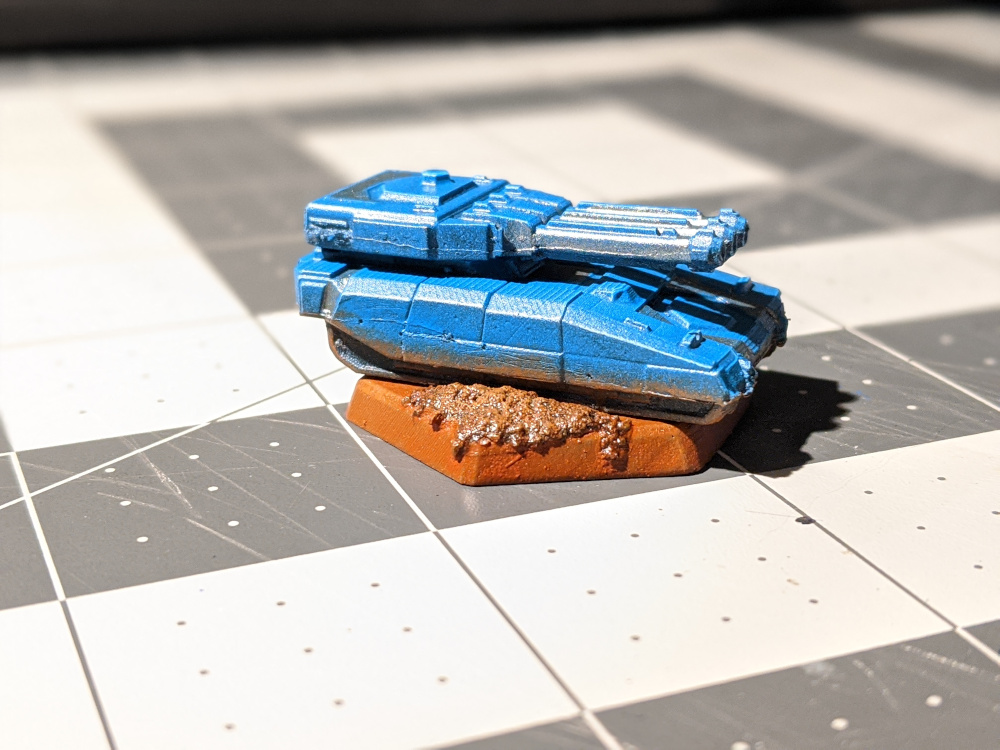
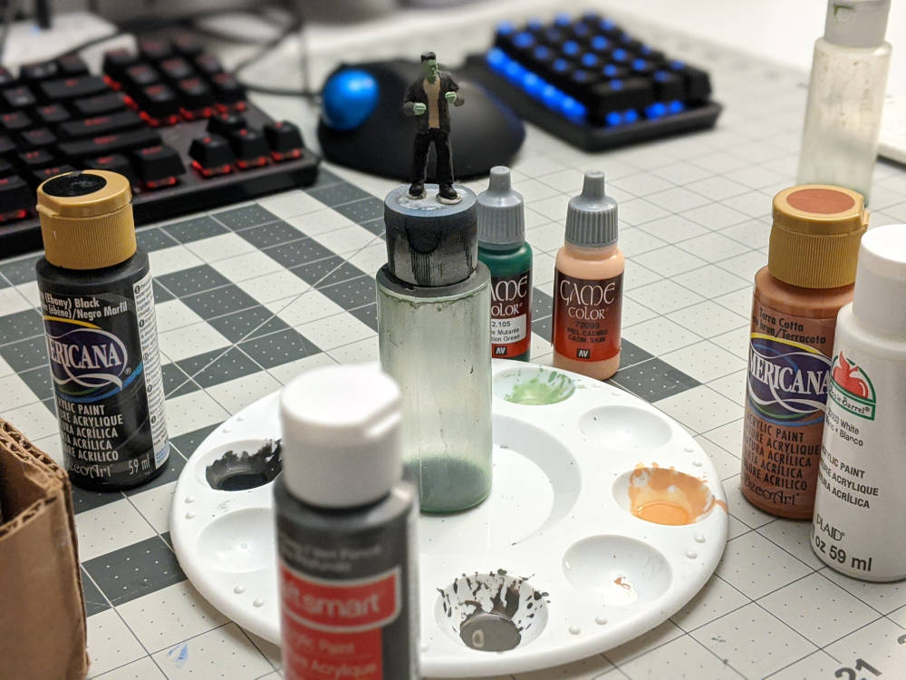
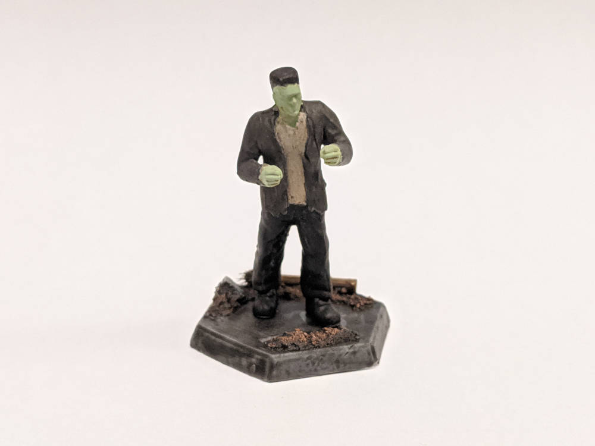
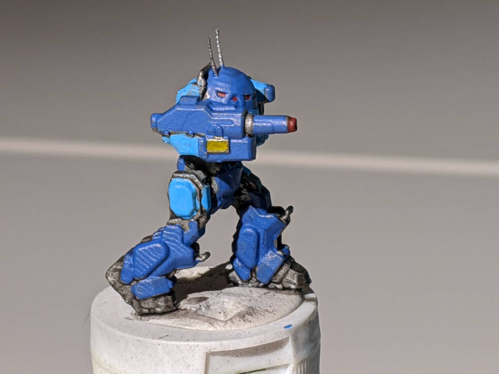
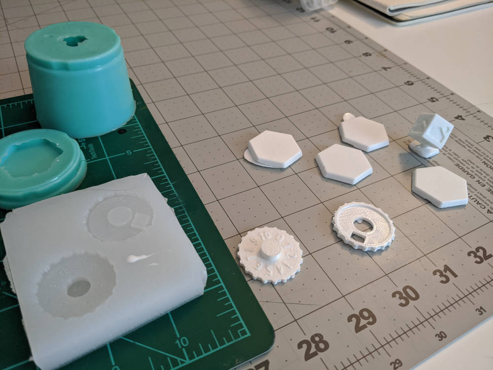
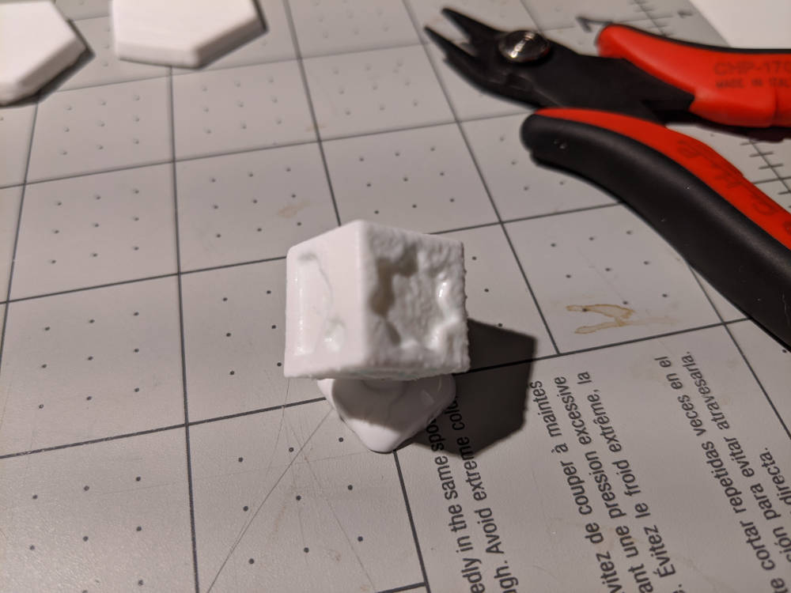

This has been a week with a lot of painting, a little casting, and a bit of thinking about future projects.
## Painting

### Finished Tank

Early in the week, I was able to wrap up my Schrek tank build, which gave me a chance to get some experience in basing. The base seen above was the third iteration, where I finally got the spacing between the dirt piles right. This allowed the tank sat on the base instead of floating above the rocks. I tried to match the base to the dirt on the bottom fenders, which helped paint the picture of this thing rolling through the mud during a battle.

### The Monster

I also spent some time painting up Frankenstein's Monster. A fan of classic horror films, my wife requested this one. The paint job was pretty straightforward, but I got creative with the base, adding some bits of bamboo skewers and wood from the shop floor. My old M.O. for basing was to throw on some paint as an afterthought, but now I see how it can really set the mood for a mini.

Shooting for an "emerging from destruction" look, I tried to make the base look like he is surrounded by rubble. It was fun using the base to define a small backstory for the mini, and will definitely keep this going for future pieces.

### The UrbanMech

My last painting for the week was an UrbanMech with a MegaMan theme. This is the first time I tried adhering to a dedicated color scheme, and I enjoyed the challenge of matching colors to the classic MegaMan look.

Resembling a walking trashcan with a massive gun, the UrbanMech is a bit of a meme in the Battletech Universe. The lightly armored and incredibly slow moving Urbie may lead an opposing pilot into a false sense of security just long enough to get cored by the UrbanMech's AC/10 Autocannon. For some fun history on this mech, I highly recommend checking out [Tex's talk on this beloved oversized R2-unit](https://www.youtube.com/watch?v=xOAre8wMWGU).

## Mold Making

After telling myself I would take a break from mold making and casting, I made a couple molds and did some casting. For my originals, I printed off a few hex bases and some custom dice and counters for a game called Starbreach.

For some reason, I am in love with hex bases for minis. It could be the [superiorities of a hex based map](https://www.giantitp.com/comics/oots0175.html) over a grid, or how they are simply more interesting than the common circle base. Either way, I keep using them, and needed a way to make them more often than a single cast at a time.

This was a pretty simple mold. I glued the hexes to a block of wood, encircled the pieces with a Lego wall, and poured the silicone. After setting overnight, I was able to churn out 4 fresh bases ready for sanding.

### Dice

For the dice, I wanted the ability to cast a few at a time. Unfortunately, my mold material supply is running low, so I had just enough for a single die mold. I hot-glued the custom die to a d6 to use as a stand/sprue, and glued the d6 to the bottom of a small cup. The silicone pour went smoothly, and I was able to cut halfway down the sides to pull the original out and make a not-quite-two-part mold.

As seen above, casting did not go so well. The detail of the die got lost in some silicone residue I failed to clean off the mold, and I have yet to find a solvent or cleaning method to get rid of this residue. I like the idea of making a custom set of these dice, so I will try another cast soon.

### Starbreach

As mentioned above, these dice are for [Starbreach](https://www.starbreach.com/), a tabletop skirmish game that combines several mechanics from popular tabletop games into a system that encourages players to bring their own models. The rule set is only a few pages, and there is a lot of freedom to assemble a small warband (5-15 models) kitbashed from spare models. 

## This Upcoming Week...

Over the next week, I'll be doing some more painting. My wife requested a Bride of Frankenstein and Igor to build up a set. These models are already printed, but I haven't settled on a paint scheme yet. I also plan to wrap up the UrbanMech with a base, and maybe retry casting some dice for Starbreach.

Since grabbing the Starbreach ruleset and watching some battle reports on YouTube, I've been wanting to put together a warband and find some nearby players. This week, I am going to research "digital kitbashing" from 3d models and printing.

I have also been thinking about improving my 3d modeling skills. With all the mini printing I have been doing, it would be nice to sculpt my own models for home manufacturing and sharing. Since I started working with 3d printers at work and home, I have become familiar with parametric modeling, where objects are defined by their length, width, etc. These objects are designed to fulfill a certain mechanical function, but I would like to get into making objects from a more artistic perspective, with a focus on form. Over the next few days, I would like to find some resources to learn how to do this.