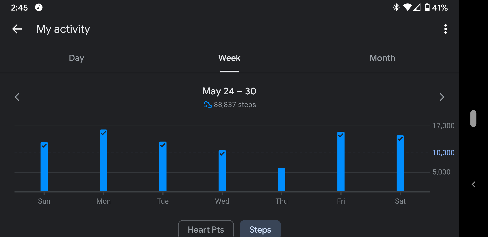
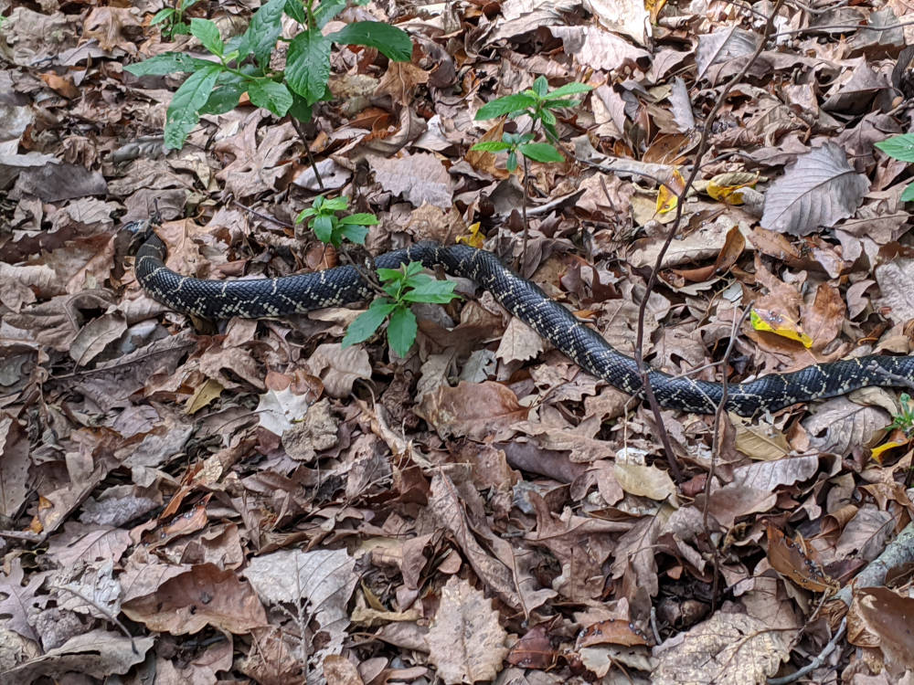
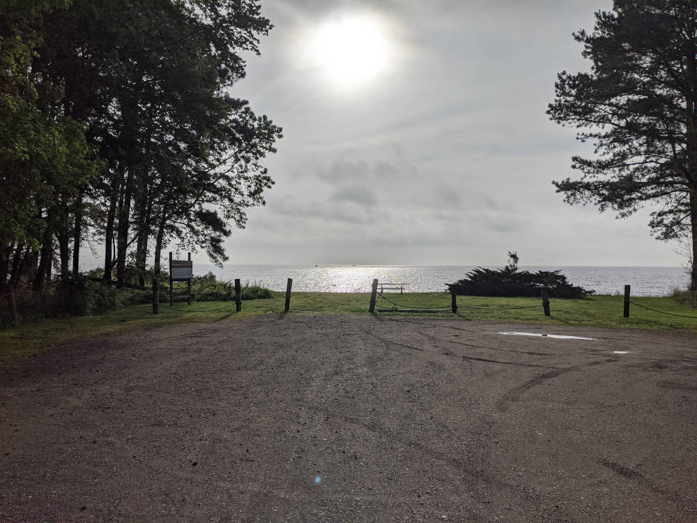
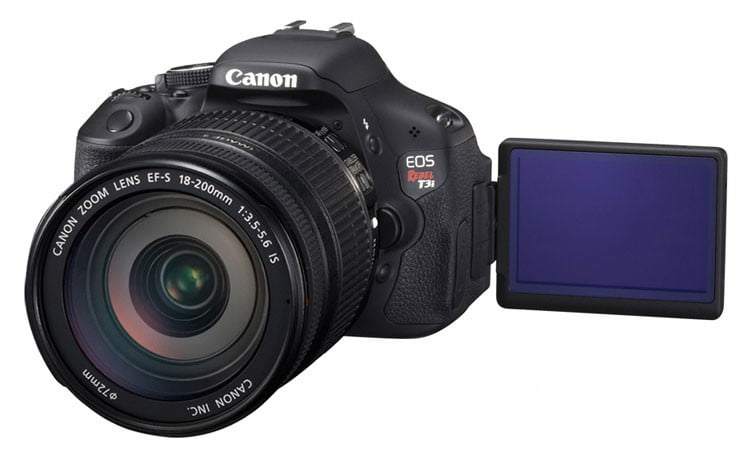

This past week has been a bit slow. I have been preoccupied with a lot of work-related things, and was not in much of a mood to work on the usual hobbies of painting/printing/casting. While I may not have created too much, I spent a lot of time this week taking walks in the neighborhood. I suppose I could say this created a clear headspace from which to move into the next week.

## Walking

Since quarantine started mid-March, going to restaurants was a no-go, and I stopped eating take-out or delivery. After a few weeks, that alone resulted in me dropping 3 lbs. Since then, I have tried to meet a daily step goal and be conscious of my meals. At the time of this writing, I have dropped 15 lbs, and hope to drop 10 more before trying to maintain that weight.

My favorite part of this fitness adventure is the walking, and I have taken a lot of steps this week. I enjoy getting out, getting some fresh air, and seeing the local wildlife (above).

Several times this week, I tossed on my headphones, queued up a podcast or some music, and went for a solo walk in the morning or evening. Each time, I took the paved loop around the neighborhood, and/or made my way down the road to the beach access to check out the bay. A round trip walk is two or three miles, depending on which combination of paths I took.

When my wife and I walked together, it's a good opportunity to chat and it helps to remind us there is more to the world than the walls of the house and whatever comes though our various screens. 

## Hunting for Cameras on eBay
Speaking of screens, I spent a few hours this week glued to my computer, searching eBay for a used Canon digital camera. I am considering a few experimental video projects, and wanted an affordable DSLR with lens options. 

I ended up grabbing a Canon Rebel T3i, which should ship here by Thursday. It's an older model, but looked to be in great condition, and has a few lenses I can add to my collection. Once it gets here, I will post an update on what I learn from playing with it, and maybe a demo video.
