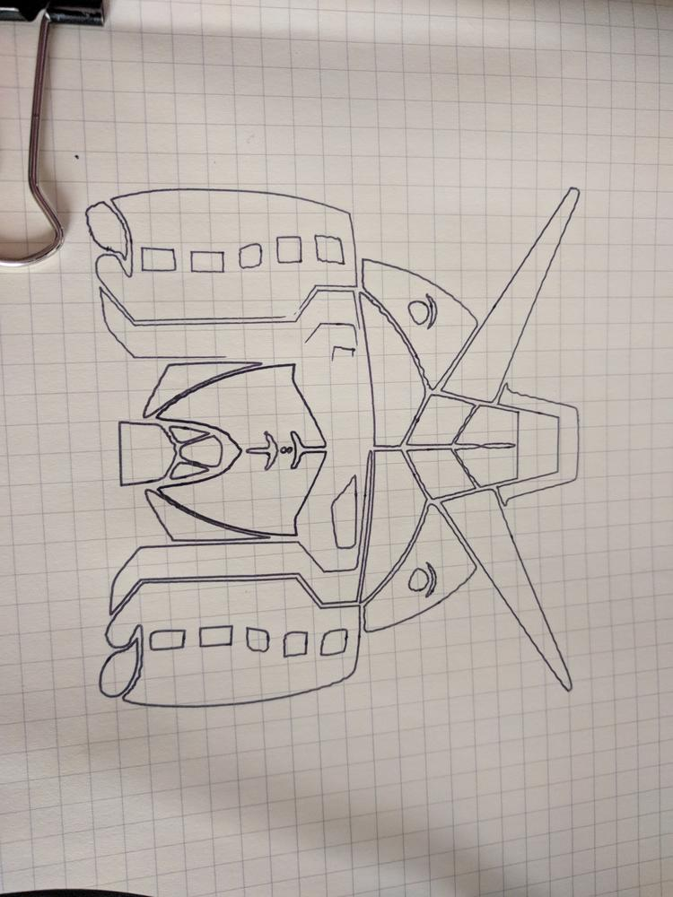
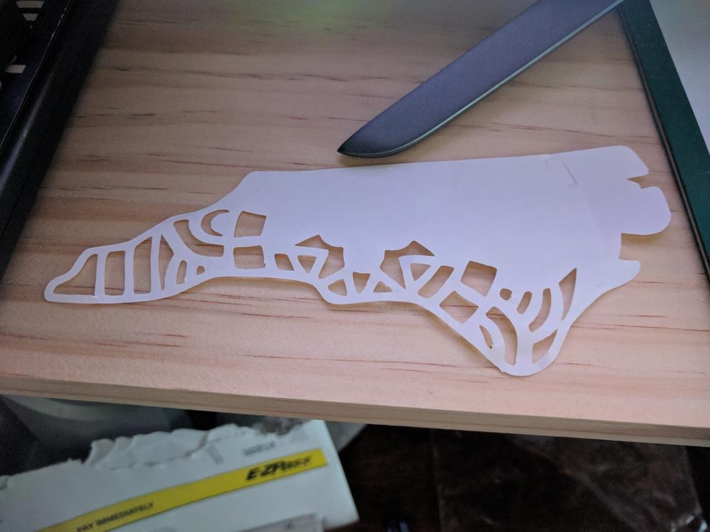
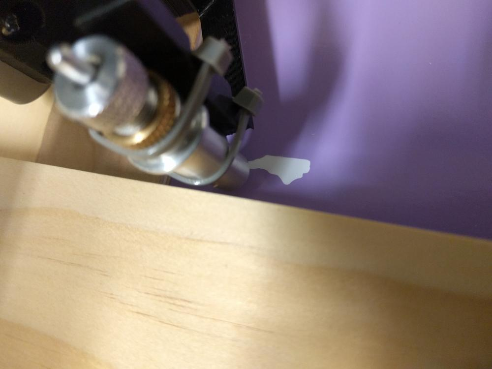
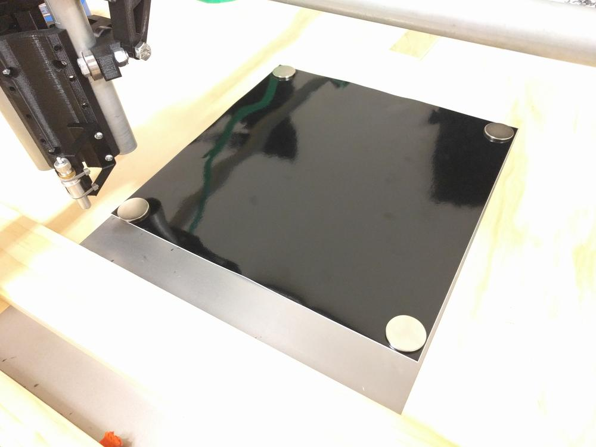
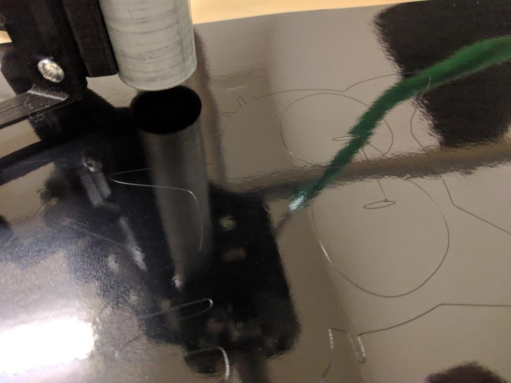
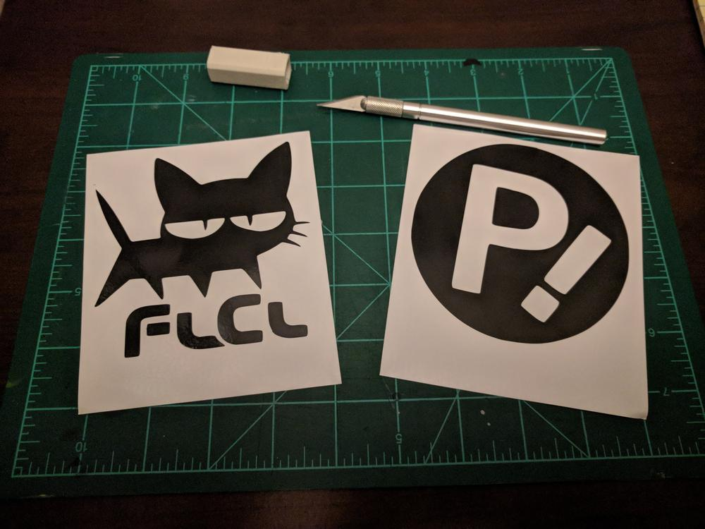

Now that the MPCNC is assembled and wired up, it's time to make something! I decided to start with some simple actions with a pen plotter and vinyl cutter.

## Pen plotting

For the first action, I went with a simple vector outline of a Gundam head. I found the above image as a black and grayscale png, and used Inkscape to trace the outline into black and white vector shapes. This was imported in Estlcam, which generated the gcode for this plot.

I zip-tied a marker pen to the z-axis and hit go! The lines ended up pretty clean, but there is a bit of wobble when the machine changes direction (as seen in the oscillations on a few lines). To compensate I slowed down and tightened up the belts and bearings.

## Drag knife

Following the same setup procedure from above, I swapped out the pen for a drag knife, which is a sharp blade that can rotate freely around the z axis. This allows it to cut though thin material wherever the tool head drags the knife around. The above picture was a test of my home state of NC on a piece of printer paper.

I started to get a little more daring, and tossed down a sheet of vinyl sticker paper. I was hoping for a solid color sticker of NC, but I missed the step of scaling it up to a usable size. I'll find a place for it nonetheless.

To keep the vinyl flat, I used a few magnets to hold the sheet down to a piece of steel. This worked well enough to get a few cuts done, but if the z axis moves too close to a magnet, it will jump from the steel sheet to the conduit.

## Making Stickers

The pressure of the knife is a little tricky to dial in. Too much, and it cuts though the backing paper; too little, and it won't cut all the way though the vinyl. This, coupled with a slightly off-level build surface, and I ended up with a few unusable stickers.

Another difficulty I encountered was the drag knife not finishing a cut where it had started. This is due to the free-spinning action of the blade, and how it might not begin a cut in alignment with the cut direction. There ends up being a small uncut portion left that requires a bit of cleanup before pulling the sticker off the sheet.

Once I got some successful stickers, I weeded out the negative portions and cut the sheet to size. To transfer a sticker, I use some lightly adhesive transfer paper to peel the sticker off, holding everything in place, and apply it to the desired surface.