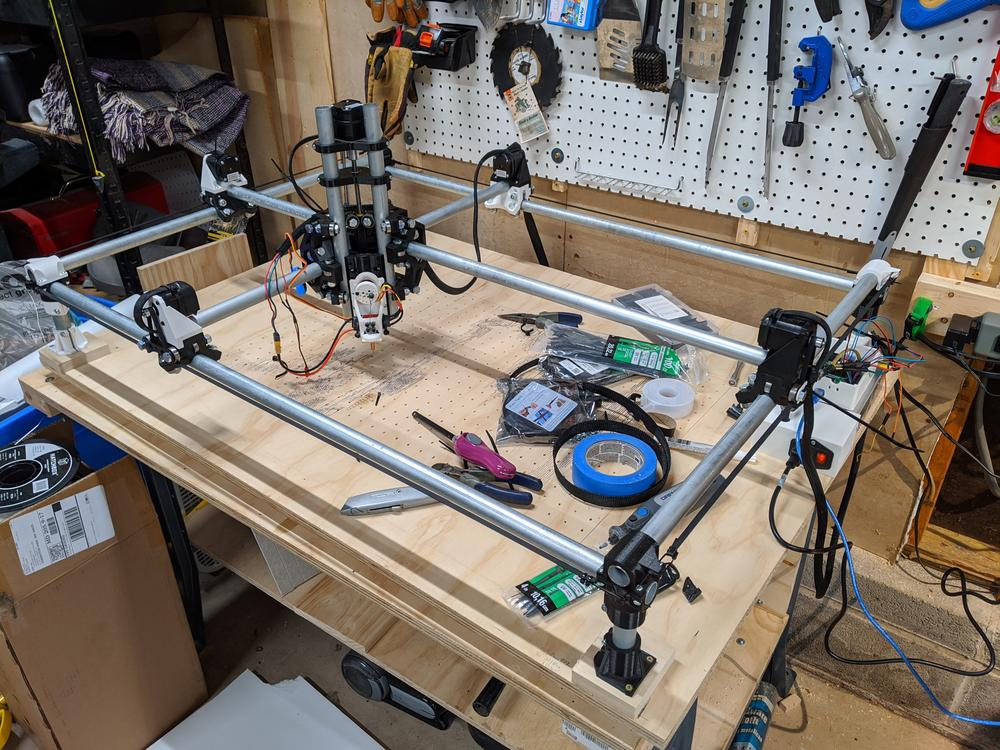
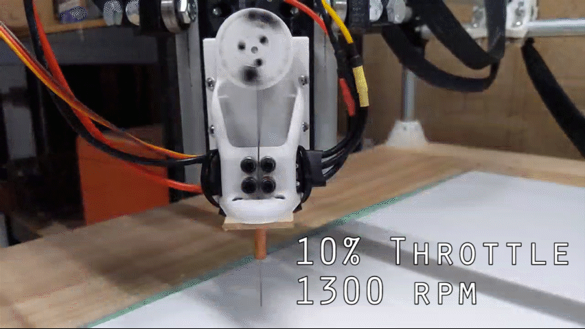
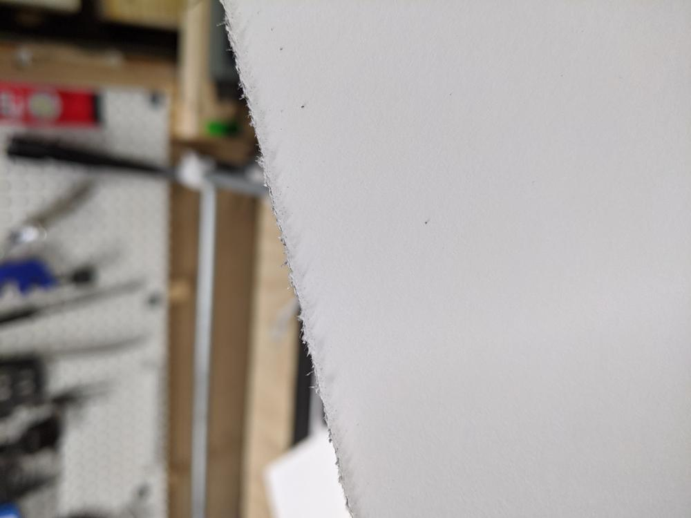
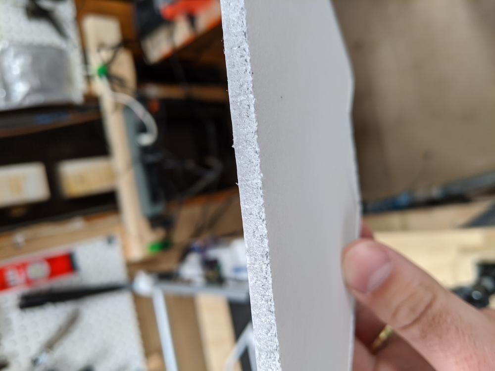
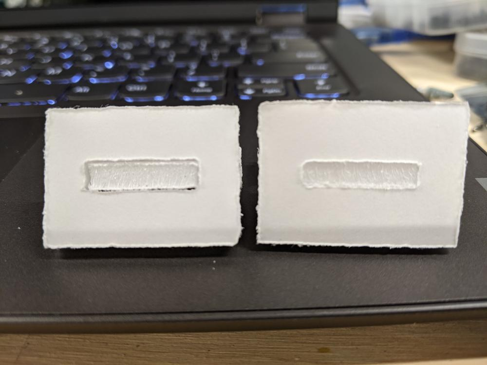
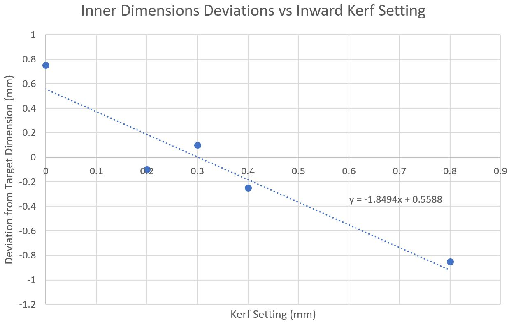
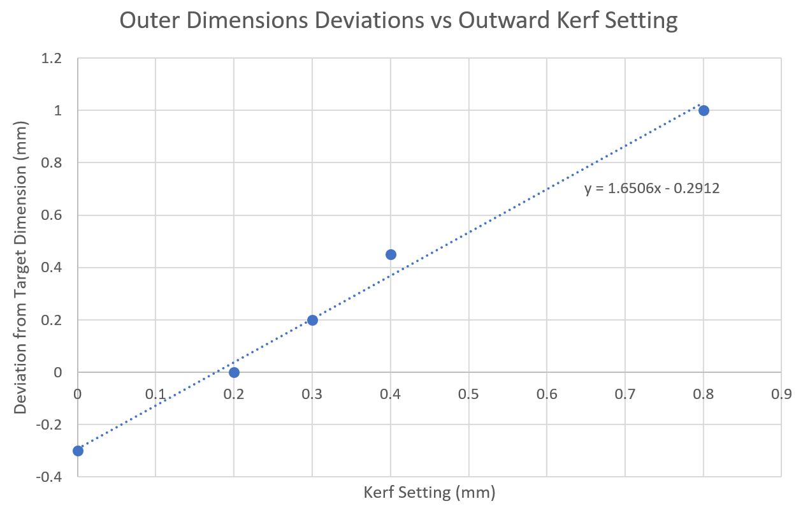
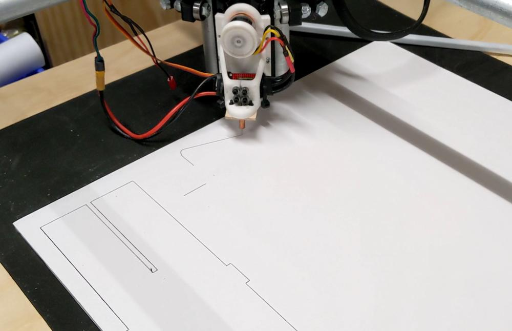

After a hiatus, I decided to revisit the needle cutter and get back to making planes from the free svg plans on FliteTest. I wanted to characterize the performance of the MPCNC and develop a streamlined workflow for creating parts that would fit together snug without being too tight.

<!--more-->

## The State of Things


During this downtime, I did a small rebuild of the electronics enclosure and wiring to make the machine easier to work on. I did not get a chance to document this process as well as I had hoped, but the result is a 3d printed open-top enclosure for the electronics, and the stepper wires kept in check with braided cable hose.

## Needle Cutter
I started this project by cleaning up the build platform, tidying up the garage, and reattaching the needle cutter tool to the z axis. Using the slow-motion feature of my phone, I was able to get the following video:



This GIF was captured at 1/8th speed while the needle was spinning at 10% throttle. Looking at the frames per revolution and crunching some numbers, it comes out to 1300 rpm. Scaling this up to full throttle, it should be spinning at 13k rpm under no load. With everything running smoothly, I did a few cuts.



The fibers of the paper surface make the edge cut look a little ragged, but the cut line and foam are well-defined with virtually no tearing.



## Dialing in Software Settings
To set up these cuts, I use a laser cutting software called Lightburn, and post-process the gcode with a python script, making it work for the MPCNC. I talked about Lightburn in a [previous post](/projects/rc-planes/rc-plane-from-pen-plotter/), but since then, I have started playing with the "laser offset" setting. This is used to offset the laser from the path to ensure the part is dimensionally accurate. For example, if I need to cut out a 10 mm square, and my laser beam is 1 mm wide, I need to offset the cut by 1 mm outward. This is also known as the laser kerf, and Lightburn allows the user to set this up as a cut parameter.


I designed the above test piece to see how different kerf settings would affect the accuracy of the part. Measured dimensions are compared against parameters A through E. A, B, and C were used to test outward kerf settings for accurate parts. D and E are used to test inward kerf settings for accurate holes.



I cut out several of these test parts, varying the kerf from 0.0 to 0.8 mm, both inward and outward. Here are two test fits of tab C in the hole formed by D/E. If the fit is too loose (as on the left), the pieces may not align properly, requiring more adhesive to keep them in place. If the fit is too tight (as on the right), pieces could be damaged during assembly or require some manual re-cutting to work.



The plot above shows the deviation in measured dimensions against inward kerf setting for the test pieces. In an ideal world, all I would have to do is measure the width of the needle and set that as the offset. However, the play between the needle and guide and flexibility of the wire itself makes finding the kerf more involved. Using a line of best fit on the above graph indicates no deviation from the target dimension (x-intercept) with an ```inner kerf of 0.302 mm```.



The above graph shows the deviation in measurements versus outward kerf setting. Similar to the inward kerf plot, a line of best fit shows an ideal ```outward kerf of 0.176 mm```.

I would have assumed the kerf setting would be the same between both parts and holes, and there is a possibility this would be apparent with more data collected. In the interest of saving time and streamlining the workflow, I set all future cuts to the average of these two values, a ```compomised kerf of 0.239 mm```. This should provide dimensionally accurate parts within 0.2 mm.

## Fun Stuff


For a quick demo of the needle cutter in action, check out the video below:
