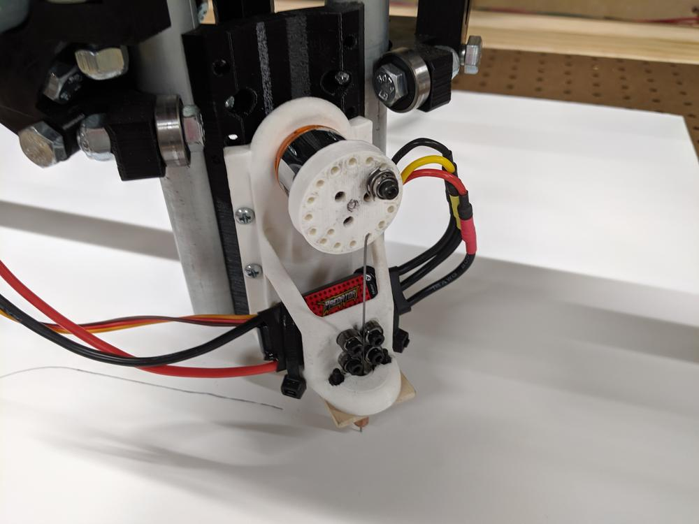
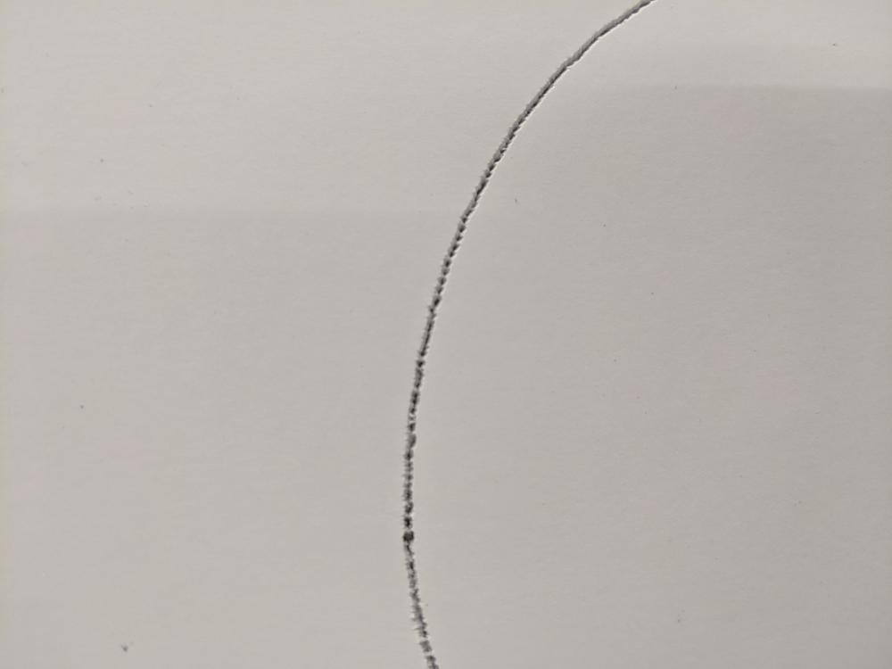
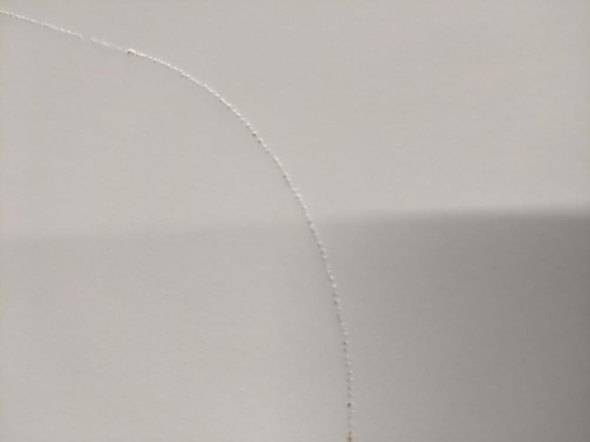
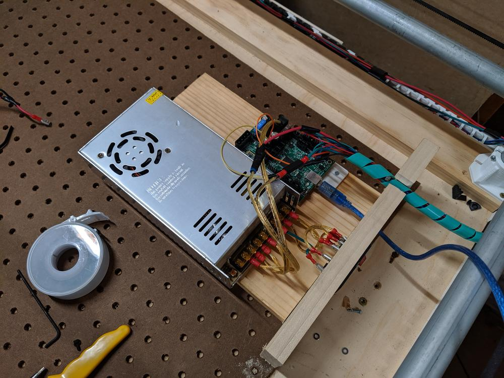

In my pursuit of speeding up my RC plane building, I found a new tool on the Flite Test forums, a needle cutter. This is a simple tool where a flexible piece of music wire is attached to a brushless motor to repeatedly puncture soft materials. When these punctures are spaced close enough, it acts as a cutting tool.

<!--more-->
## Needle Cutter

The wire is wrapped around a grooved bearing offset from the motor shaft. This wire is then guided through some small bearings down to a welding tip. The metal tip resists the wear of the needle and helps dissipate heat from friction.

One of the tricky parts of this tool is ensuring the wire has proper up-and-down travel length while minimizing the flex in the needle. If there is too much flex, the life of the wire will be reduced. During one of my test cuts, the needle descended too far below the material, and struck the MPCNC table, snapping the wire at the wrapping point.

Given the 1100kv rating of the motor, and the 12V power coming though the speed controller, I should be getting about 13k rpm under no load. When cutting foamboard, I am getting nowhere near these speeds, so I have to set my feedrate to between 5 and 10 mm/s to ensure enough "stabs per mm".

Once I figure out the vacuum table surface, I am going to enjoy jumping right to the "assembly" step of building planes. Check out the video below to see the vacuum table in action:



