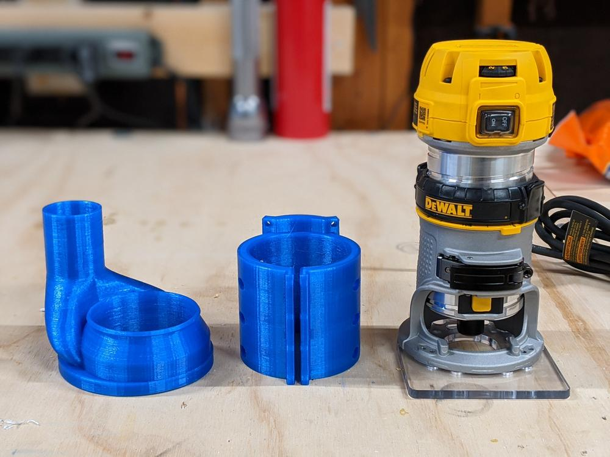
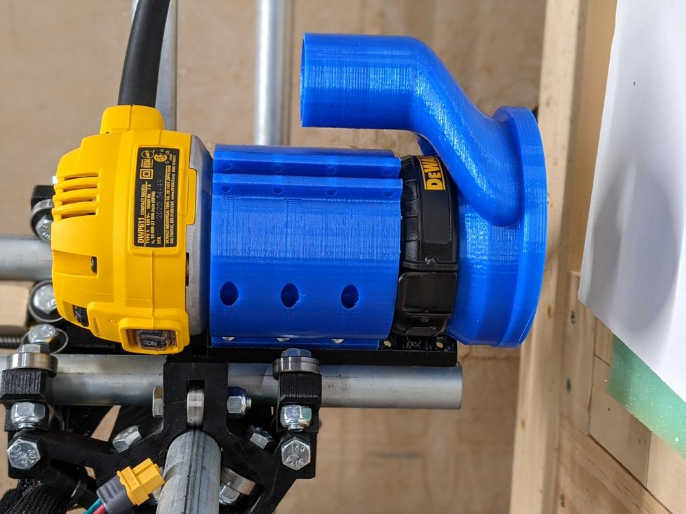
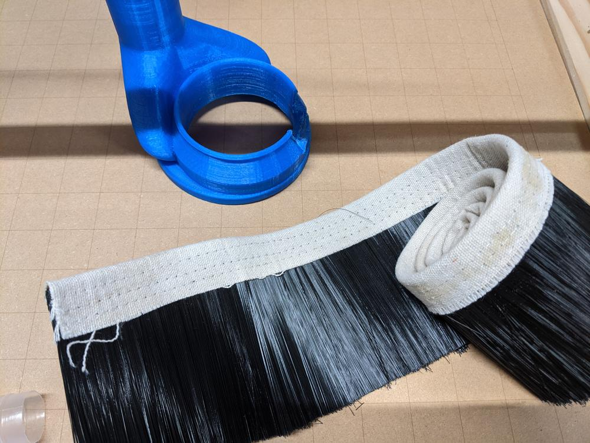
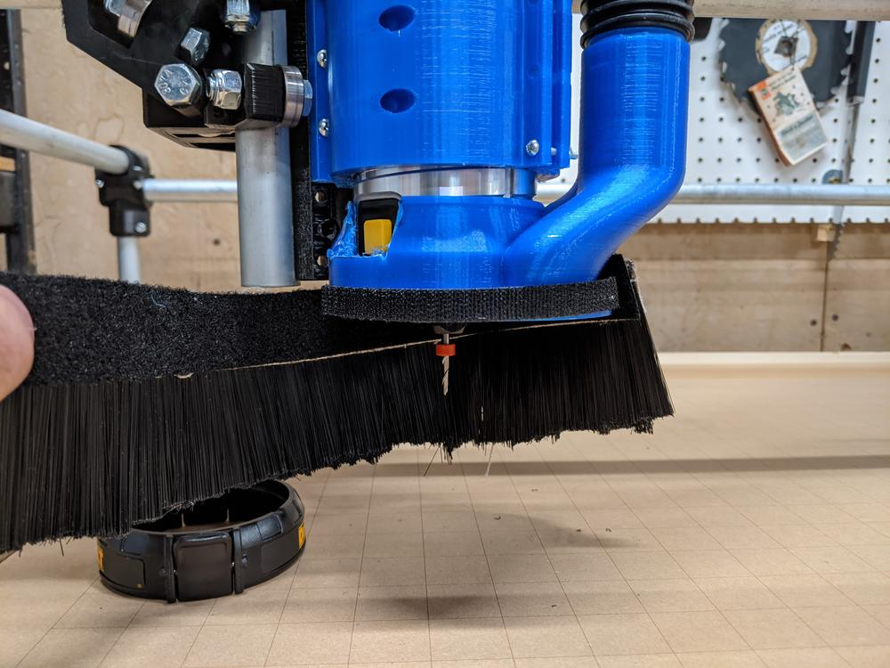
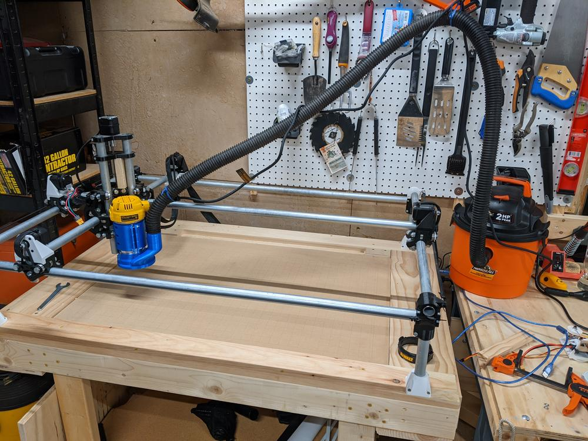
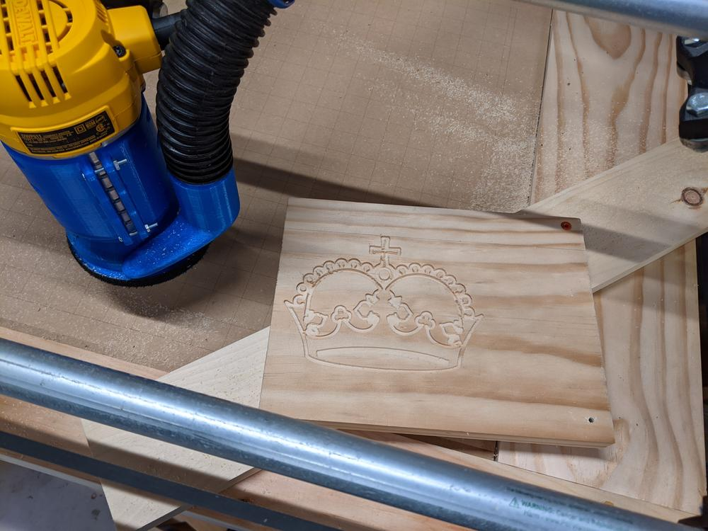

After a few years of rebuilds, teardowns, and tool changes, I am finally adding a router to my MPCNC. I have been wanting to work more with sheet material like wood, acrylic, and even aluminum if I can get the hang of using this tool.

<!--more-->

## Router Choice and Prints

For a router, V1 Engineering recommend the Dewalt 660, a 5.0 Amp, handheld rotary tool that operates at 30,000 rpm with an included 1/8" collet. This seemed like a solid choice, but I could not find it in my local stores or on Amazon. This led me to get the 7.0 Amp Dewalt 611, which is larger, has a variable speed from 16,000 to 30,000 rpm, and includes a 1/4" collet. Even though I had to purchase a separate 1/8" collet to fit the end mills I would be using, it was a much better choice. The variable speed will allow me to dial in on what is best for the material, and the higher amperage will give it a bit more punch when working with harder materials.

A change in router requires hardware that differs from the stock MPCNC build list. Fortunately, someone already designed and shared a compatible [mount](https://www.thingiverse.com/thing:2814921) and [dust shoe](https://www.thingiverse.com/thing:3311685) on Thingiverse.

## Attachment and Dust Collection

Once everything was printed, I attached everything to the Z-axis. I ended up having to modify the mount so the dust shoe would fit. This removed two of the holes for the mounting bolts, but the remaining 6 bolts seems to be enough for securing the router.

In the picture, there is a black ring that holds the dust shoe. This blocked access to the spindle lock that allows swapping of end mills, and kept the dust shoe a little too close to the work surface. Since the dust shoe was a tight fit and was held in place by friction alone, I ditched the ring. The shoe was further modified by cutting away a bit of the plastic to access the spindle lock.

Part of the dust shoe is a detachable skirt to help direct airflow across the work surface. This pulls cut material into the vacuum, keeping the environment clean(er) and loose chips from getting re-cut by the end mill. I tried to cut a bristle strip to size and attach it with velcro, but the bristles were too stiff to flex when the z-axis was moved close for low cuts. This will need to be redesigned in the future.

## Test Cut

With everything assembled and firmly attached, it was time to do a test cut. The standard test for the MPCNC is the "Crown Vector" seen below. I used a 1/8" single flute endmill, running at about 24k rpm. Feedrate was 15 mm/s, with a 1 mm depth of cut and 3 mm/s plunge rate.

I think this rpm was way too fast, and feedrate way too slow to get an efficient cut. Ideally, the spindle is spinning just fast enough to cut chips out of the material, but not too fast to grind material into dust. A fast rpm can be compensated for by moving faster though the material (increased feedrate). Feedrate is limited by the rigidity of the MPCNC and how much the material will yield to being cut.

The balancing act of rpm, feedrate, and other cutting parameters is different for each material. These numbers can only be determined through research, first-hand experience, and "rules of thumb" that I have yet to figure out, but that is all part of the fun. 

